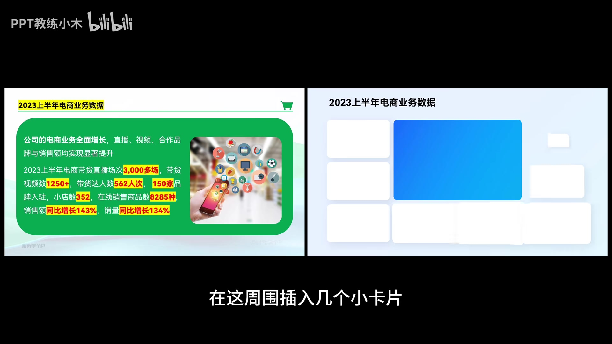

# 哪有什么天赋，全靠死磕基本功

> 状态：候选规则／待验证
> 来源：[Bilibili BV1WprrYeEun](https://www.bilibili.com/video/BV1WprrYeEun/)
> 作者：PPT教练小木
> 时长：06:33
> 记录日期：2026-09-03

## 一句话结论

PPT 排版的起点不是套用某个好看的模板，而是先读懂内容、提炼文字关系，再选择能把这种关系表达清楚的版式。

## 视频给出的基本流程

1. 阅读原始文案，判断总分、并列、递进、循环等内容关系。
2. 按“长文变短句、短句变词汇”的方向梳理文字，保留标题、结论和必要分点。
3. 根据内容关系选择版式，不让装饰反过来决定信息结构。
4. 最后再增加图片、色块、图标、箭头或背景等视觉处理。

其中最值得 PPagenT 吸收的不是五个版式名称，而是“内容逻辑 → 文字提炼 → 版式选择 → 视觉修饰”的先后顺序。

## 五类版式及其适用关系

### 1. 拦腰版式

用一个横向大色块把页面分成上下两部分。视频将它用于总分或并列内容：先把长文提炼为一条总述，再把其他信息拆成若干分点；图片、色块和形状衬底属于后续视觉处理。

对 PPagenT 的启发：上下分区只是几何形式，真正决定能否使用它的是两组内容之间是否存在明确的统领、解释或并列关系。

### 2. 环绕版式

用中心图形承载总述或核心概念，让其他内容围绕中心排列。视频给出的适用关系包括总分、循环和并列，并展示了完整环绕、单侧环绕、非正圆路径和多个重心等变化。

对 PPagenT 的启发：不能把“有圆”直接等同于循环关系。中心—外围、顺序箭头和分项之间是否互相连接，分别表达不同语义。

### 3. 分割版式

用矩形或大色块把版面分成若干独立区域，适合递进或并列内容。若内容有先后关系，可以再用箭头或连续路径把分区串联；若只是并列，则不应为了装饰强行加入方向。

对 PPagenT 的启发：分区解决的是内容归组，箭头解决的是组间方向；这两个职责应分别由内容关系决定。

### 4. 卡片版式

用多个矩形卡片形成矩阵或主从组合，可承载总分、递进或并列关系。视频强调减少多余色块，只保留真正用于隔开内容的卡片；递进关系仍需要箭头等连接线补充语义。

对 PPagenT 的启发：卡片不是独立的 Logic。同样的卡片外形可以表达多种关系，必须由卡片大小、位置、分组和连接方式共同确定语义。

### 5. 全图版式

让图片铺满页面并叠加文字。视频认为它本质上更接近一种背景处理，可以叠加在多种内容关系上；它尤其适合只有一句话或一小段文字的页面。为了保证可读性，可以在文字与图片之间加入半透明色块、局部虚化或暗化处理。

对 PPagenT 的启发：全图版式更接近媒体与视觉样式策略，不宜与总分、循环等语义结构放在同一层分类。

## 可供 PPagenT 验证的候选规则

1. **文字提炼必须发生在版式选择之前。** 原始长文尚未形成清晰内容块时，不应直接匹配 Structure Group。
2. **内容关系与几何版式不能一一绑定。** 同一种关系可以有多种版式，同一种版式也可能承载多种关系。
3. **分组与连接承担不同语义。** 区域、卡片负责归组；箭头、环线和路径负责方向、顺序或循环。
4. **装饰不得替代结构。** 透明图片、图标、色块、背景和毛玻璃只能在关系已经清晰后加入。
5. **媒体策略应与结构策略分层。** 全图背景不是一种新的内容 Logic，而是作用于页面视觉呈现的独立选择。

## 与 PPagenT 当前路线的关系

这期视频支持 PPagenT 当前的基本方向：AI 先理解稿件与内容关系，再由规则选择已验证的结构，最后由程序确定性生成。但五个版式名称不应直接注册成五个 Logic。

可以进一步验证：

- “拦腰”“分割”“卡片”是否更适合作为整页 Composition 或 Structure Group 的几何家族。
- “环绕”内部是否需要区分中心辐射、单侧分布和真正闭环三种语义拓扑。
- “全图”是否应进入媒体／背景策略，而不是结构资产分类。
- 内容导演输出的内容块、关系和阅读顺序，是否足以让视觉导演稳定选择这些形式。

以上均为待验证方向，不代表已经修改正式分类、契约或生成线。

## 证据边界

- 原视频没有可用的官方字幕；本笔记依据本地语音转写和逐帧画面复核整理，不是逐字稿。
- 视频给出的是教学案例和经验方法，没有提供适用率、对照实验或定量排版阈值。
- “拦腰、环绕、分割、卡片、全图”是视频中的教学分类，不等于 PPagenT 已确认的分类体系。
- 本记录尚未经过 PPagenT 对照页面实验和用户视觉确认，因此保持 `候选规则／待验证`。
