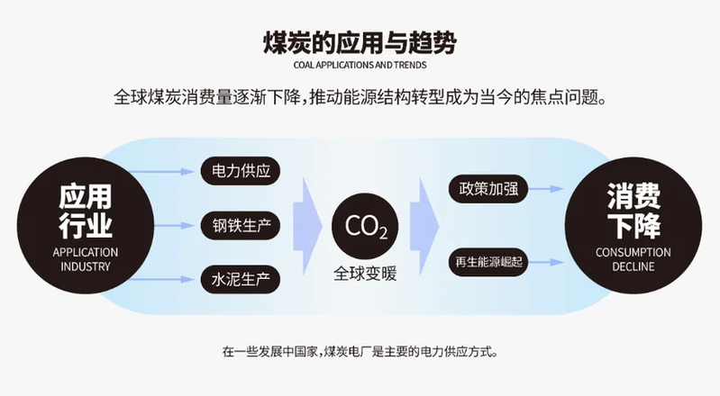
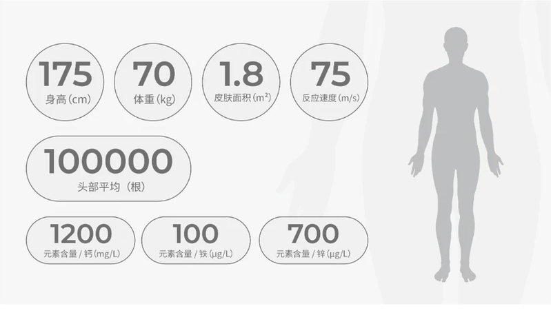
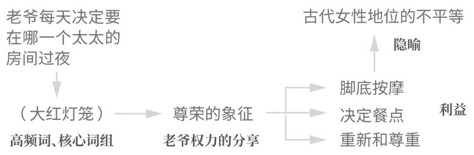
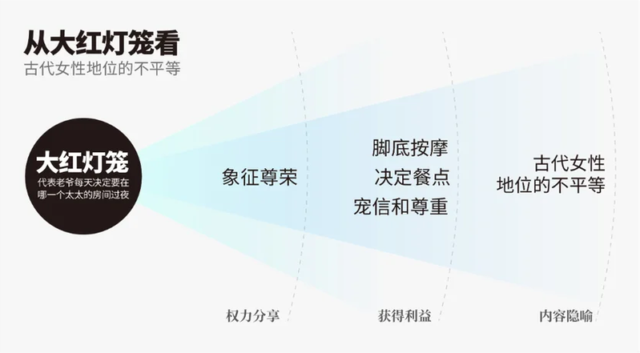
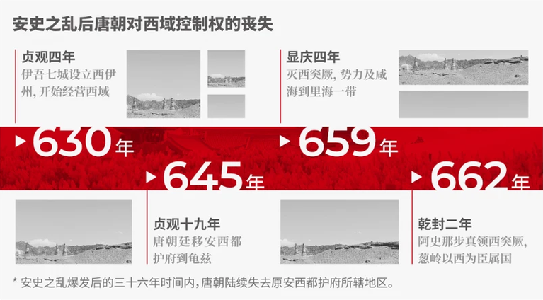
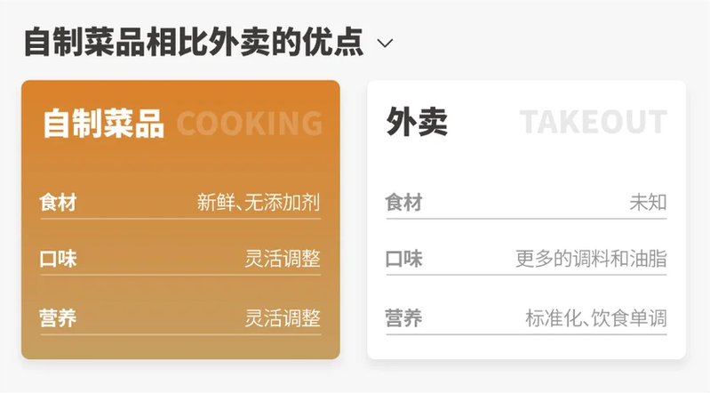

# 内容的提取：用户提供十一图原文逐字稿

本次仅整理用户于 2026-09-17 分两批提供的十一张截图，按上传顺序编号，不表示整篇文章已经收齐。正文与图内文字均转录；版面换行适当合并，文字、数字、重复表述及疑似笔误不擅自改正。以下章节名、图片链接和“图内文字”等标识为整理者添加，不属于原文。完整截图是核对依据，独立配图由对应截图裁切得到。

## 第 1 张

[完整原图](原图/01.png)

PPT是视觉软件**一定要尽量简化、可视化**，将抽象的或难以直接理解的信息尽量转变为直观的、可感知的视觉表现形式（图形、、图片、列表或者其他的图例）。拿到的文稿内容需要进行信息整理和提炼，然后再进行图像化排版。

图内文字：

一条狗

可视化可以这么理解。

要将内容可视化，首先要做的就是关键信息提取。需要在段落中找关键信息，摘取、提炼后进行图例的转化。

\* 内容分组也属于提炼内容的一种方法。

**提取信息的切入点：**

1. 内容总结：拆分、提炼、总结内容说了什么，尽量用短句、词组解释；
2. 放大数字：内容中出现的数字、数据直接放大就行；
3. 重要词汇：重复出现的词汇 / 术语和专有名词；
4. 时间：段落中和时间有关的内容；
5. 对比内容：对比一般就是内容的关键信息；

## 第 2 张

[完整原图](原图/02.png)

**内容总结：**拆分提炼内容，足够简单后在这个基础上搭建框架。

\* 可以用 AI（通义千问、GPT），虽然不一定完美解决，但是实打实地提高效率。

煤炭广泛应用于电力、钢铁、水泥等行业。煤炭在发电中占据重要地位，特别是在一些发展中国家，煤炭电厂依然是主要的电力供应方式。然而，煤炭燃烧产生大量二氧化碳等温室气体，是全球气候变化的主要原因之一。近年来，随着环保政策的加强和可再生能源的崛起，全球煤炭消费量逐渐下降，推动能源结构转型成为当今的焦点问题。

这段拆分下来说了两点，一是应用、二是问题、三是趋势，有了这两点就有了标题：煤炭的应用与趋势。这种有因有果的段落就做成 A → B → C 的样式。

**应用行业**

煤炭广泛应用于电力、钢铁、水泥等行业。

**导致的问题**

然而，煤炭燃烧产生大量二氧化碳等温室气体，是全球气候变化的主要原因之一。

\* 字虽然多，但是能用化学式、数学、图形直接替代。

**消费趋势**

近年来，随着环保政策的加强和可再生能源的崛起，全球煤炭消费量逐渐下降，推动能源结构转型成为当今的焦点问题。

## 第 3 张

[完整原图](原图/03.png)

再根据上面逐步细节，这一步就要压缩内容，然后简单搭建一下骨架：

图内文字（依版面从左至右列出）：

- 煤炭应用
- 电力
- 钢铁
- 水泥
- CO₂
- 全球变暖
- 环保政策加强
- 再生能源崛起
- 消费下降

“推动能源结构转型成为当今的焦点问题”，结论作为主要内容 放进页面。

“煤炭在发电中占据重要地位，特别是在一些发展中国家……”这句前后都没有隶属关系，可以放在一些不起眼的地方；

到这里差不多拆分完了，剩下就是通过扩词和缩句增减字数和词语。一般像 PPT 里这些元素，大多都使用几何图形 + 文字的组合。

图内文字：

煤炭的应用与趋势

COAL APPLICATIONS AND TRENDS

全球煤炭消费量逐渐下降，推动能源结构转型成为当今的焦点问题。

- 应用行业
- APPLICATION INDUSTRY
- 电力供应
- 钢铁生产
- 水泥生产
- CO₂
- 全球变暖
- 政策加强
- 再生能源崛起
- 消费下降
- CONSUMPTION DECLINE

在一些发展中国家，煤炭电厂是主要的电力供应方式。

原文甚至可以拆成两页内容，这里只是演示，有些复杂的还需要逐字逐句弄。这段呈现其实并不完全准确，就只当做一个参考。

## 第 4 张

[完整原图](原图/04.png)

**放大数字：**让段落中数字更易于观看和理解。

\* 可以做成表格的内容就做成表格，数字能放大就放大，视觉动物是不喜欢看文字的。表格尽量不要截图，不方便适配 PPT 的配色。

成年男性身高175厘米，体重70公斤，拥有约10万根头发，皮肤面积约为1.8平方米。血液检测显示，钙含量为1200毫克/升，铁含量为100微克/升，锌含量为700微克/升，这些数据表明在营养摄入上相对均衡。此外，神经反应速度为75米/秒，反映出良好的神经功能。

把数据单列出来，然后放大配上图标、图片，和做表格差不多。

身高：175 cm

体重：70 kg

毛发数量：约100,000根（头部平均）

皮肤面积：约1.8 m²（成人男性的估算）

元素含量：　钙：1200 mg/L　　铁：100 μg/L　　锌：700 μg/L

神经反应速度：75 m/s

其他内容基本没啥用，这种带数字的段落最好就是把数字放大，本来就是给人看数据内容的，除了数字其他一律缩小。

## 第 5 张

[完整原图](原图/05.png)

图内文字：

| 数字 | 图中说明 |
| --- | --- |
| 175 | 身高 (cm) |
| 70 | 体重 (kg) |
| 1.8 | 皮肤面积 (m²) |
| 75 | 反应速度 (m/s) |
| 100000 | 头部平均（根） |
| 1200 | 元素含量 / 钙 (mg/L) |
| 100 | 元素含量 / 铁 (μg/L) |
| 700 | 元素含量 / 锌 (μg/L) |

对信息整理后，呈现的可读性会比纯文字的内容更强，再加上示意的图片，效果会比直接把段落复制进来好，参考图根据内容找一下就好，也不需要特别准确，如果是特定行业图片那就用科技出去找吧。

数字如果想做成图例，也能做，就是会比较麻烦，当然会更好看，本质都一样，比如下面这句话：

山地水土保持率提升到80%

图内文字：

山地水土保持率提升

80%

表格类的呈现相对简单，要么复制，要么就用PPT自带的工具做，表格占据页面的比例不要低于一半，至于什么样式就看喜好，适合PPT的大多是柱状图、甘特图这类方便修改长宽的，饼图浪费的空间有点多。

## 第 6 张

[完整原图](原图/06.png)

**重要词汇：**段落中重复的、专有名词都算。

\* 这里就以重复词组作为参考。

当她的丈夫，大宅院的主人，夜晚留宿她的房间时，门前便会挂着“大红灯笼”。然而，颂莲很快的发现，并非所有的太太们都能接受到同样的奢华待遇。事实上，是老爷每天决定要在哪一个太太的房间过夜，就会命人在房间前挂“大红灯笼”，“大红灯笼”是一种尊荣的象征，她可以享受脚底按摩，决定餐点，得到仆人们的尊敬与服侍。陈老爷每晚都找不同的太太过夜，“大红灯笼”代表那位太太受宠幸，她也因此得势，会受到其他人的尊重。在现代角度，这也代表古代女性地位的不平等。

高频词一般代表着重点、含义，遇到就选高频词。

这里的高频词就是“大红灯笼”，然后顺着这个段落就拆分成各种内容。

大宅院的主人，夜晚留宿她的房间时，门前便会挂着“大红灯笼”。

哪一个太太的房间过夜，就会在房间前挂“大红灯笼”。

\* 这两句一个意思：老爷在哪过夜，哪就挂灯笼，合并掉。

“大红灯笼”是一种尊荣的象征。

\* 原文是尊荣的象征，结合下文就知道其实也是权力的分享。

她可以享受脚底按摩，决定餐点，得到仆人们的尊敬与服侍。

“大红灯笼”代表那位太太受宠幸，受到其他人的尊重。

\* 分享到权力后，能获得的利益。

在现代角度，这也代表古代女性地位的不平等。

\* 隐喻、含义、结论。

## 第 7 张

[完整原图](原图/07.png)

简单画个图，这种流程图要不要画看自己需不需要。

图内文字：

- 老爷每天决定要在哪一个太太的房间过夜
- （大红灯笼）
- 高频词、核心词组
- 尊荣的象征
- 老爷权力的分享
- 脚底按摩
- 决定餐点
- 重新和尊重
- 利益
- 古代女性地位的不平等
- 隐喻

接下来的工作就是把这个流程图给具象化。选择什么样的图例按喜好来，无所谓。

图内文字：

从大红灯笼看

古代女性地位的不平等

- 大红灯笼
- 代表老爷每天决定要在哪一个太太的房间过夜
- 象征尊荣
- 脚底按摩
- 决定餐点
- 宠信和尊重
- 古代女性地位的不平等
- 权力分享
- 获得利益
- 内容隐喻

没有什么用的内容直接删掉，剩下的东西就还是通过扩词 / 缩句来做，很多内容多读两遍原文就总结出来了。每个人理解和切入点不一样，不能照抄。

## 第 8 张

[完整原图](原图/08.png)

**时间：**一般就是大事记、历程这一类的。

\* 回顾的内容 / 项目类 / 产品演变 / 课程 / 活动计划，只要是和时间有关系的内容，都可以用这种方法整理。

贞观四年，唐朝廷在伊吾七城设立西伊州，开始经营西域。贞观十九年（645年），唐朝廷移安西都护府到龟兹。显庆四年（659年），唐军又灭西突厥，势力及咸海到里海一带。但唐朝廷对葱岭以西地区的统治始终不稳固，乾封二年（662年），阿史那弥射死，阿史那步真统领西突厥十姓，此后葱岭以西一直为唐朝臣属国，尤其是吐火罗。安史之乱爆发后的三十六年时间内，唐朝陆续失去原安西都护府所辖地区。

把每段时间的内容隔开，时间显示更明显，方便压缩内容。

贞观四年，唐朝廷在伊吾七城设立西伊州，开始经营西域。

贞观十九年（645年），唐朝廷移安西都护府到龟兹。

显庆四年（659年），唐军又灭西突厥，势力及咸海到里海一带。但唐朝廷对葱岭以西地区的统治始终不稳固，

乾封二年（662年），阿史那弥射死，阿史那步真统领西突厥十姓，此后葱岭以西一直为唐朝臣属国，尤其是吐火罗。

安史之乱爆发后的三十六年时间内，唐朝陆续失去原安西都护府所辖地区。

这句话梳理一下就是标题，原文作为补充说明也可以

## 第 9 张

[完整原图](原图/09.png)

最后的工作就是纯缩句了，有些该增补的内容查一下（贞观四年的年份），该删除的删除（~~唐军又~~灭西突厥，势力及咸海到里海一带。~~但唐朝廷对葱岭以西地区的统治始终不稳固~~），根据需要加减就行了。

图内文字：

安史之乱后唐朝对西域控制权的丧失

- 贞观四年
- 伊吾七城设立西伊州，开始经营西域
- 630年
- 贞观十九年
- 唐朝廷移安西都护府到龟兹
- 645年
- 显庆四年
- 灭西突厥，势力及咸海到里海一带
- 659年
- 乾封二年
- 阿史那步真领西突厥，葱岭以西为臣属国
- 662年

\* 安史之乱爆发后的三十六年时间内，唐朝陆续失去原安西都护府所辖地区。

时间轴一般就是横线、竖线、曲线。

不要使用圆形、发散形、块状的方式，占地方不说做着还麻烦。

## 第 10 张

[完整原图](原图/10.png)

**对比内容：**要把对比的文字内容转化为图表的形式。

自制菜品能够确保使用新鲜、无添加剂的食材，避免潜在的健康风险。而外卖为了口味常常会使用更多的调料和油脂，长期食用会对身体产生负担。此外，自制可以根据个人口味和营养需求灵活调整，既能保证美味，又能确保饮食的多样性。相比之下，外卖虽然方便，但一般是标准化的出品，无法满足每个人的营养需求，容易导致饮食的单调。

内容对比了自制菜品和外卖在健康上的优缺点。

还是那样，拆分嘛。

自制菜品：

能够确保使用新鲜、无添加剂的食材，避免潜在的健康风险。

根据个人口味和营养需求灵活调整，保证美味，确保饮食的多样性。

外卖：

口味常常会使用更多的调料和油脂，长期食用会对身体产生负担。

标准化的出品，无法满足每个人的营养需求，容易导致饮食的单调。

具体对比的项目根据内容定，这里分了三个方向：食材、口味、营养。实际上怎么分类也看自己想怎么表达。

大部分对比内容都是使用左右结构的页面设置，多数比例为 1：1。

## 第 11 张

[完整原图](原图/11.png)

图内文字：

自制菜品相比外卖的优点

| 项目 | 自制菜品 COOKING | 外卖 TAKEOUT |
| --- | --- | --- |
| 食材 | 新鲜、无添加剂 | 未知 |
| 口味 | 灵活调整 | 更多的调料和油脂 |
| 营养 | 灵活调整 | 标准化、饮食单调 |

文稿中没有的内容还是要自己补充，像“外卖食材”这一栏就是后补进去的，原文没有，比较专业的内容需要增补一定要事先查阅资料。

基本对比页左右排版占大多数，少有上下的那个就没啥必要做了。

内容可视化其实就是靠拆分信息进行精炼、提取，然后根据提取出来的信息结合简单的排版、设计再输出：

**输入 → 整理 → 提炼 → 输出**

这里只能大概给一些方向。

---

## 整理说明（非原文）

- 第 1 张“图形、、图片”的连续顿号按截图保留。
- 第 2 张原文写“两点”，后面列“一、二、三”，随后又写“这两点”；均保留，不改成“三点”。“化学式、数学、图形”中的“数学”也照录。
- 第 3 张作者自己注明示例“并不完全准确”，该限定已完整保留；英文分行合并，CO₂ 下标以 Unicode 表示。
- 第 4、5 张的示例数据、单位以及“约”的有无分别照各自截图记录，没有自行统一或纠正；这些是原文转录，不是数据核验。
- 第 6 张“很快的发现”“接受到”等措辞照录。原文提出的解释与推论不改写成整理者的事实判断。
- 第 1、3、5、7、9、11 张含独立图示，共裁出十幅；其余截图完整保留原有框线、颜色与文字组织。
- 主笔记见[《内容的提取》](../内容的提取.md)；旧学习摘要已移除。

- 第 7 张草图的“重新和尊重”与成页示例的“宠信和尊重”分别照录。第 9 张红线划掉的文字用删除线保留，未直接删去；年份及史实未擅自校改。
- 第 11 张对照图的两列均有“食材／口味／营养”标签；转录为表格时共用左侧项目列，逐字核对可看原图。
- `用户提供六图/` 是首批存档目录的历史名称，现已接续保存十一张，保留路径以免已有链接失效。
