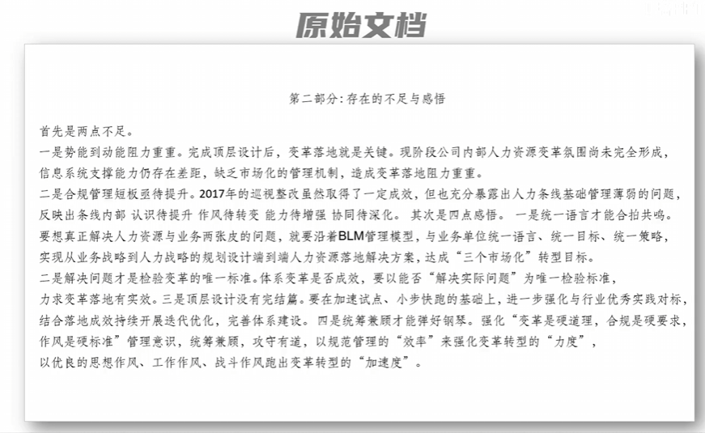
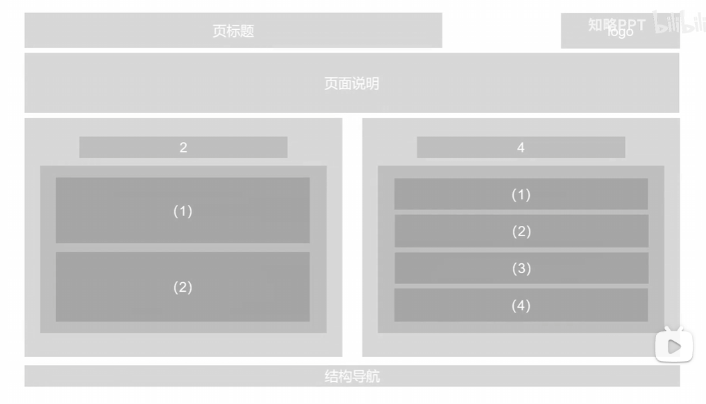
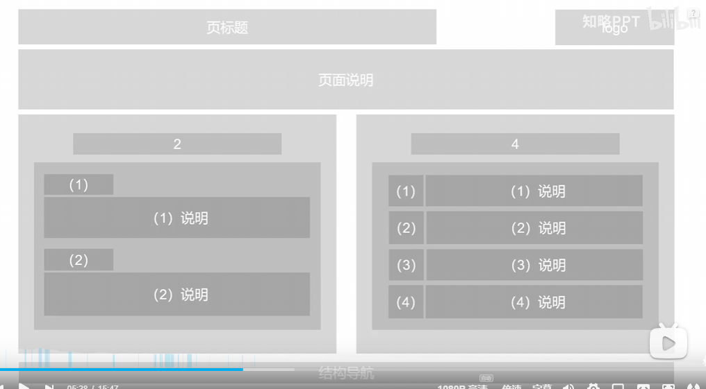
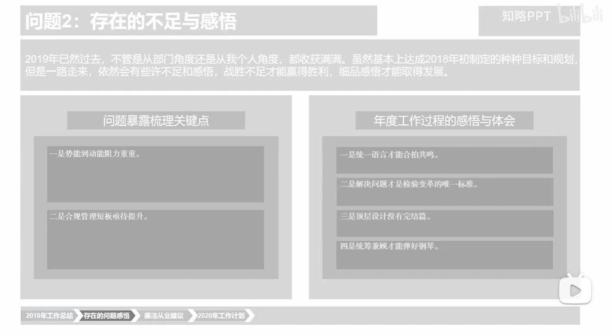
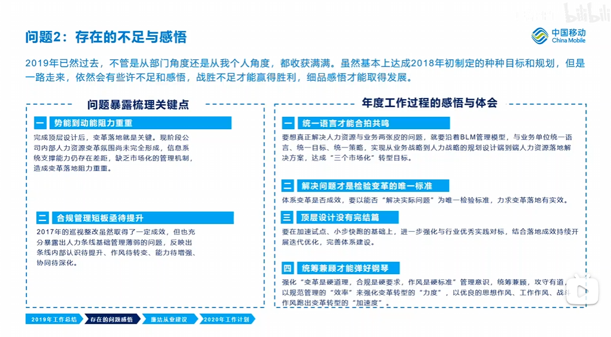
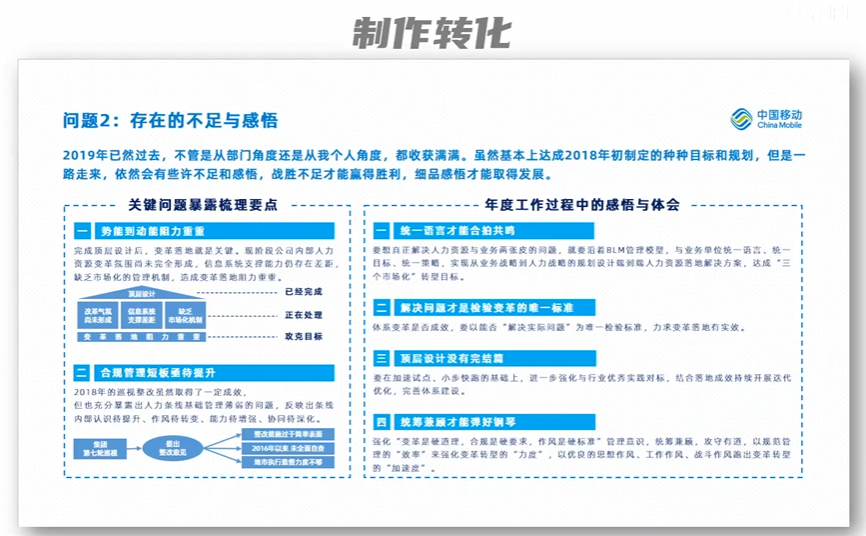

# 从原稿到页面：先分清归属，再展开条目

> 记录日期：2026-09-16
>
> 来源：用户在当前任务中提供的六张截图及口述；未提供原视频链接或源 PPT。
>
> 状态：学习案例／候选方法，尚未通过 PPagenT 的跨稿件验证。
> 原图按理解顺序归档，未裁剪、重绘或改字，六张副本均已核对 SHA256。

## 用户要保留的思路

用户明确描述：“我这一页要说明一个事件。这个事件包括两个观点：观点一要阐述两个依据，观点二要阐述四个依据。”

用户补充的学习目标是：“从一大段话，到分块，到把字安排好地方，到块内用结构进行高级表示。”因此这个案例用作信息组织过程的范本，学习对象包含中间实文编排，不能只模仿最终成品的蓝色和两栏外观。

这意味着先确定每项信息在解释什么、支持谁，再确定它的位置。整页的六个依据分属两个观点，不能脱离各自观点变成六个同级卡片。此前用户也明确：允许提炼、合并和重组原稿；要求保留重要含义和关系，并让展开程度与空间相称，不要求逐字装下全文。

```text
本页要说明的事件／回答的问题
├─ 观点一
│  ├─ 依据一：要点 + 必要说明
│  └─ 依据二：要点 + 必要说明
└─ 观点二
   ├─ 依据一：要点 + 必要说明
   ├─ 依据二：要点 + 必要说明
   ├─ 依据三：要点 + 必要说明
   └─ 依据四：要点 + 必要说明
```

这里的树用来说明归属，不要求在页面上画成树图。观点之间若有对照、递进或因果关系，还须按原稿表达；仅凭两个分支不能判定它们完全独立或互为因果。

## 六张图补齐了哪些步骤

### 1. 原文已经包含分类线索



原稿用“首先是两点不足”“其次是四点感悟”明确划分了两类内容。“一是、二是……”在各类别内重新计数。应先恢复这个层级，再处理长句，而不是按每个编号建立一个顶层区域。

这个具体案例是“两个类别，各有 2／4 个条目”。用户口述的例子是“两个观点，各有 2／4 个依据”。两者可以使用相似的包含与分组方法，但语义不同：感悟不自动成为证明不足的依据，也不能把四点感悟擅自分配成两项不足的解决方案。

### 2. 先分整页层级，再分支内层级



可直接观察到：标题和 logo 位于上方，页面说明跨正文宽度，下方是两个并列分支，左边含两项、右边含四项，底部另有结构导航。大分支包含自己的条目，组间的距离大于组内距离。

“2”和“4”是骨架中的数量标记，不是最终应上屏的观点标题。标题、页面说明、正文分支、导航也不属于同一内容层级：标题建立主题，说明提供理解主题所需的背景，正文展开，导航指示在整套报告中的位置。并非每页都需要这些区域；没有新增信息的说明可省略，logo 和导航由实际 Skin 及文稿需要决定。

### 3. 每个条目继续拆成要点和展开



第二张骨架在左侧采用“条目标题在上、说明在下”，右侧采用“短标签在左、说明在右”的紧凑行。其共同结构都是“条目要点 + 对应说明”，只是局部空间组织不同。

这使读者能够先扫各项要点，再选择需要阅读的细节。短标签不应获得与长说明相同的面积，说明也不能脱离所解释的要点独立成为无归属的区域。最终成品没有逐项照搬这张骨架的几何，说明骨架仍可随真实内容调整。

### 4. 用真实内容检查分类是否成立



“2／4”被替换为两类内容的名称；左边两项不足、右边四项感悟进入各自分支。此时即使没有配色与图形，也已能判断是否分组正确、是否漏项、标题是否承担了不同职责。

这张图仍有大量待展开的灰区，属于编排中间态，不能用它证明最终密度合理。需放入实际说明，才能判断长短、留白与分页。原文信息不必逐字复制，但压缩后不能把“有成效但仍暴露问题”改成全盘失败，也不能把检验标准写成已经实现的结果。

### 5. 先让完整文字在各自位置上可读



用户最后补充的截图展示了关键中间态：两类内容与六个条目标题已排好，每项说明回到对应标题下。左侧两项、右侧四项仍清楚成立，此时还没有最后成品中的局部结构图。

可以先检查“文字安排是否说清楚了”：观点／条目要点是否先被看见，说明是否紧跟，重复信息是否合并，条件是否保留。图示不是用来补救未分清归属的长段落，而是在已经明确的局部信息上选择更易读的表达。表达选择后可以回调精简文案和调整面积，不是先锁死矩形后再填图。

左侧仍有较多空位，后续成品在相应条目中加入图示。由这组前后图可推导出局部图文展开的方向，但不能据截图证明每块空位都已事先精确预算。中间态留有待展开空间可以接受，最终成品还应重新检查密度。

### 6. 按局部关系选择表达并调整空间



成品左侧的两项不足含短文和局部图示；右侧四项感悟主要用分项标题和说明。左栏较窄、右栏较宽，与前面近似等宽的骨架不同。图示服务于各自问题内部的关系，没有把整页变成一张流程图。

这张成品仍保留不少说明文字。可学习的变化包括恢复分类、提取阅读锚点、建立包含关系、局部图文分工和调整展开空间；不能把其成效全部归因于删字，也不能据截图认定小字密度适合所有投影环境。

## 从原文推导结构，而不是从框反推内容

下表是本次对原文的归纳，不是截图的逐字转写，也不是一版已经通过验收的 PPT 文案。

| 原稿内容 | 在本页中的归属 | 要保留的含义与关系 | 可选表达 |
| --- | --- | --- | --- |
| 势能到动能阻力重重 | 不足 → 问题一 | 顶层设计完成；变革氛围、系统支撑、市场化机制仍存在不足，与落地阻力有关 | 短标题与说明；需要展开时，用局部图示区分已完成设计、落地障碍与目标 |
| 合规管理短板亟待提升 | 不足 → 问题二 | 2017 年巡视整改取得一定成效，同时暴露基础管理薄弱；认识、作风、能力、协同四方面仍需提升 | 保留“成效与问题并存”的说明，四方面用紧凑分项；不凭三个图框漏掉第四方面 |
| 统一语言才能合拍共鸣 | 感悟 → 第一项 | BLM 管理模型；统一语言、目标、策略，贯通业务战略、人力规划与落地方案，指向转型目标 | 标题加短说明；若展开内部关系，再采用局部层级或对应表达 |
| 解决问题才是检验变革的唯一标准 | 感悟 → 第二项 | “能否解决实际问题”是检验尺度，不是已经成功的证据 | 突出标准的短句即可，不需要强制图示 |
| 顶层设计没有完结篇 | 感悟 → 第三项 | 加速试点、小步快跑、行业对标，并结合落地成效持续迭代 | 短说明；仅当持续反馈是本页重点时才展开循环关系，不能凭几个动词造出固定串行阶段 |
| 统筹兼顾才能弹好钢琴 | 感悟 → 第四项 | 变革、合规、作风共同受关注；规范管理和良好作风支撑变革落地 | 标题加并列要点／说明；不改成三步流程 |

可以按以下顺序完成新的稿件：

1. **确定本页要让读者理解什么。** 一页可以围绕一个问题展开两个观点，不等于一页只能有一个内容块。标题概括共同主题或有依据的结论，正文负责展开其内容。
2. **先找归属。** 每段话是哪个观点的依据、哪项问题的说明，还是全页共同背景？合并重复说明，保留限定与例外的归属。用一个朴素提纲就能表达清楚时，不另建逐句关系图。
3. **再看同层关系。** 同组条目是并列理由、真实步骤、不同对象的比较，还是有证据的因果？这决定局部表达；编号的出现不等于有先后顺序。
4. **形成可阅读的实文。** 为需要快速扫描的条目提炼短要点，把必要事实与解释放在其下或相邻位置。可用短语、合并重复内容；不能把后台“表达作用”等说明当作实际观点。
5. **选择文字或局部图示。** 短观点和解释可以直接用文字。需要呈现对应、分支、时序或层级时，按该局部关系检索现有结构。整页组织与区域内的关系表达分别处理。
6. **用真实内容分配空间。** 测量正常字号下的标题、说明与图示容量，再调整列宽、条目高度、局部行列或分页。先满足理解所需的展开，再处理剩余空间。

## 为什么不能把 2∶4 直接换成面积 1∶2

骨架中的两大分支接近等宽：左侧两项各占较多纵向空间，右侧四项各占较少纵向空间。成品又根据真实展开调整了列宽。它提供了一个明确反例：条目数量并不直接决定区域面积。

一个“依据”可能只有一句数据结论，也可能含口径、证据和必要限定。左侧两项若各需解释障碍并配局部图示，所需面积未必小于右侧四项短体会。面积应综合考虑重要性、实际文字行数、关系表达需要和阅读留白；不能按字数比例直接计算，也不能为了对称填充空话。

可操作的判断是：读者是否先看见两组及其要点；每项说明是否紧跟所属条目；某一栏是否挤满而另一栏只有少量标签；空白是帮助分组，还是固定容器留下的无意义空洞。发现问题后优先调整内容归属、展开方式与空间分配，不能缩小正文或重复结论来凑平衡。

## 对 PPagenT 的具体启发与边界

这组图提示需要检验“页面目的 → 分支职责 → 分支内条目 → 条目内要点与说明”能否在灰稿中连续读出。`role` 的文字描述并不足够：读者必须能从组标题、包含、邻接、层级和阅读顺序识别归属。独立画出两个文本框也不足以证明它们已完成各自职责。

目前 `gray-plan-3` 已有 `pagePurpose`、`claim`、`groups`、`role`、`heading` 与 `blocks`，无需为本案例另设“事件／观点／依据”必填字段或强制页型。“两个分支”可由已有组承载，“分支内条目”可由块与标签承载。本次发现的具体承载缺口是：媒介原先只能选在整个组上，不能让同组某个条目转为局部图示而保留其他条目的文字层级。修订复用相同的 `kind / expression / relationship / production` 字段，允许文字组内的条目选择局部蓝区；不增加任意层级树或语义分类器。

现有表达阶段应负责决定哪些信息共同阅读、怎样展开以及用何种媒介；布局阶段按已确定的内容关系落实空间。`single / row / column / grid` 继续作为空间操作。已有组合求解器支持嵌套；灰稿现在在页级组合之内复用它安排已有 blocks 的纵向子区，未引入任意层级规划，也不能据此声称截图中的各级组织已全面实现。

本轮灰稿中，普通文字呈现实际文案与层级；选用图示的局部仍按既有约定使用浅蓝制作说明，不据此案例自动推进正式绘图或美化。蓝区也应只承担对应局部关系，不能因为一个条目需要图示，就吞并整页其他观点和说明。

用户随后进一步明确：蓝框说明“这里放什么”可以，不希望灰稿把块内图示节点也画出来；被退回的原因包括分区太粗、两栏上下边界不齐、页面空间分布欠妥。因此灰稿不能止于两个大框和内部连续文字。应保留大分支归属，在栏内显式区分各条目、要点与说明，普通文字和蓝区均有对应子区；同排主体栏对齐上、下边界，内部按实际文字需求分配高度和留白。这里的“分得更细”是可见的内容区域与层级，不是提前绘制流程节点或把所有原句变成卡片。

结构是否成立要看具体稿件。两个视图可能共同支持一个结论，也可能只是两个并列类别。对八周试点原稿，三项准则仍是选择尺度，不能因本案例使用“观点—依据”的说法，就改写成方案满足准则的证明；同时准备第二路径的工作也仍是并行。

## 如何验证学到的是方法

后续用固定实现与配置检查以下迁移，不在本次笔记任务中重新生成多轮 PPT：

| 变化 | 应保持的能力 | 能暴露的问题 |
| --- | --- | --- |
| 将 2／4 改为 3／2，调换原文段落顺序 | 仍按真实归属分组，不照搬原来的左右槽位 | 是否只是记住了截图 |
| 一组条目少但解释长，另一组条目多但说明短 | 依据实文与表达需要分配空间 | 是否按数量均分或硬填空白 |
| 将两个观点改成问题与建议、或两个并列类别 | 保留真实语义，不把所有子项称为证据 | 是否用角色标签补造论证 |
| 在某个条目内加入并行、否定、条件或反例 | 压缩后仍附着于正确对象，且关系清楚 | 是否只留短标题、漏掉关键限定 |
| 换为窄版或小内容区 | 能调整局部表达或分页，保持正常字号和归属 | 是否只能在一张样例尺寸成立 |

程序检查来源和容量，实际图像检查层级、归属、密度与阅读路径，再由用户验收。它们不能相互替代。本笔记没有证明通用能力已经实现，也没有把此前被退回的宽版改列为成功基线。

## 来源与可采用范围

- 六张截图均来自用户；中间骨架图可见“知略PPT”水印，但未核实视频作者、发布日期或完整课程上下文。图片在此用于项目内部学习，不冒充自制。
- 顶部导语中的 2019／2018 年度背景，在所提供的原稿截图中找不到对应内容。可能来自截图之外的资料，当前不能将其作为可自由补写事实的示范。
- 原稿中的“2017 年巡视整改取得一定成效”与上述新增年度背景是不同内容，提炼时不能混淆。
- 成品左下图示的细小标签无法全部可靠辨读；不根据外形推定它完整保留了原稿四方面问题。可学习其局部表达的选择，不照抄未经核实的节点或箭头。
- 标题条、虚线框、蓝色、logo、导航属于此示例的视觉实现，不是所有稿件的结构要求。笔记是参考材料，正式规则仍以 [rules](../../../rules/README.md) 为唯一入口。
