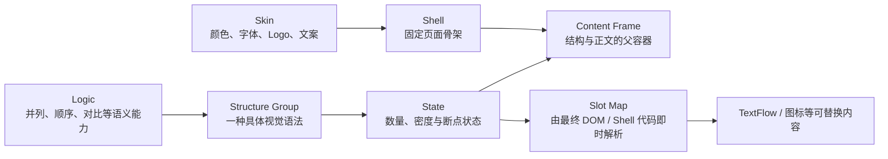
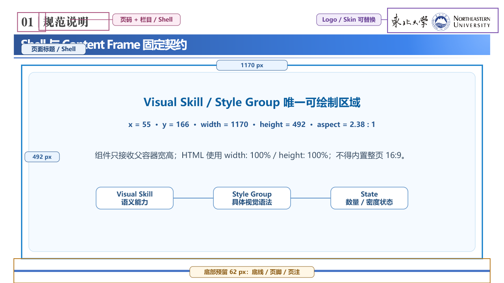

# Shell、Content Frame 与 Logic 契约

本文固定当前实验使用的页面壳、正文内容区域和结构能力颗粒度。它是后续蒸馏 Structure Group、编排整套 PPT 和扩展其他学校 Skin 时的共同接口。

## 一、固定分层

- **Skin** 决定学校或组织身份，包括颜色、字体、Logo 和页注文案。
- **Shell** 决定版式骨架，包括页码、栏目、Logo 槽、标题区、分隔线、Content Frame 和底部预留。当前先冻结几何，Skin 以后可以替换身份和主题值。
- **Logic** 是视觉导演按语义调用的能力，例如 `parallel`、`sequence`、`comparison`。
- **Structure Group** 是某个 Logic 下的一种具体视觉语法，例如“中心辐射”“横向卡片”“交错双列”。一个 Logic 可以登记多个 Structure Group。
- **State** 是同一 Structure Group 面对不同数量、密度或断点时的确定性排布结果。State 不是新的自由设计，也不应被保存成互不相关的页面。每组只声明其视觉语法真正支持的范围；矩阵可以固定四项，金字塔可以只支持 3–5 层，不要求所有 Structure Group 统一扩成 3–8 项。
- **Content Slot** 是父 Structure Group 在某个 State 下最终求解出的真实可见填充区域。它不是整个灰色承载面，也不是整页 Composition 槽位；遮罩、圆环或装饰占去的区域不能算进可填空间。

Logic 只有在“现有 Logic 无法在不损失关键关系的前提下表达该内容”时才进入能力地图。时间轴属于 `sequence + temporal`，成熟度属于 `sequence + monotonic`，泳道属于 `sequence + roles`；这些应作为关系属性或既有 Logic 下的 Structure Group，而不是为了名称齐全另建 Logic。每次新增 Logic 前必须先回答：它与已有 Logic 的选择条件是否互斥、视觉结构是否承载了不可替代的语义；若答案是否定的，就合并或降为属性。

目标颗粒度是：

> `Logic → Structure Group → State → Slot Map → 可替换内容`

核心资产包正式登记 `logicId / structureGroupId / stateContract`，候选发现结果也暴露这些字段。State 仍由程序根据内容与父容器确定性求解，不由导演逐页重画。

Slot Map 不是第二份手工登记表。入库阶段从 HTML 的 `data-slot-*` 与浏览器计算样式生成紧凑的 `slot-contract.json`，固化控件、字段、槽位身份、真实矩形、字体、字号和容量。默认状态与每个控件的独立变化只记录一次；只有资产明确声明的控件联动才增加代表状态，不能预展开全部组合。看板直接展示这份结果；后续正式生成只读取，不再现场测量。

结构只声明连续的 **TextRegion**，不在结构代码中分别固化标题框、正文框、数值框或说明框。文字区域取得真实矩形后，从文字排版库选择尺寸和内容组合相容的 **Text Layout**；标题正文自适应只是其中一种排版，数值说明上下排是另一种。同一地区域可更换兼容排版而不修改结构图几何；浏览器求解后的字号、分行和内部子区直接进入 Native 编译。

同一语义节点若存在空间分离或形状不连续的文字承载面，应以不同 `regionId` 保留多个 TextRegion，不能为了追求“一个容器”而强行合并。标题、正文、数值、标签只是本次排版的内部部分，不是结构的固定小容器。

文字排版库是独立能力库。每种排版声明名称、可承接的内容组合和最小区域；看板直接读取该库，并在结构详情中显示每个 TextRegion 当前绑定的排版及可替换排版。排版库与结构共用同一运行时代码，不另抄人工登记表。

这里的可编辑 Slot Contract 与后文二层 Content Slot 不同：前者描述当前组件已有文字和图标怎样填充；后者描述父结构中未来可继续放置子内容的区域。正式生成已经使用前者规划 `componentText` 与 `iconQueries`，后者当前仍固定使用普通文字兜底。

## 二、当前固定 Shell

唯一几何来源是 `PPT源/PPT模板-封面正文尾页.pptx` 第 3 页。固定契约位于 `src/runtime/shells/academic-report.mjs`，东北大学 Skin 只引用该契约，不再另写一份正文坐标。

画布为 `1280 × 720 px`。正文页主要槽位如下：

| 槽位 | x | y | width | height | 所有者 |
| --- | ---: | ---: | ---: | ---: | --- |
| 页码 | 44.45 | 31.90 | 71.23 | 48.47 | Shell，文案由运行时填写 |
| 栏目 / 章节 | 98.87 | 31.90 | 177.93 | 45.24 | Shell / Skin |
| Logo | 984.21 | 20.82 | 280.94 | 62.29 | Shell 定位，Skin 替换内容 |
| 标题带 | 35.17 | 87.55 | 1209.67 | 52.42 | Shell / Skin |
| 页面标题 | 9.04 | 88.85 | 1250.55 | 48.47 | Shell 定位，稿件提供文本 |
| **Content Frame** | **55** | **166** | **1170** | **492** | Composition / Structure Group |
| 底部预留 | 35.17 | 658 | 1209.67 | 62 | Shell / Skin |

标题下分隔线位于 `y = 147.22`，底线位于 `y = 689.24`。Content Frame 左右各保留 `55 px`，宽度占整页 `91.41%`，高度占整页 `68.33%`，面积约占整页 `62.46%`，宽高比约为 `2.38:1`。

这意味着 Structure Group 的设计基准不是整页 16:9，而是 `1170 × 492` 的真实父容器。HTML 根组件必须使用父容器尺寸，例如 `width: 100%; height: 100%`，并在此范围内自行处理内边距、断点、换行和密度；不得把标题、Logo、页码、背景或页脚复制进组件。

东北大学 Skin 与新 Structure Group 都直接引用同一 Content Frame 契约，不再维护另一套正文坐标。

## 三、标注页

- [可编辑 PPTX 标注页](../experiments/shell-content-frame-contract/output/shell-content-frame-contract.pptx)
- [生成脚本](../experiments/shell-content-frame-contract/generate-shell-contract.mjs)

标注页直接复制来源模板正文页，保留原有 Logo、标题带、页眉和底线；新增框线、标签和说明均为 PowerPoint 原生可编辑对象。

## 四、Structure Group 的完整对象

一个 Structure Group 不是一张图，也不是一个数量状态。核心包固定由六类信息构成：

1. `asset.json`：保存来源、Logic / Structure Group 身份、语义边界、State、空间范围和轻量入口；全库启动时只读取这一层。
2. `runtime.mjs`：只在资产粗筛入围后加载，暴露 HTML 组件容量、Content Slot resolver 和 PageContent Mapper；不得导入浏览器或 PPT 重型运行库。
3. `review.mjs`：保存 HTML 审美组件、可替换内容和 State 参数解析；`runtime.mjs` 与看板复用它，不另抄容量。
4. `generate.mjs` 与通用编译器：只在实际预览或渲染时加载，读取浏览器求解的 DOM/CSS、SVG 几何和文字样式并生成原生 PowerPoint 对象。
5. 一份共享预览输入：由 `previewParametersExport` 和 `previewResolverExport` 暴露，使 HTML 与正式运行接收同一组内容和 State 选择。
6. Native State 产物：同一 State 只编译一次最终 PPTX，并由该 PPTX 渲染 PNG；看板缩略图、详情预览和下载共用它。`example.pptx` 仅作为脱离看板或旧资产的兼容示例，不得成为第二条预览真源。

其中的契约必须覆盖适用关系、数量范围、TextRegion、媒体要求、最小尺寸、轮廓、密度，以及 `items`、节点内 `points` 和重复视觉条目的语义接口。图标、中心图像和文字内容等可变槽必须进入参数，不得固化来源模板中的第三方内容。图标槽必须声明独立于外部装饰形状的安全内框；正式生成只往安全内框填图标，不把整个圆形、卡片或承载面误当成图标容器。

每个 Structure Group 还必须声明 `fieldContract`，把真实应用中的字段分为“可编辑、程序生成、固定、当前未开放”四类。看板示例中的文字只是预览值，不能让维护者猜测哪些会随稿件变化。

每个 State 还必须登记其在 `1170 × 492` 设计坐标系中的自然占用宽高、最小可用宽高和文字区域。Text Layout 的容量、实际字号和内部 Primitive 位置由相同 HTML 在入库时派生，不由资产作者另抄标题／正文上限。Structure Group 不必填满 Content Frame；这些空间信息用于正式生成时判断组件适合整区、半区或与文字组合，不能用非等比例拉伸代替真实排版。

字号由 Skin 的语义字号角色统一提供。当前组件使用 `25 / 23 / 21 / 19 / 17 / 15 pt`，普通正文默认为 17 pt。HTML Structure Group 只能引用这些角色，不能按 State 或数量发明字号；通用编译器会按固定容器实测文字，选择规范档位中能完整容纳的最大一级，正文最多从 17 pt 降到 15 pt。若 15 pt 仍放不下，则调整容器或结构，或压缩、拆页、换组、拒绝，不做连续缩放或低于下限的“硬塞”。组件按登记的自然占用尺寸进入 Composition，不能靠任意缩放改变字号层级。

固定高度的单行短标签必须使用真实的 Flex/Grid 视觉居中，不能用“行高等于容器高度”模拟居中。通用编译器会继承 HTML 的单行、水平居中和垂直居中结果，再按上述离散档位处理溢出，避免 Native PPT 出现数字错位或标签被拆行。

预览 PNG、布局检查文件和看板 JSON 都是从上述对象即时生成的缓存，不属于资产真源，也不得人工维护第二份数据库。

Structure Group 在 HTML Component 中完成设计、数量响应、间距、字体和层级。确认后不再为同一版式手写第二套布局：通用编译器读取最终 DOM/CSS/SVG 并生成 Native 形状。HTML 截图不能进入正式 PPTX；进入 PPTX 的仍是文字、形状和自由曲线等可编辑对象。

当前已有 12 组正式结构 Structure Group；准确清单以 `assets/资产索引.md` 和各资产 `asset.json` 为准。新资产统一以 HTML 为布局真源，由通用编译器生成 Native PPT，不再为同一版式维护第二套布局代码。

### Content Slot 契约

Content Slot 先用于声明父结构中真正可填的区域。当前只在槽内放普通文字，不建立二级 Logic 或递归布局系统。

父 Structure Group 必须先确定 State 和一级拓扑，再从同一布局求解器导出槽位。`asset.json.runtime.slotContract` 至少声明：

- `schemaVersion`：槽位契约版本；
- `coordinateSpace=design-frame`：坐标基于组件自己的 `1170 × 492` 设计框，不是整页坐标；
- `resolverExport`：返回动态槽位的导出函数；
- `binding`：槽位与父内容项的绑定关系；
- `maxDepth=1`：只记录一层可填区域，不继续递归；
- `childPolicy`：为未来二级结构预留，当前不启用；
- `fallback=plain-text`：当前固定使用普通文字。

解析后的每个槽位至少包含 `id / bindingPath / role / frame / side / alignment / capacity / allowedContentModes / fallback`。其中 `frame` 是排除圆环遮挡、装饰和内边距之后真正可用的矩形；容量声明至少覆盖最大深度、条目数和单条字数。

当前选择顺序固定为：父 Structure Group → 父 State → Content Slots → 普通文字。二级结构何时接入、怎样选择和怎样编译，留到一级资产库稳定后再设计；当前不得自行开启。

`items[].points[]`、`componentBindings` 和 Content Slots 的职责不同：`points` 是来源已有的二级语义，`componentBindings` 是视觉导演对重复视觉单元的内容适配，Content Slots 是组件提供的空间容器。声明槽位不会自动创造内容，也不会自动把任意 `points` 升级成子结构。

### 媒体契约

媒体槽不是装饰占位，必须随 Structure Group 一起声明为硬约束：

- `required` 媒体只能来自稿件或已登记媒体资产；不得生成、搜索或虚构素材来让候选勉强成立。
- 来源页中央有主体照片时，组件必须把它建模为可替换的 `centerVisual`，不能把来源雪山、人物或第三方图片固化为默认内容。
- 外围圆槽优先承载与内容对应的 Logo；语义不适合 Logo 时，允许替换为已登记图标。
- 若中央图片是该 Structure Group 的视觉中心，则它不能用 Logo、图标、渐变或任意装饰代替。稿件没有合法中央图片时，该 Structure Group 直接从候选中剔除。
- 同一 Logic 应逐步提供不依赖图片的其他 Structure Group；所需媒体缺失时先换组，再退化为简单文字 Composition。

审阅稿中的“中心图片槽（必填）”与“标识”仅说明接口，不是正式内容，也不能作为缺失媒体时的运行时替代物。

语义图标采用轻量链路：视觉导演只为对应内容项输出简短语义查询，不查看图标库，也不输出文件名；程序使用 Tabler Icons 自带的名称、分类和标签在本地模糊匹配，并只取唯一 Top 1。解析出的 SVG 填入 Structure Group 自己声明的图标安全槽，HTML 与 Native PPT 共用同一个结果。图标检索不增加人工标签表，也不让图标选择反向影响 Logic 或 Structure Group 的判断。

来源页先形成对应数量下的 HTML 初稿；确认关系、核心拓扑和视觉中心没有误读后，继续在同一 HTML Component 中优化审美并求解不同 State。用户的主要审美判断发生在 HTML 工作台，不要求先反复生成 PPT。扩散时可以改变行列、环绕角度、换行或内部比例，并允许在来源基础上改善颜色、留白、层级和装饰；只有语法已经实质变化时，才登记为同一 Logic 下新的 Structure Group。

## 五、正式选择

正式运行按两段完成；当资产声明 Content Slots 时，在父选择之后再增加一个受控槽内步骤：

1. 程序只读全部核心资产的 `asset.json`，按 Logic、关系、item 数、媒体和 State 范围做轻量粗筛；此时不导入组件或渲染代码。
2. 程序只加载粗筛入围资产的轻量运行契约，取得 TextRegion、兼容 Text Layout 和派生容量摘要并完成硬过滤；最终文字以同一排版器实际求解为准。任何必填媒体缺失都使该组不合法。
3. 视觉导演只接收合法候选的结构化能力卡，在整套 PPT 尺度选择 Structure Group，综合轮廓、密度、前后页节奏和已用次数。
4. 程序根据已选父 State 求解 Content Slots；最终选定后才加载该资产 Mapper，渲染时才加载 HTML/PPT 编译运行库。

State 由内容数量、容量和父容器确定性求解，视觉导演不为每个数量重新绘图。正式生成只能调用已经登记并经用户确认的核心 Structure Group。

### 主节点与节点内分点

Logic 的调用接口采用两级版式中立内容：

- `items[]`：页面主关系中的同级语义节点，例如流程阶段、并列对象或对比双方。
- `items[].points[]`：某个主节点内部的支撑维度、例子或判断项。

内容导演负责忠实形成原稿本来就有的两级语义结构；视觉导演不得把这些 `points` 提升成同级主节点。这里还要和 Structure Group 自身的“重复视觉单元”分开：当模板需要把一段来源内容整理为若干短卡、标签或对比条目时，由 Structure Group 在 `runtime.contentContract.bindings` 声明绑定 ID、适用范围、最少/优先/最多条目数、单条字数、是否跨组均衡和来源约束；视觉导演选择该 Structure Group 后，在 `CompositionPlan.componentBindings` 中决定本页实际拆成几点及其短句。内容导演不需要预知组件内部要几行。

因此，`points` 是来源语义，`componentBindings` 是视觉适配结果，二者不能混为一谈。程序在候选阶段按 `itemRole`、`points`、TextRegion 和媒体契约做过滤，在 Composition 阶段验证绑定 ID、数量、来源依据及 `title/body/points` 覆盖；实际文字能否装入由统一排版器判断。绑定型组件所在 Composition 只有组件槽时，绑定结果即为文字区的内容，不再重复创建文字槽。

为避免长上下文内容导演偶尔漏掉节点内层次，正式生成允许一个受限补充回路：视觉导演选中能承载 `points` 的 Structure Group 后，可以指出具体页面和主节点；小型结构模型仅从对应 `sourceText` 提取短分点，程序核对来源片段、候选容量和节点 ID 后合并。该回路整套至多一次，不改标题、正文、主节点数量和页序，也不再次调用视觉导演；不足时沿用原编排、换合法候选或退化为简单排版。它不是新的资产蒸馏流程，也不扩展为通用递归框架。

当前顺序流程 Logic 已声明 `itemRole=semantic-node`、`points=optional`。对“作品—规律—能力”这类页面，流程仍然只有三个步骤；“表达、容量、变化、禁忌”以中间节点内分点显示，不能扩成四个步骤。

如果某页没有合法结构 Structure Group，应退化为 Shell 内已经登记的简单文字排版，例如单观点、标题加要点或基础列表；这不是临时自创结构图。只有当简单排版也无法在容量和字号边界内成立时，才压缩、拆页或失败关闭，并登记资产缺口。

## 六、后续工作边界

当前先固定 Shell 和 Content Frame，再蒸馏更多 Structure Group。其他学校版本可以替换 Logo、颜色、字体、栏目和页注文案；除非真实模板证明版式骨架必须改变，否则继续复用本 Shell 几何。未确认的 Structure Group 仍需用户明确确认后才能标记为正式可调用，Luna 只承担来源 PPT 的蒸馏与入库，不参与正式生成线。

当前实现状态必须分开理解：Shell 几何、核心资产发现、12 组 HTML 单源结构和正文兜底已经进入运行时代码。循环闭环可动态解析 3–6 步 State 的 Content Slots；二级 Logic 的候选、绑定和嵌套渲染尚未进入正式流程，当前只使用普通文字兜底。
