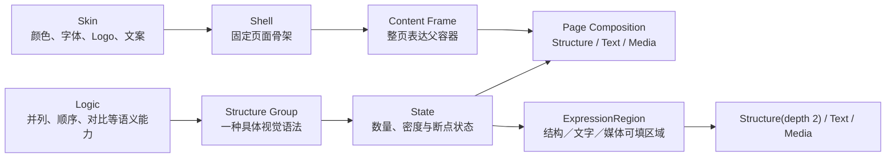

# Shell、Content Frame 与 Logic 契约

本文固定当前实验使用的页面壳、正文内容区域和结构能力颗粒度。它是后续蒸馏 Structure Group、编排整套 PPT 和扩展其他学校 Skin 时的共同接口。

## 一、固定分层

- **Skin** 决定学校或组织身份，包括颜色、字体、Logo 和页注文案。
- **Shell** 决定版式骨架，包括页码、栏目、Logo 槽、标题区、分隔线、Content Frame 和底部预留。当前先冻结几何，Skin 以后可以替换身份和主题值。
- **Logic** 是视觉导演按语义调用的能力，例如 `parallel`、`sequence`、`comparison`。
- **Structure Group** 是某个 Logic 下的一种具体视觉语法，例如“中心辐射”“横向卡片”“交错双列”。一个 Logic 可以登记多个 Structure Group。
- **State** 是同一 Structure Group 面对不同数量、密度或断点时的确定性排布结果。State 不是新的自由设计，也不应被保存成互不相关的页面。每组只声明其视觉语法真正支持的范围；矩阵可以固定四项，金字塔可以只支持 3–5 层，不要求所有 Structure Group 统一扩成 3–8 项。
- **Structure／Text／Media** 是整页和结构内部共用的三种内容表达。Structure 是可组合节点，Text 与 Media 是内容节点。
- **ExpressionRegion** 暂指父 Structure Group 在某个 State 下最终求解出的真实可见填充区域。它声明允许的表达类型；现有只接受文字的 TextRegion 和 Content Slot 均作为迁移基础。遮罩、圆环、装饰和内边距占去的区域不能算进可填空间。
- **Surface** 是背景、边框、色块、强调边与内边距等可选视觉承载，不是第四种内容表达。

Logic 只有在“现有 Logic 无法在不损失关键关系的前提下表达该内容”时才进入能力地图。时间轴属于 `sequence + temporal`，成熟度属于 `sequence + monotonic`，泳道属于 `sequence + roles`；这些应作为关系属性或既有 Logic 下的 Structure Group，而不是为了名称齐全另建 Logic。每次新增 Logic 前必须先回答：它与已有 Logic 的选择条件是否互斥、视觉结构是否承载了不可替代的语义；若答案是否定的，就合并或降为属性。

下一阶段目标颗粒度是：

> `PageContent 内容块 → Page Composition → Structure / Text / Media → ExpressionRegion → State / Markdown Renderer / Media Fit`

核心资产包正式登记 `logicId / structureGroupId / stateContract`，候选发现结果也暴露这些字段。State 仍由程序根据内容与父容器确定性求解，不由导演逐页重画。

Slot Map 不是第二份手工登记表。入库阶段从 HTML 的 `data-slot-*` 与浏览器计算样式生成紧凑的 `slot-contract.json`，固化控件、字段、槽位身份、真实矩形、字体、字号和容量。默认状态与每个控件的独立变化只记录一次；只有资产明确声明的控件联动才增加代表状态，不能预展开全部组合。看板直接展示这份结果；后续正式生成只读取，不再现场测量。

结构只声明连续的 **TextRegion**，不在结构代码中分别固化标题框、正文框、数值框或说明框。新文字能力使用受控 Markdown 保存标题、段落、列表、引语、强调和分隔；Markdown 解析为稳定 Token 后，再由统一 Renderer 在真实区域中排版。浏览器求解后的字号、分行和内部子区直接进入 Native 编译。

同一语义节点若存在空间分离或形状不连续的文字承载面，应以不同 `regionId` 保留多个 TextRegion，不能为了追求“一个容器”而强行合并。一个连续 TextRegion 内允许使用命名区域模板，把同一份 Markdown Token 分配到 lead、body 等内部区域；模板只改变几何与内容分配，不改写 Markdown，也不新增字段组合排版。

PPA 新文字库只公开两种渲染模式：`markdown-flow` 负责传统连续文档流，`markdown-zoned` 负责在同一 TextRegion 内调用受控命名区域模板。标题正文、标签正文、指标正文等字段排列不再各自成为 Text Layout。现成优秀排版可以沉淀为区域模板，但只有真实阅读路径或区域几何不同才新增模板，不能为字段有无或样式换皮增加候选。

新 Markdown 区域模板、候选视觉层和 Surface 必须先进入 PPA 文字库，至少覆盖较少、代表性和较多内容及其真实区域尺寸，并通过最低字号、越界、裁切、意外遮挡和整体溢出检查。模板只定义网格、层级、对齐、留白与 Token 分配，颜色、字体和主题身份必须从当前 Skin 读取。自动检查通过只代表“可进入人工视觉审批”；用户确认 HTML 后还要完成一次 HTML／Native 对照，特别确认行内强调与列表可被原生对象忠实编译，才允许正式生成线调用。

页面直接文字、Structure 内文字和 Surface 内文字统一使用 `TextRegion + 受控 Markdown + Renderer + Skin 字号令牌`，不建立第二套页面文字系统。ExpressionRegion 负责“区域可接收哪种表达”，TextRegion 负责“文字在区域内怎样排版”；两者不能混为一张手工登记表。旧十种 Text Layout 暂时只作为已审批 Structure Group 的隐藏兼容渲染器，不再出现在 PPA 新文字库或新2+3候选中，待逐项迁移后删除。

## 二、当前固定 Shell

唯一几何来源是 `PPT源/PPT模板-封面正文尾页.pptx` 第 3 页。固定契约位于 `src/runtime/shells/academic-report.mjs`，东北大学 Skin 只引用该契约，不再另写一份正文坐标。

画布为 `1280 × 720 px`。正文页主要槽位如下：

| 槽位 | x | y | width | height | 所有者 |
| --- | ---: | ---: | ---: | ---: | --- |
| 页码 | 44.45 | 31.90 | 71.23 | 48.47 | Shell，文案由运行时填写 |
| 栏目 / 章节 | 98.87 | 31.90 | 177.93 | 45.24 | Shell / Skin |
| Logo | 984.21 | 20.82 | 280.94 | 62.29 | Shell 定位，Skin 替换内容 |
| 标题带 | 35.17 | 87.55 | 1209.67 | 52.42 | Shell / Skin |
| 页面标题 | 9.04 | 88.85 | 1250.55 | 48.47 | Shell 定位，稿件提供文本 |
| **Content Frame** | **55** | **166** | **1170** | **492** | Composition / Structure Group |
| 底部预留 | 35.17 | 658 | 1209.67 | 62 | Shell / Skin |

标题下分隔线位于 `y = 147.22`，底线位于 `y = 689.24`。Content Frame 左右各保留 `55 px`，宽度占整页 `91.41%`，高度占整页 `68.33%`，面积约占整页 `62.46%`，宽高比约为 `2.38:1`。

这意味着 Structure Group 的设计基准不是整页 16:9，而是 `1170 × 492` 的真实父容器。HTML 根组件必须使用父容器尺寸，例如 `width: 100%; height: 100%`，并在此范围内自行处理内边距、断点、换行和密度；不得把标题、Logo、页码、背景或页脚复制进组件。

东北大学 Skin 与新 Structure Group 都直接引用同一 Content Frame 契约，不再维护另一套正文坐标。

## 三、标注页

- [可编辑 PPTX 标注页](../experiments/shell-content-frame-contract/output/shell-content-frame-contract.pptx)
- [生成脚本](../experiments/shell-content-frame-contract/generate-shell-contract.mjs)

标注页直接复制来源模板正文页，保留原有 Logo、标题带、页眉和底线；新增框线、标签和说明均为 PowerPoint 原生可编辑对象。

## 四、Structure Group 的完整对象

一个 Structure Group 不是一张图，也不是一个数量状态。核心包固定由六类信息构成：

1. `asset.json`：保存来源、Logic / Structure Group 身份、语义边界、State、空间范围和轻量入口；全库启动时只读取这一层。
2. `runtime.mjs`：只在资产粗筛入围后加载，暴露 HTML 组件容量、Content Slot resolver 和 PageContent Mapper；不得导入浏览器或 PPT 重型运行库。
3. `review.mjs`：保存 HTML 审美组件、可替换内容和 State 参数解析；`runtime.mjs` 与看板复用它，不另抄容量。
4. `generate.mjs` 与通用编译器：只在实际预览或渲染时加载，读取浏览器求解的 DOM/CSS、SVG 几何和文字样式并生成原生 PowerPoint 对象。
5. 一份共享预览输入：由 `previewParametersExport` 和 `previewResolverExport` 暴露，使 HTML 与正式运行接收同一组内容和 State 选择。
6. Native State 产物：同一 State 只编译一次最终 PPTX，并由该 PPTX 渲染 PNG；看板缩略图、详情预览和下载共用它。`example.pptx` 仅作为脱离看板或旧资产的兼容示例，不得成为第二条预览真源。

核心包还必须具备一条由程序计算的正式可达性见证：其 Logic、关系、用途、数量和可选 `structuredData.type` 必须与正式 PageIntent/PageContent 契约相交。该见证只读清单，不生成页面；失败的资产即使已经审批，也不得在看板或运行时标记为 `autoCallable`。

可达不等于通用。入库时还要由同一份 `contentContract / mediaContract` 自动派生适用性：普通 `title / body` 即可调用的记为通用结构；要求特定 `points`、正负极性、结构化数据或必需媒体的记为专用结构。能力地图分别统计两者；某个高频 Logic 即使已有多个专用结构，只要通用结构仍只有一组，就必须显示“单候选重复风险”，不能用资产总数掩盖实际可用性不足。该分类由清单自动计算，不新增人工登记表。

其中的契约必须覆盖适用关系、数量范围、TextRegion、ExpressionRegion、媒体要求、自然／最小尺寸、轮廓、密度，以及内容块、块内项目和重复视觉条目的语义接口。图标、中心图像和文字内容等可变槽必须进入参数，不得固化来源模板中的第三方内容。图标槽必须声明独立于外部装饰形状的安全内框；正式生成只往安全内框填图标，不把整个圆形、卡片或承载面误当成图标容器。

每个 Structure Group 还必须声明 `fieldContract`，把真实应用中的字段分为“可编辑、程序生成、固定、当前未开放”四类。看板示例中的文字只是预览值，不能让维护者猜测哪些会随稿件变化。

每个 State 还必须登记其在 `1170 × 492` 设计坐标系中的自然占用宽高、最小可用宽高和文字区域。Markdown Renderer 的容量、实际字号和 Token 边界由相同 HTML 在入库时派生，不由资产作者另抄标题／正文上限。Structure Group 不必填满 Content Frame；这些空间信息用于正式生成时判断组件适合整区、半区或与文字组合，不能用非等比例拉伸代替真实排版。

字号由 Skin 的语义字号角色统一提供。当前组件使用 `25 / 23 / 21 / 19 / 17 / 15 pt`，普通正文默认为 17 pt。HTML Structure Group 只能引用这些角色，不能按 State 或数量发明字号；通用编译器会按固定容器实测文字，选择规范档位中能完整容纳的最大一级，正文最多从 17 pt 降到 15 pt。若 15 pt 仍放不下，则调整容器或结构，或压缩、拆页、换组、拒绝，不做连续缩放或低于下限的“硬塞”。组件按登记的自然占用尺寸进入 Composition，不能靠任意缩放改变字号层级。

Structure Group 的共享艺术基线是“简约克制的生成式几何”：优先用少量可编辑 SVG／DOM 基础图形，通过拼合、切分、包围、连续和负空间形成结构身份；避免卡片堆叠、复杂插画和无语义装饰。配色以 Skin 主色及相近色相的低饱和明度阶梯为主，用留白、轻阴影和细线建立层次，不以大量鲜艳颜色区分项目。来源模板可以贡献逻辑、比例和优秀细节，但不得破坏这一整体设计语言。

固定高度的单行短标签必须使用真实的 Flex/Grid 视觉居中，不能用“行高等于容器高度”模拟居中。通用编译器会继承 HTML 的单行、水平居中和垂直居中结果，再按上述离散档位处理溢出，避免 Native PPT 出现数字错位或标签被拆行。

预览 PNG、布局检查文件和看板 JSON 都是从上述对象即时生成的缓存，不属于资产真源，也不得人工维护第二份数据库。

Structure Group 在 HTML Component 中完成设计、数量响应、间距、字体和层级。确认后不再为同一版式手写第二套布局：通用编译器读取最终 DOM/CSS/SVG 并生成 Native 形状。HTML 截图不能进入正式 PPTX；进入 PPTX 的仍是文字、形状和自由曲线等可编辑对象。

当前已有 35 个正式 Structure Group，全部使用 HTML 作为布局真源；准确清单以 `catalog/logic-map.json`、`assets/资产索引.md` 和各资产 `asset.json` 为准。通用编译器生成 Native PPT，不为同一版式维护第二套布局代码。

### ExpressionRegion 与两层嵌套契约

2+3架构允许 Structure、Text、Media 在 Content Frame 中同级组合，也允许一级 Structure 的真实可填区域承载二级 Structure、Text 或 Media。页面根节点不计入 Structure 深度；二级 Structure 可以承载自身文字和媒体，但不得继续嵌套 Structure。

父 Structure Group 必须先确定 State 和一级拓扑，再从同一布局求解器导出 ExpressionRegion。现有 `asset.json.runtime.slotContract` 和 Content Slot 作为迁移基础；具体 Schema 名称待实现前确认。每个区域至少需要表达：

- 区域身份、语义角色和与父内容块的绑定关系；
- 基于组件设计框的真实矩形、内边距、自然尺寸和最小尺寸；
- `accepts`：允许 `structure / text / media` 中的哪些表达；
- 文字容量、媒体适配要求与 Structure 最小空间；
- `overlayPolicy`：默认禁止未经声明的叠加，确有设计需要时由资产显式声明；
- `fallback`：子 Structure 不适配时允许换为 Text、Media、同级组合或拒绝，不能默认缩到最低尺寸以下；
- `maxStructureDepth=2`：运行时必须拒绝第三级 Structure。

TextRegion 是只处理文字排版的区域能力；ExpressionRegion 是可以接收多种表达的父容器。一个 ExpressionRegion 选择 Text 后由统一 Markdown Renderer 求解，必要时调用已批准的命名区域模板；一个 ExpressionRegion 选择 Structure 后必须检查子资产 Logic、自然／最小尺寸、媒体和内部文字契约。

区域声明不会自动创造内容，也不会自动把普通分点升级为子 Structure。内容导演提供真实的内容块与两级语义关系；视觉导演决定使用同级表达还是合法嵌套；程序验证每个必需内容块恰好被覆盖，并完成递归尺寸求解。

当前运行时代码仍只实现旧 Content Slot 的普通文字填充。ExpressionRegion、两层候选、绑定和嵌套渲染属于下一阶段实现，不能把本节决策描述为已经接入正式生成。

当前本地已增加一组不进入正式线的候选接口用于 HTML 验证：`PageContentBlocks 0.1` 用 `coreMessage / contentBlocks / blockRelations` 保存来源语义，每个文字叶子保存受控 Markdown 和 `sourceFragments`；`PageExpressionPlan 0.1` 用 `compositionId / expressions / contentBindings / regionKey / children / derivations` 保存视觉适配结果。PPA 视觉导演填表实验台把前者作为只读输入，只允许人工编辑后者的表达选择与内容绑定，再调用同一个候选运行时重渲染 HTML；它不是第二套表单模型，修改不调用模型、不写入资产。运行时验证必需内容恰好覆盖一次，并拒绝第三级 Structure；浏览器再检查最低字号、越界、裁切和整体溢出。该命名只是两个固定原型的候选结论；用户确认 HTML 后才可据此固化通用 ExpressionRegion、资产尺寸和正式双导演 Schema。

### 媒体契约

媒体槽不是装饰占位，必须随 Structure Group 一起声明为硬约束：

- `required` 媒体只能来自稿件或已登记媒体资产；不得生成、搜索或虚构素材来让候选勉强成立。
- Media 能力必须声明类型、自然／最小尺寸、允许的 `contain / cover` 方式、是否允许裁切、关键内容保护和是否需要说明文字；不能只检查图片没有越界。
- 来源页中央有主体照片时，组件必须把它建模为可替换的 `centerVisual`，不能把来源雪山、人物或第三方图片固化为默认内容。
- 外围圆槽优先承载与内容对应的 Logo；语义不适合 Logo 时，允许替换为已登记图标。
- 若中央图片是该 Structure Group 的视觉中心，则它不能用 Logo、图标、渐变或任意装饰代替。稿件没有合法中央图片时，该 Structure Group 直接从候选中剔除。
- 同一 Logic 应逐步提供不依赖图片的其他 Structure Group；所需媒体缺失时先换组，再退化为简单文字 Composition。

审阅稿中的“中心图片槽（必填）”与“标识”仅说明接口，不是正式内容，也不能作为缺失媒体时的运行时替代物。

语义图标采用轻量链路：视觉导演只为对应内容项输出简短语义查询，不查看图标库，也不输出文件名；程序使用 Tabler Icons 自带的名称、分类和标签在本地模糊匹配，并只取唯一 Top 1。解析出的 SVG 填入 Structure Group 自己声明的图标安全槽，HTML 与 Native PPT 共用同一个结果。图标检索不增加人工标签表，也不让图标选择反向影响 Logic 或 Structure Group 的判断。

来源页先形成对应数量下的 HTML 初稿；确认关系、核心拓扑和视觉中心没有误读后，继续在同一 HTML Component 中优化审美并求解不同 State。用户的主要审美判断发生在 HTML 工作台，不要求先反复生成 PPT。扩散时可以改变行列、环绕角度、换行或内部比例，并允许在来源基础上改善颜色、留白、层级和装饰；只有语法已经实质变化时，才登记为同一 Logic 下新的 Structure Group。

## 五、正式选择

正式运行仍只有内容导演和视觉导演两个模型角色，候选与区域求解均为程序能力：

1. 内容导演输出每页核心信息、内容块、块间关系和块内 Logic，不输出 Structure Group、表达类型或坐标。
2. 程序只读核心资产轻量声明，分别为页面关系和内容块内部关系筛选 Structure Group，并提供合法 Markdown Renderer／区域模板、Media 与 Composition 能力；此时不导入组件或渲染代码。
3. 程序按关系、数量、TextRegion、ExpressionRegion、自然／最小尺寸、媒体和深度完成硬过滤，只向视觉导演披露少量合法能力卡。
4. 视觉导演在整套尺度决定 Structure／Text／Media 的同级组合或两层嵌套、内容引用、Surface 与展示性派生，不输出坐标、字号或底层 State。
5. 程序自下而上计算各表达最小尺寸，再自上而下分配 Content Frame 与父 ExpressionRegion；同一计划优先确定性调整 Markdown 流式／区域模板、State、区域比例或表达层级，仍失败时才消耗共享恢复预算。
6. 最终选定后才加载资产 Mapper 和 HTML/PPT 编译运行库，并执行语义覆盖、最低字号、越界、裁切、遮挡、媒体和深度门禁。

State 由内容数量、容量和父容器确定性求解，视觉导演不为每个数量重新绘图。正式生成只能调用已经登记并经用户确认的核心 Structure Group。

### 页面内容块与块内项目

内容导演采用两级版式中立内容，而不是每页只填写一个 Logic：

- 页面级：一个核心信息、若干 `contentBlocks[]` 和内容块之间的关系；
- 块级：每个内容块的 `role`、可选 Logic、内部项目、原文引用和必须保留内容。

`role` 表示核心、证据、解释、组成、案例、结论等页面职责，Logic 表示并列、过程、层级、对比、因果等块内关系。观点、解释、引语、图片说明和过渡语可以没有 Logic，不能为了调用资产强行结构化。单页若仍需要第三层语义才能说清，应拆页、概括次要内容或降为普通文字。

内容块和项目是来源语义，表达树和组件绑定是视觉适配结果，二者不能混为一谈。视觉导演可以在资产允许范围内压缩、合并或概括，但必须保留 `contentRef`、派生类型和结果；程序验证来源依据、必须内容覆盖和无意义重复，实际文字能否装入由统一排版器判断。

展示性派生不能补造新的节点、数据、时间、条件、结果、因果、层级、角色阶段、矩阵位置、极性或结论。正常生产保持内容导演一次、视觉导演一次；确定性区域调整失败后，才允许使用整次运行共享的一次恢复预算，恢复范围和结果必须进入日志。

当前顺序流程 Logic 已声明 `itemRole=semantic-node`、`points=optional`。对“作品—规律—能力”这类页面，流程仍然只有三个步骤；“表达、容量、变化、禁忌”以中间节点内分点显示，不能扩成四个步骤。

结构性页面没有合法 Structure Group 时必须保留 `asset-gap` 和原 Logic，不得硬套相近 Logic。正式生成可让该页退回 Shell 内已登记的通用正文 Composition 以完成交付，但必须输出退回页清单和对既有 Logic 的 Structure Group 补充建议；正式生成线只报告，不自动建设资产。

## 六、后续工作边界

当前保持 Shell 和 Content Frame 不变，先建立2+3整页组合与两层 Structure 的 HTML 工作台，再改正式生成线。其他学校版本可以替换 Logo、颜色、字体、栏目和页注文案；除非真实模板证明版式骨架必须改变，否则继续复用本 Shell 几何。未确认的 Structure Group 和组合能力仍需用户明确确认后才能标记为正式可调用，Luna 只承担来源 PPT 的蒸馏与入库，不参与正式生成线。

当前实现状态必须分开理解：Shell 几何、核心资产发现、35 个 HTML 单源 Structure Group 和正文兜底已经进入运行时代码。循环闭环可动态解析 3–6 步 State 的旧 Content Slots；同级多表达、ExpressionRegion、二级 Structure 候选、绑定、区域求解和嵌套渲染尚未进入正式流程，当前仍按单主 Structure／Composition 运行。
