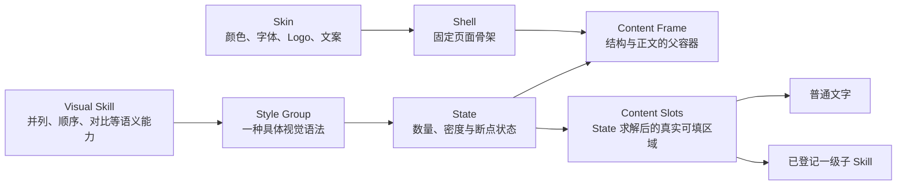

# Shell、Content Frame 与 Visual Skill 契约

本文固定当前实验使用的页面壳、正文内容区域和结构能力颗粒度。它是后续蒸馏 Style Group、编排整套 PPT 和扩展其他学校 Skin 时的共同接口。

## 一、固定分层

- **Skin** 决定学校或组织身份，包括颜色、字体、Logo 和页注文案。
- **Shell** 决定版式骨架，包括页码、栏目、Logo 槽、标题区、分隔线、Content Frame 和底部预留。当前先冻结几何，Skin 以后可以替换身份和主题值。
- **Visual Skill** 是视觉导演按语义调用的能力，例如 `parallel`、`sequence`、`comparison`。
- **Style Group** 是某个 Visual Skill 下的一种具体视觉语法，例如“中心辐射”“横向卡片”“交错双列”。一个 Skill 可以登记多个 Style Group。
- **State** 是同一 Style Group 面对不同数量、密度或断点时的确定性排布结果。State 不是新的自由设计，也不应被保存成互不相关的页面。每组只声明其视觉语法真正支持的范围；矩阵可以固定四项，金字塔可以只支持 3–5 层，不要求所有 Style Group 统一扩成 3–8 项。
- **Content Slot** 是父 Style Group 在某个 State 下最终求解出的真实可见填充区域。它不是整个灰色承载面，也不是整页 Composition 槽位；遮罩、圆环或装饰占去的区域不能算进可填空间。

目标颗粒度是：

> `Visual Skill → Style Group → State → Content Slots → 普通内容或一级子 Skill`

核心资产包现在开始正式登记 `skillId / styleGroupId / stateContract`，候选发现结果也会暴露这些字段；`familyId / variantId` 暂时保留为兼容接口。State 仍由程序根据内容与父容器确定性求解，不由导演逐页重画。

## 二、当前固定 Shell

唯一几何来源是 `PPT源/PPT模板-封面正文尾页.pptx` 第 3 页。固定契约位于 `src/runtime/shells/academic-report.mjs`，东北大学 Skin 只引用该契约，不再另写一份正文坐标。

画布为 `1280 × 720 px`。正文页主要槽位如下：

| 槽位 | x | y | width | height | 所有者 |
| --- | ---: | ---: | ---: | ---: | --- |
| 页码 | 44.45 | 31.90 | 71.23 | 48.47 | Shell，文案由运行时填写 |
| 栏目 / 章节 | 98.87 | 31.90 | 177.93 | 45.24 | Shell / Skin |
| Logo | 984.21 | 20.82 | 280.94 | 62.29 | Shell 定位，Skin 替换内容 |
| 标题带 | 35.17 | 87.55 | 1209.67 | 52.42 | Shell / Skin |
| 页面标题 | 9.04 | 88.85 | 1250.55 | 48.47 | Shell 定位，稿件提供文本 |
| **Content Frame** | **55** | **166** | **1170** | **492** | Composition / Style Group |
| 底部预留 | 35.17 | 658 | 1209.67 | 62 | Shell / Skin |

标题下分隔线位于 `y = 147.22`，底线位于 `y = 689.24`。Content Frame 左右各保留 `55 px`，宽度占整页 `91.41%`，高度占整页 `68.33%`，面积约占整页 `62.46%`，宽高比约为 `2.38:1`。

这意味着 Style Group 的设计基准不是整页 16:9，而是 `1170 × 492` 的真实父容器。HTML 根组件必须使用父容器尺寸，例如 `width: 100%; height: 100%`，并在此范围内自行处理内边距、断点、换行和密度；不得把标题、Logo、页码、背景或页脚复制进组件。

`northeastern-university.mjs` 中保留的 `componentSourceFrame = 1200 × 520 @ (40,135)` 只服务于旧资产坐标变换，不是新 Style Group 的黄金设计框。新组件一律以 Content Frame 契约为准。

## 三、标注页

- [可编辑 PPTX 标注页](../experiments/shell-content-frame-contract/output/shell-content-frame-contract.pptx)
- [生成脚本](../experiments/shell-content-frame-contract/generate-shell-contract.mjs)

标注页直接复制来源模板正文页，保留原有 Logo、标题带、页眉和底线；新增框线、标签和说明均为 PowerPoint 原生可编辑对象。

## 四、Style Group 的完整对象

一个 Style Group 不是一张图，也不是一个数量状态。核心包固定由六类信息构成：

1. `asset.json`：保存来源文件与页码、Visual Skill / Style Group 身份、语义与容量契约、State 控件、可选 `slotContract`，以及 HTML Component 或旧 Native Builder 入口。
2. `review.mjs`（或等价 HTML 组件入口）：保存建设期审美组件、可替换内容和 State 参数解析；一组只有一份组件代码，不按二项、三项、四项分别维护。
3. 通用 HTML → ResolvedVisualTree → Native 编译器：读取浏览器已经求解的 DOM/CSS、SVG 几何和文字样式，机械转换为原生 PowerPoint 对象；尚未迁移的旧资产暂由原 Native Builder 运行。
4. 一份共享预览输入：由 `previewParametersExport` 和 `previewResolverExport` 暴露，使 HTML 与 Builder 接收同一组内容和 State 选择。
5. `example.pptx`：按 `asset.json` 声明的 State 控件生成整个样式家族，供脱离代码审查原生可编辑结果。
6. 可选 Content Slot 解析器：从与 HTML 相同的布局计算中导出每个 State 的实际槽位位置、尺寸、容量和允许内容模式，不能再维护一份手写坐标表。

其中的契约必须覆盖适用关系、数量范围、标题/正文字数、媒体要求、最小尺寸、轮廓、密度，以及 `items`、节点内 `points` 和重复视觉条目的语义接口。图标、中心图像、标题和正文等可变槽也必须进入参数，不得固化来源模板中的第三方内容。

预览 PNG、布局检查文件和看板 JSON 都是从上述对象即时生成的缓存，不属于资产真源，也不得人工维护第二份数据库。

Style Group 在 HTML Component 中完成设计、数量响应、间距、字体和层级验证。确认后不再为同一版式手写第二套布局：通用编译器读取最终 DOM/CSS/SVG 并生成 Native 形状。HTML 截图不能进入正式 PPTX；进入 PPTX 的仍是文字、形状和自由曲线等可编辑对象。旧 Native Builder 仅作为尚未迁移资产的兼容路径。

当前 14 个正式结构 Style Group 都已整理为自描述资产包，但并非都完成 HTML 单源编译迁移。`cycle-pdca-ring-p57` 是首个正式试点；双向对比、四象限、泳道、金字塔、分层架构、组织树、问题—改进和中心辐射也已迁移为以 HTML 为唯一布局真源、由通用编译器生成 Native PPT。其余资产仍按各自声明走兼容路径。Builder 或编译器都不是正式运行时由 AI 临时写出的代码。

### Content Slot 与一级子 Skill 契约

Content Slot 用来解决“图中还有结构”的页面，但它只是一层受控空间接口，不建立递归布局系统。

父 Style Group 必须先确定 State 和一级拓扑，再从同一布局求解器导出槽位。`asset.json.runtime.slotContract` 至少声明：

- `schemaVersion`：槽位契约版本；
- `coordinateSpace=design-frame`：坐标基于组件自己的 `1170 × 492` 设计框，不是整页坐标；
- `resolverExport`：返回动态槽位的导出函数；
- `binding`：槽位与父内容项的绑定关系；
- `maxDepth=1`：当前只允许一级子结构；
- `childPolicy=registered-core-only`：只能调用已经登记、用户确认的核心子 Skill；
- `fallback=plain-text`：没有合法子 Skill 时必须退化为普通文字。

解析后的每个槽位至少包含 `id / bindingPath / role / frame / side / alignment / capacity / allowedContentModes / fallback`。其中 `frame` 是排除圆环遮挡、装饰和内边距之后真正可用的矩形；容量声明至少覆盖最大深度、条目数和单条字数。

选择顺序固定为：父 Style Group → 父 State → Content Slots → 槽内内容。子 Skill 只能在精确槽位内布局，不得改变父环、父卡片或 Shell；候选必须同时满足槽位尺寸、文字容量、媒体契约和语义关系。没有合法候选时使用槽内普通文字，不得现场创造结构。父与子最终仍在同一 HTML 树中求解，再由同一通用编译器生成 Native 对象。

`items[].points[]`、`componentBindings` 和 Content Slots 的职责不同：`points` 是来源已有的二级语义，`componentBindings` 是视觉导演对重复视觉单元的内容适配，Content Slots 是组件提供的空间容器。声明槽位不会自动创造内容，也不会自动把任意 `points` 升级成子结构。

### 媒体契约

媒体槽不是装饰占位，必须随 Style Group 一起声明为硬约束：

- `required` 媒体只能来自稿件或已登记媒体资产；不得生成、搜索或虚构素材来让候选勉强成立。
- 来源页中央有主体照片时，组件必须把它建模为可替换的 `centerVisual`，不能把来源雪山、人物或第三方图片固化为默认内容。
- 外围圆槽优先承载与内容对应的 Logo；语义不适合 Logo 时，允许替换为已登记图标。
- 若中央图片是该 Style Group 的视觉中心，则它不能用 Logo、图标、渐变或任意装饰代替。稿件没有合法中央图片时，该 Style Group 直接从候选中剔除。
- 同一 Visual Skill 应逐步提供不依赖图片的其他 Style Group；所需媒体缺失时先换组，再退化为简单文字 Composition。

审阅稿中的“中心图片槽（必填）”与“标识”仅说明接口，不是正式内容，也不能作为缺失媒体时的运行时替代物。

来源页先形成对应数量下的 HTML 初稿；确认关系、核心拓扑和视觉中心没有误读后，继续在同一 HTML Component 中优化审美并求解不同 State。用户的主要审美判断发生在 HTML 工作台，不要求先反复生成 PPT。扩散时可以改变行列、环绕角度、换行或内部比例，并允许在来源基础上改善颜色、留白、层级和装饰；只有语法已经实质变化时，才登记为同一 Visual Skill 下新的 Style Group。

## 五、正式选择

正式运行按两段完成；当资产声明 Content Slots 时，在父选择之后再增加一个受控槽内步骤：

1. 程序根据页面关系、item 数、文字容量、媒体契约、Skin 和 Content Frame，对核心 Style Group 做硬过滤。任何必填媒体缺失都使该组不合法。
2. 视觉导演在整套 PPT 尺度选择合法 Style Group，综合轮廓、密度、前后页节奏和已用次数。已经使用过某组是重复惩罚，不是绝对禁用；没有更合适的替代时允许复用。
3. 程序根据已选父 State 求解 Content Slots。只有 Composition Schema 明确提供合法子候选和绑定字段时，视觉导演才可在槽内选择一级子 Skill；否则使用父资产声明的普通文字兜底。

State 由内容数量、容量和父容器确定性求解，视觉导演不为每个数量重新绘图。正式生成只能调用已经登记并经用户确认的核心 Style Group。

### 主节点与节点内分点

Visual Skill 的调用接口采用两级版式中立内容：

- `items[]`：页面主关系中的同级语义节点，例如流程阶段、并列对象或对比双方。
- `items[].points[]`：某个主节点内部的支撑维度、例子或判断项。

内容导演负责忠实形成原稿本来就有的两级语义结构；视觉导演不得把这些 `points` 提升成同级主节点。这里还要和 Style Group 自身的“重复视觉单元”分开：当模板需要把一段来源内容整理为若干短卡、标签或对比条目时，由 Style Group 在 `runtime.contentContract.bindings` 声明绑定 ID、适用范围、最少/优先/最多条目数、单条字数、是否跨组均衡和来源约束；视觉导演选择该 Style Group 后，在 `CompositionPlan.componentBindings` 中决定本页实际拆成几点及其短句。内容导演不需要预知组件内部要几行。

因此，`points` 是来源语义，`componentBindings` 是视觉适配结果，二者不能混为一谈。程序在候选阶段按 `itemRole`、`points` 和 `textCapacity` 做硬过滤，在 Composition 阶段验证绑定 ID、数量、字数、均衡、来源依据及 `title/body/points` 覆盖。绑定型组件所在 Composition 只有组件槽时，绑定结果即为正文的视觉承载，不再重复创建文字槽。

为避免长上下文内容导演偶尔漏掉节点内层次，正式生成允许一个受限补充回路：视觉导演选中能承载 `points` 的 Style Group 后，可以指出具体页面和主节点；小型结构模型仅从对应 `sourceText` 提取短分点，程序核对来源片段、候选容量和节点 ID 后合并。该回路整套至多一次，不改标题、正文、主节点数量和页序，也不再次调用视觉导演；不足时沿用原编排、换合法候选或退化为简单排版。它不是新的资产蒸馏流程，也不扩展为通用递归框架。

当前顺序流程 Skill 已声明 `itemRole=semantic-node`、`points=optional`。对“作品—规律—能力”这类页面，流程仍然只有三个步骤；“表达、容量、变化、禁忌”以中间节点内分点显示，不能扩成四个步骤。

如果某页没有合法结构 Style Group，应退化为 Shell 内已经登记的简单文字排版，例如单观点、标题加要点或基础列表；这不是临时自创结构图。只有当简单排版也无法在容量和字号边界内成立时，才压缩、拆页或失败关闭，并登记资产缺口。

## 六、后续工作边界

当前先固定 Shell 和 Content Frame，再蒸馏更多 Style Group。其他学校版本可以替换 Logo、颜色、字体、栏目和页注文案；除非真实模板证明版式骨架必须改变，否则继续复用本 Shell 几何。候选 Style Group 仍需用户明确确认后才能进入核心库，Luna 只承担来源 PPT 的蒸馏与入库，不参与正式生成线。

当前实现状态必须分开理解：Shell 几何、核心资产发现、正文兜底、字段级内容覆盖和 `componentBindings` 校验已经进入运行时代码。九个结构资产已经由 HTML 单源正式生成 Native PPT；其中只有 `cycle-pdca-ring-p57` 已声明并可动态解析 3–6 步 State 的 Content Slots。正式生成尚未开放子 Skill 候选、Slot 绑定 Schema 和嵌套渲染，因此当前这些槽位仍使用普通文字。下一步只需用一个已登记的小型子 Skill 做最小闭环，不扩成递归 Agent 或通用嵌套框架。其余五个结构资产仍走兼容路径，待逐项审核后迁移。
