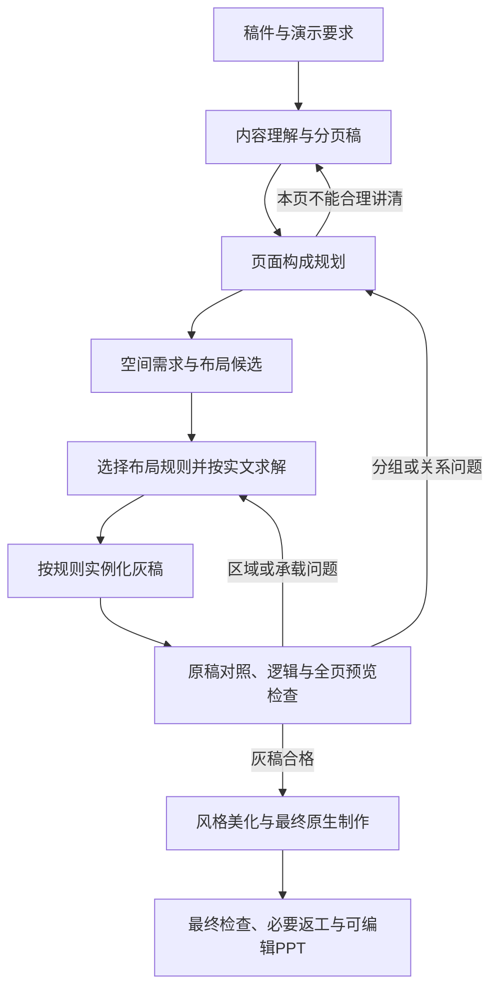

# 页面构成规划与资产架构

2026-09-28 按资产与程序承担生产能力的路线纠偏更新，沿用 2026-09-24 的四类资产划分。本文统一资产职责、页面构成规划与布局接口；运行入口及返工执行见 [Harness 运行流程](../../harness/运行流程.md)，进度与验收唯一见 [页面编排能力计划](../方向讨论/页面编排能力计划.md)。目标不等于当前实现。

## 2026-09-29 已接入范围

同一纯文字语义组内的并列/独立视觉分块已接入正式灰稿入口。`gray-plan-3` 页面可提交 `visualMapping`：引用原组/原 block ID，选择横向或纵向，保留组首/组尾一条全宽共同说明；程序测量并渲染，不接受坐标或新正文。省略映射保持原排版。实际契约由 `src/runner/visual-block-mapping.mjs`、语义编译与 `grayBodyLayout` 共同实现，映射变更使审稿失效，回放核对原内容与派生绑定。

该范围不覆盖跨组作用范围、比较矩阵、条件分支或含局部图示组的拆分；纯文字美化新增 `source-text-v1` 程序消费同一映射和原区域，仅选择程序、不接收自由坐标；仍为建设候选。图示美化沿用兼容局部排版。当前引擎 v5 缺少实际字号/行盒证据，自动交付未通过。[固定计划产物与边界](../../experiments/visual-block-mapping-20260929/README.md)不等于模型选择或正式新稿验收。下文目标契约中超出这些范围的内容仍待建设。

## 一、四类资产

PPagenT 的资产体系为 **Skin、风格、布局、逻辑与结构图**。这四类是专业设计经验的复用方式，不等于四个 Agent、四次调用或现有看板的四个栏目。

| 资产 | 负责什么 | 不负责什么 |
| --- | --- | --- |
| Skin | 组织视觉身份、字体与色彩来源、Logo、页眉页脚、Shell 和可用内容区 | 不推断稿件关系，不为每个组织复制布局或结构库 |
| 风格 | 在 Skin 边界内将文字层级、承载面、强调、疏密和细节落实为角色、参数与可执行样式；字号与间距取值沿用现有真源 | 不改事实、分组、逻辑主次或阅读关系；不在美化时重新发明页面组织 |
| 布局 | 按真实关系选择参数化空间程序，将内容角色与测量需求落实为区域；保存输入契约、变体、受限参数、执行入口和失败返回 | 不是固定坐标模板清单；不因块数相同就认定逻辑相同 |
| 逻辑与结构图 | Logic 描述内容关系和适用条件，结构图保存表达这些关系的设计方法与可调用实现 | 不强迫每页画图，不从有一个图形资产倒推原稿有相应关系 |

“逻辑与结构图”是同一资产领域内的两个层次：逻辑是选择依据，结构图是可选的表达能力。复用已有 Logic 和结构入口，不再平行建设一套同义逻辑库。一个逻辑可以对应多种结构图；结构可用于局部区域，不要求覆盖整页。

文字、图片、表格和数据图表是内容或表达媒介；测量、渲染、Skill、Harness 是执行能力；来源、审核记录与样例是证据。它们继续保留，但不与上述四类资产并列为新的顶层资产分类。真实图片仍需来源与裁切约束，数据图表仍需数据依据。

现有索引中的 `layout` / `layouts` 曾用于绑定风格，不能与本文的布局规范混为一谈。暂不批量改名资产 ID、目录或接口；当前一个 Skin 绑定一套风格是实现约束，不是四类资产必须永久绑死。

## 二、生成主线

总原则：**先把稿件整理成分页稿，再从分页稿提取空间需求并选择布局规则，最后按规则把该页内容实例化为灰稿。** 灰稿不是再次决定分页和布局的地方；灰稿只把已经确定的页面内容、视觉块和布局规则落成可审阅的页面。

这些是职责，不规定固定调用次数，也不增加逐阶段用户审批。分页依据“一页讲明白一件事”，综合表述结构、信息量与实际内容区，而非按字数阈值切页。主题句可以引出、概括、总结或提出有依据的判断；目录、封面和过渡页按其职责处理，不硬造结论。后续容量反馈可以退回分页稿或空间需求修订，但不能让灰稿阶段悄悄改页意图。

### 2.1 颗粒度与中间产物

| 阶段 | 回答的问题 | 主要产物 | 不在本阶段决定 |
| --- | --- | --- | --- |
| 稿件 | 原稿说了什么，来源在哪里 | 原稿规范化文本与来源锚点 | 页数、区域和视觉样式 |
| 分页稿 | 每一页要讲明白什么 | 页序、页面目的、主题句、阅读单元、必要关系与来源 ID | 具体卡片坐标和装饰 |
| 空间需求 | 这一页的内容需要怎样被承载 | 视觉块映射、块角色、共同作用范围、文字测量、宽高倾向、最小承载尺寸 | 改写事实或替分页意图 |
| 布局规则 | 哪一种空间语法能承载这些块 | 布局家族、方向、面积权重、邻接/顺序约束、候选与选择理由 | 直接生成最终视觉样式 |
| 灰稿 | 按已选规则实际放进去是否读得懂 | 带真实正文的可编辑 PPTX、逐页 PNG、检查与回执 | 重新发明分页和逻辑关系 |

布局建设面向可执行的参数化规则。检索先依据真实关系与页面任务，再依据阅读路径、内容体量和目标区域筛选家族、变体及参数。横排、纵排、相册等描述几何方式，不能代替对照、因果、支撑或作用范围的语义判断。看板示例展示已声明规则的实例，既不是任意拼装授权，也不是候选能力的上限。

### 2.2 灰稿的交接契约

灰稿由内容与空间计划生成。计划应可追溯到原稿、分页意图、必要关系、内容到区域的绑定，以及已选布局能力和版本；灰稿 PPT/PNG 是该计划的可审阅呈现。后半段引用同一内容和关系，在可用视觉能力中选择、绑定并渲染，不能重新编写一份正文。

这些是目标职责，继续兼容现有 gray-plan-3、state 与 blueprint，不要求立即新增 GreyPagePlan 文件或完整内容图。语义分组与视觉块可以不同，但映射必须保持来源、归属和共同作用范围。换渲染器是否保持语义与几何需验证，不能只凭接口相同认定可互换。

## 三、页面构成计划

沿用已有页面目的、主题句、groups、blocks、来源和表达说明，逐步补齐影响布局的必要信息。以下是目标语义接口，不是已发布的新 JSON Schema，不要求新增独立文件或复制正文。

| 信息 | 内容与来源 |
| --- | --- |
| 页面任务与主题句 | 说明本页为何存在及读者应理解什么；主题句与正文关系可核对 |
| 内容身份与归属 | 稳定内容 ID、真实上屏文字、来源和必要条件；证据与解释、条目与限定不能被任意拆散 |
| 必要逻辑关系 | 并列、对照、先后、因果、总分、支撑等，仅记录影响表达的关系；不要求逐句关系图 |
| 语义重要性 | 哪些是核心、支撑或补充；重要不等于文字多，也不自动等于面积最大 |
| 表达需求 | 文字、结构图、图片、表格或数据图表及理由；非文字区需保留制作要求 |
| 空间要求 | 必须共同阅读的组、对照对应、先后路径、视觉锚点、必要邻接和可调整偏好 |

原稿关系、模型解释和几何假设须区分。没有依据的因果不能靠箭头补出来；单纯有三个块不能推出流程；并列不必严格等面积；比较不必固定镜像；相册式不要求所有页面有主块或固定主块占比。

## 四、从空间要求到布局

1. 根据页面内容关系和表达需求生成空间要求；逻辑含义由规划负责，几何工具不重新解释原稿。
2. 从已登记能力中筛选少量候选，排除违反必要分组、阅读路径或实际能力边界的方案。数量、比例和横竖形态可变，示例不是候选上限。
3. 选择器比较可行候选，也可返回“无合适候选”。保留选择依据，不能用模型自报置信度充当语义或审美验收。
4. 以稳定内容 ID 绑定槽位角色，再计算区域。角色如主体、支撑、共同注记只描述本页职责，不预先锁死位置或数量。
5. 按实际字体、宽度、换行和组件需求测量。文字所需高度随宽度变化；`minWidth/minHeight` 或面积权重只能作为输入或测量摘要，不能替代真实承载检查。
6. 生成灰稿并检查实际显示结果。几何无重叠、空框铺满内容区都不等于逻辑和阅读质量合格。

硬约束是来源保真、内容归属、必须共同阅读的关系、明确先后及实际承载底线；软偏好包括视觉重心、理想宽高比和节奏。冲突必须反馈，不能悄悄违反硬约束。关系层级靠位置、对齐、标注和表达共同体现，不单靠面积。

## 五、布局规范与已有结构的协作

每项可用于生产的能力至少明确以下契约；具体字段复用现有声明，不要求马上发布统一大 Schema：

| 契约 | 必须能回答 |
| --- | --- |
| 适用关系与排除条件 | 表达什么关系，需要哪些真实证据；哪些相似内容不能使用 |
| 输入与内容绑定 | 必填/可选字段、稳定内容 ID、来源、节点或条目归属，哪些内容不会上屏 |
| 容量与参数 | 数量、文字与区域的已验证范围，合法变体与参数边界，真实测量方式 |
| 风格与实现 | 使用的 Skin/风格角色、可调用程序、版本及依赖；模型选择与程序计算的边界 |
| 失败与修订 | 不适用、缺字段、容量不足、依赖或渲染失败分别返回什么，哪些保真降级可用 |
| 证据 | 代表内容、边界状态、反例、原生 PPT、实际预览与用户认可范围 |

规范文字解释选择依据，资产和程序落实可执行约束。缺少实现或证据的部分保留候选身份，不把新增 Markdown 表格当作能力已建成。

当前卡片式、相册式和混合式保留为起点。卡片式按同向组织和承载需求变化；相册式可按块数、体量、横竖倾向和分组形成不同拼接；混合式允许主体区与作用范围说明带采用不同方向并组合成一页。后续接入必要的邻接、同组与阅读约束，不继续靠增加固定组合扩库。

一页可采用主辅布局，主区放流程结构图，辅区放说明。页面构成规划决定这种组织是否忠实；布局分配合法区域；结构图按实际支持范围适配区域；Skin 与风格统一呈现。生产选择限于已登记且可执行的适配能力；建设实验中的参考重组单独记录，不因一次临场构建成功晋升全库能力。

布局库与现有 `gray-layout.mjs` / `resolveLayoutTree` 应共用测量和几何能力，逐步统一预览与正式执行，不复制两套长期求解真源。已有来源审查、PPT 构建、导出与预览继续复用。

## 六、修订和模型边界

空间不足时，先在不改变逻辑和事实的范围内调整区域、比例或同族组合；候选不适用则换族；仍无法承载则返回构成规划或分页。邻区只有保留其承载底线才可缩减。修订受当前运行预算约束，不能无限重试。

事实、条件、分组或关系变化返回内容规划；空间映射错误返回构成规划；测量与区域错误返回求解；对象或导出错误返回制作。修改相关输入后，对应的检查及派生产物失效，需重新生成，不继承旧通过状态。

规划在灰稿阶段已确定有逻辑含义的阅读顺序、主次和区域组织。美化可复核媒介并调整视觉细节，但改变内容或阅读关系必须写回计划、重新检查。灰稿的蓝区是制作说明，不假装已完成内部结构图。

模型可替换：理解与规划可先由现有模型承担，选择器提供有限候选决策接口，将来可换快速决策模型。此处不承诺具体模型准确率、价格或兼容性，也不以更强模型能否一口气做完来取消来源、能力契约和质量标准。

## 七、当前实现与迁移顺序

2026-09-28 核对合并后的代码与已有记录：前后两段均有实现和产物，质量未达用户要求。以下区分实现存在和能力验收。

本轮具体调用链、资产成熟度、接口探针、产物抽查和首批建设顺序见[现有能力盘点与首批建设](现有能力盘点与首批建设.md)。它是当前实现证据快照，接口职责仍在本文维护。

| 状态 | 实际边界 |
| --- | --- |
| 已有 | gray-agent、旧 gray-draft、通用 runner 和 legacy 入口；gray-plan-3、来源绑定、实文测量、PPT 与预览可复用 |
| 局部接入 | gray-agent 的布局规则模式调用 gray-layout-selection 与看板同源能力；旧按组数默认仍在兼容模式中。不能再统称“正式灰稿完全未接通布局库” |
| 局部接入 | runner 已支持 --gray-state；灰稿局部视觉方案仍由模型提交 frame、字号和装饰，属于需要收敛为资产选择与参数执行的实现 |
| 待建设 | 关系到空间程序的覆盖与适用契约、语义组到视觉块的通用映射、受限视觉选择接口、版本固定与重复生成保证 |
| 未验收 | 真实稿件的规划质量、完整美化质量、跨稿稳定和 M1；已有测试或样稿不改变状态 |

迁移先按[资产建设流程](../工作流/资产积累与入库/工作流.md)梳理并验证现有可调用能力，再补关系覆盖与参数边界，以固定计划检验程序，以同一契约检验模型选择，最后接回正式入口验证新稿。建设用对照脚本可以定位问题，但不代替正式生产验收。每一步复用现有内容与测量真源；不先重命名全库、扩大全面 Schema 或另建生成线。

下列 2026-09-26 及之后的记录保留当时的能力、失败与候选结论；其中“下一步”属于当时建议，当前调度以[项目台账](../方向讨论/页面编排能力计划.md)为准。

### 2026-09-26 接入进展与尚未解决的边界

正式工作台已通过 `gray-layout-selection.mjs` 调用看板同源卡片/相册规范。规划检查返回各组在全宽、半宽、三分之一宽度下的实测高度和可行候选；宽高倾向由这些测量样本形成求解偏好，不是模型臆定的面积，也不是最终图片比例。最终坐标仍需再次按实文测量。

布局块当前仍对应 `gray-plan-3` 的组。共同前提、并列对象和组内附注是否正确分组，仍由内容规划承担；求解器不能擅自拆组或改写事实。单区域候选去除同坐标别名，单组规划会提示其无法验证多区域选型，提示本身不等于分组问题已解决。

正式运行 `20260926082118-e744fe` 使用 C03 原稿和 1170×492 内容区，暴露了共同说明被独立成主辅区域、合并后五条正文纵排超容量、24 轮未交付的问题。此运行未通过。上一运行四页单区域灰稿也不能作为多区域布局适配合格证据。接入可运行、布局适配合理、用户验收是三个不同结论。

A03 采购规定的正式运行 `20260926082451-92ee75` 同样被主辅关系限制阻断。因此卡片规范补充“主体＋共同说明横带”：使用已有 primary/supporting 角色，连续说明放在页首或页尾，说明高度取实文测量值，主体使用其余空间且必须高于说明。保留原组序、全部原文和来源，不靠语义关键词猜共同说明，也不支持交错说明的自动归并。候选仍需模型判断说明的适用范围；范围错挂不能由几何检查发现。此能力须以随后正式运行证明，不能用接口测试宣称已验收。

后续 A03 正式运行 `20260926082809-e46fd7` 产生一页左右等分灰稿，但说明文字很少仍占半页，评审不通过。加入主次面积检查及 8–24px 自适应横带间距后，`20260926083052-9237c6` 的 render-9 产生两页单区域灰稿，完整预览仍显示大面积留白；第二页将应急例外与归档共同要求并列，不能证明主辅横带或多区域选型有效。状态 awaiting-user-review 仅说明产生候选，不是质量通过。上述两次均不得计作布局适配合格样本。

下一步必须分离语义组与视觉布局块：同一语义组的并列子项可以形成多个视觉块，共同范围必须保留作用对象，映射只引用原内容 ID。先定义并校验这个映射，再按宽度测量；不能用不断压缩、合组或拆页代替映射建设。正式生成链当前尚未完成这一层。

### 2026-09-26 真实内容人工映射校准

PPA 看板「布局」栏目新增 `/layout-calibration`，使用采购规定 A03、安全通报 A02 的完整原文。`catalog/layout-calibration-*.json` 保存人工划分的内容 ID、逐字引用、语义组、视觉块职责、共同说明作用对象及分块理由。`content-layout-calibration.mjs` 检查来源无遗漏、无重复、无改写及引用有效，再调用已有卡片/相册求解器；同一语义组允许映射为多个视觉块。全部正文保持 22px，空间不足明确报错，不缩字、不删文。

看板另有 `/layout-pipeline-demo` 链条页：用一份模拟分页稿生成页面目的、主题句、阅读单元和来源归属，再生成空间需求，比较卡片横向、卡片纵向和相册候选，按实文承载与共同说明关系选出规则，最后把原文填入灰稿预览。它是把五个中间产物串起来的可见演示，不是正式线运行，也不是跨稿自动能力验收。

这是用于定位映射与空间规则问题的校准工具：映射和布局家族均由人工指定，只提供 HTML 预览，不替代正式生成和原生 PPT 验收。当前只支持标题、主体块及页尾共同说明，作用对象作为可审查证据展示，尚未通用求解作用范围嵌套。最小尺寸来自文字测量，但相册宽高偏好仍采用固定初值；当前两份三块稿件的相册结果仍接近三列，不能据此认定相册变化能力或空间利用质量通过。浏览器与原生 PPT 字体测量差异也仍需正式线验证。

“并列主体＋共同说明带”是可复用的组合规则，不是采购规定专用版式：前者由同语义组的并列块定义，后者由带 `scopeIds` 的 shared 块定义；方向可以横向或纵向，比例和说明带高度由候选比较与实文测量决定。采购演示选择横向，只是该分页稿的结构和承载结果，不应固化成所有共同说明页的答案。

下一步先通过真实内容比较，调整视觉块及空间偏好的通用规则；规则冻结后，才让模型产生同一映射接口及有限候选选择，并接回正式线。记录自动结果与人工校准的差异，最后用未参与调参的稿件验证。不得把这两份人工校准样本记作自动识别、自动选型或 M1 通过。

### 横纵组合实现边界（2026-09-27）
横纵组合以分区树表达：内部节点指定 horizontal/vertical、子区和比例，叶子引用内容块。每层方向独立，支持上下内横排、左右内竖排及继续嵌套；内容必须恰好引用一次，最小尺寸不可违反。看板提供两种示例与可编辑分区树，示例不是模板数量上限。实文演示复用该求解器，但目前仍由人工来源映射构造主体和说明树，且说明只在页尾。已撤去同组横排与混合家族的额外加分；当前最短边排序只是启发式，不证明布局选择质量或正式灰稿链已完成。
