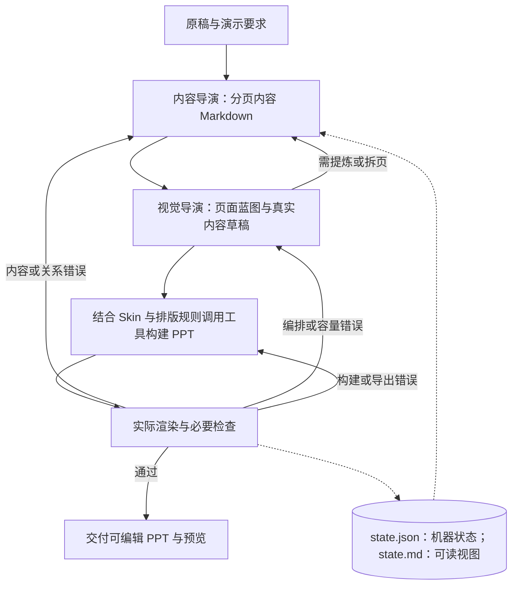

# Harness 架构与最小运行闭环

建设与生产分开：建设阶段补足可调用资产和验证证据，生产阶段使用实际登记的能力、变体与参数。Harness 管理状态、版本、调用、检查和有限返工；不通过扩大 Prompt 自由度补偿资产缺口。这里是目标执行约束，当前各入口的自由坐标/参考重组行为尚未自动收敛。

2026-09-28 路线更新：模型负责理解、判断、选择与填充，已建设能力及程序执行设计；Harness 对多次模型调用、工具、上下文、规则、状态、检查与返工进行工程化管理，只服务 PPT 制作闭环；自研 Harness 不是产品目标。本文是运行流程真源；现行 M1–M5 与项目进度在[页面编排能力计划](../docs/方向讨论/页面编排能力计划.md)维护，不把制作检查点等同于开发阶段。进度表属于仓库维护资料，不是复制本包运行的前置依赖。

## 资产与两个制作检查点

资产为 **Skin、风格、布局、逻辑与结构图**。资产职责及页面构成接口见[页面构成与布局规范](docs/架构/页面构成与布局规范.md)，本文件只维护入口、执行闭环与返工。规则加载、文字测量和原生制作是执行能力，不是额外资产类别。

目标主线：稿件理解与初步分页 → 页面构成规划 → 空间要求和布局候选 → 实文测量、区域求解与灰稿 → 检查修订 → 风格美化与最终制作。每个阶段是职责，不要求增加模型、审批或重复正文文件。

| 检查点 | 判断对象 | 通过依据 |
| --- | --- | --- |
| 1 内容与页面构成 | 一页讲什么、主题句与正文关系、内容归属、必要逻辑及空间组织依据 | 忠实来源、合理分页、主次与阅读路径清楚；以真实灰稿检查承载效果 |
| 2 制作与验证 | 规划怎样被灰稿及最终 PPT 正确呈现 | 原生可编辑、实际预览、可读性和关系表达成立；不能继承计划的通过结论 |

初步分页可根据实际承载反馈修订。灰稿中有逻辑意义的主次、邻接、对照和阅读顺序先确定；美化保持这些决定，改变时写回规划并重新检查。文字灰区是实文；结构图、图表、图片区为浅蓝制作说明，不冒充已完成内部图示。主题句可引出、概括或总结，不把后台推理放上屏。

内容或关系错误回内容与构成规划；空间映射错误回构成计划；区域容量错误回测量求解；对象或导出错误回制作。容量问题先尝试不破坏关系的区域调整或同族变形，再考虑换布局，仍不可行则重组或拆页，不删条件、不缩字硬塞。变更后使受影响检查和预览失效，保留首版、返工及外部反馈。

规划检查不增加用户逐阶段审批。正常任务默认完整 PPT；当前明确的 M1 验证止于灰稿，M1 合格也不能算 M2 完成。

## 最小架构

### 当前灰稿实验与通用运行器的边界

截至 2026-09-28，合并后实际入口如下，不能从相同目录或某个入口的能力推出其他入口也支持：

| 入口 | 实际职责 | 当前边界 |
| --- | --- | --- |
| 工作台默认 gray：根目录 `src/runner/gray-agent.mjs` | Agent 通过 check_plan、semantic_review、render_draft、finish_draft 等工具推进灰稿闭环 | 已局部接入实文测量及看板同源布局选择；不等于关系覆盖与规划质量通过；Agent 续跑按工作台实际提示处理 |
| 根目录 `src/runner/gray-draft.mjs` | 保留的阶段式规划、表达、审稿、布局、灰稿与修订入口 | 历史复现/底层能力；不能把阶段链修订功能直接套给 Agent 运行 |
| 根目录 `src/runner/run.mjs` | 通用工具循环、状态、派发与恢复 | 已支持 --gray-state 和局部视觉方案，仍含模型自由 frame/字号/装饰；结构及外部 Skill 未全面接入 |
| legacy 双导演 API | 旧候选协议、确定性执行与交付 | 兼容保留，不代表新构成规划或布局规范已迁移 |

现有 `gray-plan-3` 保留目的、主题句、groups、blocks、来源、主次与关系说明。`grayDisplayBlocks` 提供审稿和渲染共用的可见内容投影。`gray-layout.mjs` 与 `resolveLayoutTree` 用实文测量和基础组合安排区域；`gray-templates.mjs` 尚有按组数等特征选默认的机制，这是待改实现，不是新的逻辑规划原则。

看板 `page-layout-library.mjs` 已有卡片/相册及横纵组合能力；gray-agent 的布局规则模式通过 `gray-layout-selection.mjs` 接入同源测量与选择。它仍未覆盖完整页面逻辑，效果未通过用户验收。迁移目标是在已有入口补足关系适用契约、内容绑定、能力版本和有限选择，复用测量、渲染及运行记录。

**状态与版本：**当前实际 schema 和工具定义为执行契约；新架构的概念字段不能直接发给旧工具。沿用对应运行的 plan/state 文件与稳定内容 ID，后续扩展要有版本兼容；不新增另一份手工维护正文。

**镜像边界：**本次仅同步说明文档；Harness 中代码、规则及其他配置保留其清单记录的快照，未声称完成根目录灰稿能力或新布局模块迁移。使用本包时必须核对实际工具，不能按目标图推定功能存在。

### 通用工具循环

多轮工具调用循环自 2026-09-12 起由仓库自建的薄运行器提供（`src/runner/`，只拥有循环、状态落盘、工具派发、恢复四件事；构建与审计一律调既有模块），不再依赖 Codex 宿主。运行环境仍受两处外部约束：PPT 引擎 `@oai/artifact-tool` 来自 Codex 工作区（见[外部依赖](外部依赖.md)），模型走 HTTP 接口、R1 实测为 DeepSeek（`config/deepseek.local.json`，密钥不入库）。不安装 Penguin。模型可替换是产品方向，跨模型效果尚未验证。

这不是四次固定 API 调用。执行者按工具回执和实际产物自主选择后续动作；可以往返，阶段不要求用户逐步批准。保留内容与视觉两个专业职责，不要求每阶段独立 Agent，也不要求增加总控或审查 Agent。状态、工具调度、恢复与交付是运行责任，可由当前宿主和执行者承担。

## 中间产物及职责

页面语义与视觉位置分开决定：`criterion` 可以是准则清单页的主体，也可以是比较页的辅助依据；`global` 表示适用范围，不代表一定放页脚。当前薄运行器的新方案在 `textSlots[].bandItemIds` 显式指定辅助项，默认空数组表示留在主区；仅支持辅助带的区域接受非空值，禁止把区域全部内容抽走。旧方案缺此字段时保留原回放行为。角色标签不是关系或视觉验收凭据。

`read_catalog` 同时返回已有逐页反馈，供恢复后的视觉阶段读取和修订。外部看图反馈与模型自主发现必须分别记账；反馈后模型改方案并重建，仅证明受监督修订，不自动证明无人监督的视觉判断。

| 产物 | 最小内容与边界 |
| --- | --- |
| 原稿 | 保留原始输入或可读取引用；不被提炼稿覆盖 |
| content.md | 一级标题对应一页，页内内容块使用稳定 ID；页面目的、拟展示的实际内容、必要来源。核心结论仅适用时写，不强迫目录或过渡页造结论 |
| blueprint.json | 引用页面/内容块 ID，记录区域、表达方式、阅读顺序和必要关系；不复制整份正文，不要求固定版式名称或庞大 Schema |
| state.json / state.md | `state.json` 是唯一的机器状态真源，只由运行器原子写入，**不手工编辑**；`state.md` 由它渲染出来供人与模型阅读。内容含本次目标与输入、当前候选位置、未解决问题、下一步；续行前核对实际文件 |
| PPTX 与实际预览 | 首版、必要修订版与最终候选；证据必须对应交付文件，不能用源代码图代替最终 PPT 渲染 |

以上描述最小产物职责；当前运行器具体字段受现有工具和状态协议约束，说明文档不扩大程序能力，也不要求另建完整 IR 框架。现有来源编译器、composition-intent 与 resolver 是可选工具；选择后遵守其契约，不将所有新任务强制转换到旧 Schema。

当前运行器以 state.json 为唯一机器真源，content.md 与 state.md 由它派生，不手工改写；blueprint.json 引用对应内容 ID，构建器按当前状态取值。内容变化后更新受影响蓝图/页面，不在几个计划中分别改正文。渲染产物可包含编译后的文字，不作为第二份手工维护真源。暂不建立独立 Visual Plan、角色报告全集或固定阶段审批表。

## 生产阶段

1. **理解与分页。** 模型对照原稿形成保真内容、页面职责、分组和必要关系，未知关系明确保留疑点。分页候选按承载反馈可修订。
2. **选择与生成灰稿。** 程序按语义条件、输入与容量筛出合法候选；模型在已支持能力中选择并绑定内容。参数化程序测量和计算区域，记录能力 ID、变体、参数、来源及版本，生成真实灰稿。当前接口缺少的记录属于待迁移项，不编造可执行字段。
3. **选择视觉表达。** 以前半段同一内容与关系为输入，选择已接入结构/图表/流程等能力及风格变体。程序按合法参数落实字体角色、位置与装饰；改变分组、关系或分页必须返回规划并重验。
4. **构建、审查与交付。** 生成原生 PPT，实际回渲染并分别检查语义、程序约束和视觉质量。按错误来源有限返工，保留首版、修订及外部干预，不把任务内自由重画当作新生产路径完成。

无合适候选时报告能力缺口；只有保持原意且已验证的降级路径可继续。重复生成分别记录模型新决策、既定计划回放和结果复用，固定运行条件，不用缓存命中证明模型稳定。

## 检查、恢复与停止

最小检查是：原稿事实与条件没有被改错；图表与连线关系有依据；文字/图形可编辑；实际渲染无明显遮挡、裁切、不可读文字和失衡。现有工具按可用能力检查实际对象，不能拿“文件存在”或工具零告警当作全质量通过。方法见[产物审查](产物审查.md)。

检查发现经运行器状态或审查记录保存，state.md 由状态派生；详细工具回执保留原文件即可，不重复填写报告。保留首版、自修与外部干预区别；失败版本不覆盖成成功记录。

阶段有实质推进、候选变化或中断前通过运行器更新状态及派生视图；恢复时读取状态并检查实际文件，再继续。预算和外部限制按本次任务实际记录，不预建复杂调度器。不固定重试次数：同类问题持续无改善时改变诊断或策略；达到真实工具/预算阻塞时保留候选与未解决项，不能无限重试或错误宣称完成。

**正式流程验证沿用同一入口与记账。** 资产建设可以使用固定计划和隔离测试定位能力问题，并明确标为建设证据；声称自动生成能力时必须使用正式入口的原稿流程。不在看完结果之后删除失败记录，用途差异如实记录。

中断与续跑都留在同一条运行记录里，各自作为一次尝试留档。续跑从实际停下的阶段接续，排在前面的阶段沿用上次产物、本次不重新调用模型；这一点按阶段标出，避免把「沿用」看成「重做了一遍」。到 ready 之后只能零模型重编译，它同样是一条可查的记录。

## 技术选型与实现边界

先复用当前运行器，工作流稳定后再评估成熟框架；Agents SDK、LangGraph 等尚未选定。当前新运行器以有限文字版式为主，结构库和外部 Skill 尚未完整接入；按需加载规则是组织原则，不是已完成全部阶段路由的声明。

正式框架、去除 Codex 私有 PPT 引擎依赖、商用条件、并发、隔离、持久化、恢复、成本与部署纳入 M5。已有状态和恢复能力继续使用；模型调用独立不等于制作系统独立部署。

## 历史实施记录（旧 R0–R3，非现行推进计划）

以下保留当时失败、修订与验收边界；其中“当前”“下一步”均指当时，不覆盖现行 M1–M5。

R0 建立上述说明与进度基线。R1 于 2026-09-12 用自建运行器做了第一次实跑：短稿 `runs/20260912-r1-thin-runner/` 走完分页内容、页面方案、原生构建、实际渲染与审计，产出 5 页可编辑 PPTX 与全页预览，`--replay` 可零模型重编译，二进制的状态与蓝图前后一致。**这次实跑成立，不等于 R1 里程碑成立**，缺口见本节末。

首版曾有两处正文断行把单个字与标点挤成独占一行（`slide-03` 卡片 01 的「理」、`slide-05` 卡片 03 的「，」），根因是 `src/render/chinese-typography.mjs` 的字宽系数按 0.95em 估算全角字、而渲染器按 1.0em 排。这是既有缺陷，不是运行器引入的。2026-09-12 经单独授权改为按真实 1em 计算容量，重编译后两处消失、全页「拟合行数 = 引擎行数」，全量测试与资产预览回归通过。同一轮补上了机器门禁 `auditRenderedLineBreaks`：`qa/*.layout.json` 的 `element.textLayout.lines` 记录的是引擎排完之后的真实行盒，比对拟合行数与引擎行数即可判据，不必靠人眼找断行。逐项证据与首版记录见该目录的[审查记录](runs/20260912-r1-thin-runner/审查记录.md)。

**但 R1 仍未完成**（2026-09-12 执行者曾自宣通过，同日经用户否证撤回），缺三条：「关系」判为不合格——**页面实际层级与原稿关系不一致**：比较准则「选择依据」被画成与两个选项并列的第三个对象，贯穿全程的「异常处理」被编号成第四个步骤，页面上还出现了原稿没有的「核心能力」标签。判据是层级是否忠实于原稿，**不是**"有没有调用名为 structure 的工具"；这 4 个正文页恰好都是 `editorial-focus`／`editorial-grid` 纯文字版式，那只是当时的事实描述，不构成否定依据。通过与否不能由执行者自评，本次只有执行者自己的核验，没有用户验收；首版本身未过基础检查，两处断行是事后另行授权修复的，成立的是重编译后的第二版，不能倒过来记作首版通过。2026-09-13 已按该判据修掉层级误表达，并修掉三处会让失败溜过交付关口的缺陷（断行违规未被逐页归因、`check_pages`/`finish_visual` 只看逐页结论、`--replay` 无条件返回交付）；同一短稿重跑并把首版与修订分开留档之后，**由用户验收**，执行者不得自宣。

2026-09-13 用同一份短稿重跑（`runs/20260913-r1-content-relations/`）：上一条修好的部分成立——贯穿全程的「异常处理」进了不编号的底部带、抬头与条目标签只取自原稿、既有设计规则真的进了 system（视觉阶段 50,818 字节、内容阶段 10,307 字节，已记进 transcript 的 `rulesBytes`）。**但「关系」仍不合格**：第 2 页 `editorial-dual-statement` 的 `right` 区绑了「统一登记」与「选择依据」两条，渲染器只画第一条，**「选择依据」整条从交付物里消失**，而 `deckAudit`、逐页记账与 `--replay` 全部报通过。根因是 `renderDualStatement`（`src/render/page-composition.mjs`）及其预检孪生体都只取 `slotItems(...)[0]`，多绑的条目被静默丢弃、容量检查也看不见。既有缺陷，被本轮暴露；详见该目录审查记录。**该缺陷已按用户决定于同轮闭合（失败关闭）**：新增 `planStructureIssues`（`src/render/page-composition.mjs`）判定两类会静默丢件的方案结构——同一区域在 `textSlots` 里写两遍、只画一条的区域被绑多条——并放在 `check_pages` 的**构建之前**作硬闸门，命中即 `accepted: false`、该页落 `failed`、归因 `plan`；两份预检孪生体改为从同一处导入以免再次漂移；`LAYOUT_NOTES`／`BAND_NOTE` 逐条写明各区的条目容量。随后跑的**修订版** `runs/20260913-r1-revision/`（外部工程干预后重跑）证实首版两条关系缺陷已修好、逐页无丢件，但**闸门本次未触发**（模型未产出重复区域），闸门有效性只能看用例证据；修订版另暴露一处基础布局不合格（条目全为准则时主区空掉），未修。文档完成不等于 R1 完成，R1 完成也不等于该项通过。

复杂调度、多审查 Agent、全面 Schema、独立 Visual Plan、全库自动路由、多风格并行验证和批量基准都留到后续，只有真实失败与收益证据才引入。必要的渲染和基础检查不后置。

旧 API 生产线保留为兼容实现与能力来源，不再作为新产品主架构；本次不删除或重写它。A–H 风格实验保留为效果参考和失败证据，不再是项目唯一主目标。已有宿主、文档包与样稿不证明新架构的自主复现、恢复或远端部署已验收。
