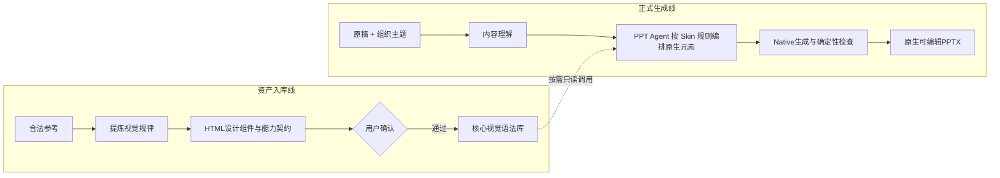

# PPagenT 产品叙事：把 PPT 生成变成可靠的生产过程

本文面向不需要了解技术细节、但希望判断 PPagenT 是否有价值的人。它解释产品为什么存在、解决谁的问题，以及为什么这条路线不同于自由生成或模板填充。

## 做 PPT，真正昂贵的不是“画”

认真完成一套答辩、汇报或讲课用的演示，最费时间的往往不是拖动文本框，而是连续做判断：一篇长稿怎样讲、拆成多少页、每页承担什么职责、哪里突出、什么时候用图、哪些内容应该删掉。

之后还要从过去的文件里找相似页面，替换内容，重新处理字数、图片、字体、颜色和间距。一个会做 PPT 的人，脑中其实已经积累了大量答案，却仍然在每次任务中重复支付这些成本。

> **既然好的判断已经发生过，为什么每次还要从头做一遍？**

## PPagenT 选择的是高概率、重复发生的需求

PPT 需求并不是平均分布的。一端只要求把文字放上去；另一端是发布会、品牌路演和高水平比赛，需要高度定制的创意。更多需求位于中间：学校、科研院所、事业单位、央国企和普通企业，要快速把一份稿件变成逻辑清楚、视觉体面、符合组织规范的工作型 PPT。

这些场景通常不要求每页成为艺术作品，却有清晰底线：不能乱，不能丑，不能掉价，不能生成完以后无法修改。

如果把生成结果的综合质量记作 `Q`，把“可以直接拿去讲”的最低标准记作 `Q可用`，PPagenT 追求的是：

> `R = P(Q ≥ Q可用 | 目标工作场景)`

也就是让一份随机工作稿稳定跨过可用线，而不是最大化某一次生成偶然有多惊艳。

> **对工作来说，稳定的 80 分，很多时候比随机的 95 分更值钱。**

“80 分”不是审美上限，而是可直接使用、可继续修改、投入与收益匹配的可靠状态。

## 限制自由，不等于放弃灵活

自由生成可以每次重新决定字体、颜色、结构、版式和元素，理论上上限很高，但失败状态也随之增加。工作中的 PPT 恰恰有大量不应该每次重来的部分：学校或企业的颜色、Logo、页眉页脚、字号底线和长期形成的表达习惯。

PPagenT 主动固定这些已经验证的部分，把模型的自由留给真正需要判断的地方。这不是“只会套模板”，而是把无限开放的问题缩成一组可以可靠求解的选择和动作。

> **每次都不一样，有时才是缺点；固定往往意味着已经验证过。**

## 从“挑结构图”走向“受控视觉语法”

项目最初积累了一批并列、流程、层级、循环、矩阵等结构能力。这一步证明：漂亮的参考页可以被提炼成参数化组件，根据数量变化，并最终编译成原生可编辑 PowerPoint。

它也暴露了一个更重要的事实：大多数真实页面并不是复杂结构图。它们往往是一句观点加解释、几项弱关系内容、一张截图加说明、一个大数字加证据，或者文字、媒体和一个小结构的组合。强迫这些页面命中某个 Structure Group，会让内容被压扁，也会让整套演示显得机械重复。

因此，PPagenT 把排版规则、原生执行工具与可选资产分开：

- Skin 提供组织身份、页面边界、字号层级、间距、对齐和留白规则；
- Agent 根据叙事与内容量生成具体 Composition；
- 原生文字、形状、线条和真实媒体直接承载表达，不要求预制文字模板；
- 已有 Structure 与 Skills 在有帮助时复用，调用时遵守其契约；
- Native 执行器把最终编排变成原生可编辑 PPTX。

流程、层级、因果等关系可以用原生元素直接表达，也可以调用合适的 Structure；关系必须来自内容。普通三点并列可以只是三段有层级和间距的文字。

## Agent 根据规则编排，工具执行并反馈

目标系统由一个 PPT Agent 分内容与视觉两个阶段完成。内容阶段组织叙事、分页和完整页面内容；视觉阶段规划整套节奏、区域及展示文案，再组合文字、图片和结构能力。两个阶段使用独立上下文，程序持久化状态并只修订有问题的页面。模型默认不看图片，依据网格、文字行、对齐、占用与留白数据判断。

程序提供通用测量、原生对象生成与反馈工具。Agent 可以在 Skin 规则内自主安排页面，不需要先从库里找到相似组合；现成资产有帮助时再调用。可读性与几何检查支持局部修订，规则本身不保证一次输出正确。

> **Agent 负责判断与协作；Skill 负责复用设计经验；Native 程序负责生成与验证。**

当前正式入口仍由内容与视觉的 Schema 调用驱动。实验分支用有限既有能力验证稿件驱动的区域编排和无图片反馈；另一台电脑的 main 丰富版式、结构与规则。实验闭环通过不等于正式入口已迁移，也不等于质量和成本已达到产品标准。

## 建设能力，再稳定调用

PPagenT 把能力建设与正式使用分成两条路线。资产入库线理解参考、提炼规律并确认可复用资产；只有用户明确批准的资产才进入正式库。生成线按规则直接编排，并只读复用核心资产；页面中自组的元素属于本次结果，不会因为一次生成成功就自动晋升为核心资产。

[打开资产入库与正式生成分离的 Draw.io 详图](架构/PPagenT-资产入库线与正式生成线.drawio) · [查看当前 Logic 建设看板](架构/PPagenT-Logic-建设看板.html)

Draw.io 详图记录两条工作流的稳定边界；正式生成线的现状与下一步探索边界，以本页上图和[正式生成线架构决策](工作流/正式生成/生成线架构决策.md)为准。

结构资产的第一轮集中建设已经到达里程碑。后续只有真实运行反复证明某种拓扑能力缺失，才重新建设单项 Structure；主要工作转向让 Text、Media、Composition 和现有 Structure Macro 能够自然合作。详细边界见[产品定义](产品定义.md)和[方向校正](方向校正.md)。

## 把昂贵的计算前移

视觉理解没有消失，而是从“每次生成都重新支付的在线成本”转化为“一次建设、多次复用的离线能力”。参考分析、组件设计、数量扩展、容量验证和人工审美判断尽量在建设期完成；正式运行只在必要范围内使用低成本模型理解与编排。

真正复杂的页面可以有一次受限的页面级反馈，但它不是所有页面的固定税负。程序只重开有明确问题的页面，不让整套演示无限循环。

## 真正积累的不是一万个模板

现实内容无法靠静态模板穷尽。PPagenT 真正积累的是一套可以组合的经验：什么内容需要拓扑，什么内容只需要层级和留白；一个表达能够容纳多少内容；数量变化时怎样重排；超过边界时应该换布局、拆页还是退化；哪些结构即使画得出来也不应该使用。

最终壁垒不是某个模型，而是：

- 经真实任务验证的视觉语法和组织规范；
- 把稿件路由到正确表达的领域决策；
- 每种能力的容量、变化方式和失败边界；
- 可直接生成原生 PPTX 的 Skill 执行能力；
- 对质量、成本和失败原因的可追溯数据。

## 从一个学校走向更多组织

东北大学是第一个正式落地场景，因为它有明确规范、持续需求和可检验边界。以后可以替换颜色、Logo、字体和 Shell，把同一套 Composition、Expression、Compiler 与质量规则带到其他学校、科研院所、企业和团队。

这使 PPagenT 不只是一个模板工具。它把原本存在于少数人头脑和电脑里的经验，变成可复用、可审计、可持续改进的组织生产能力。

> **它卖的不是一次偶然惊艳，而是把不可预测的 PPT 生成，变成概率上高度可预测的交付。**

最终，它仍然只想解决一个普通但高频的问题：让一个不擅长做 PPT 的人，也能很快得到一套不一定独一无二、但可靠、体面、可以直接拿去讲、也可以继续修改的演示。
