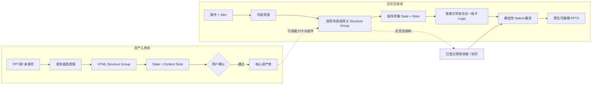

# PPagenT 产品叙事：把 PPT 生成变成可靠的生产过程

本文用于解释 PPagenT 为什么值得做、它选择了怎样的产品道路，以及这条道路可能形成什么价值。读者不需要了解 AI 或 PowerPoint 开发；后半部分同时公开它的核心架构与创新逻辑。

## 做 PPT，真正昂贵的不是“画”

即使一个人很会做 PPT，认真完成一套答辩、汇报或讲课用的演示，仍然需要很长时间。

真正费时间的不是把文本框拖到左边还是右边，而是一连串判断：这场汇报到底怎么讲，一篇长稿应该拆成多少页，每一页只承担什么职责，这几个观点是并列、递进、因果还是流程，哪里应该突出，什么时候应该用图，什么时候一句话反而更有力量。

然后，人还要翻以前做过的 PPT，找一个差不多的页面，替换内容、调整结构，再统一字体、字号、颜色和间距。

做 PPT 真正贵的，是这些反复发生的判断。而一个 PPT 做得很好的人，脑子里已经积累了大量答案。

所以 PPagenT 从一个很简单的问题开始：

> **既然一个高手已经知道怎样做是好的，为什么每次还要重新做一遍？**

## PPagenT 选择的是概率最大的需求

PPT 需求并不是平均分布的。

一端是几乎不在意版式，只要把文字放上去；另一端是发布会、品牌路演和高水平比赛，需要高度定制的视觉创意。两端都真实存在，但更多需求位于中间：学校、科研院所、事业单位、央国企和普通企业需要快速把一份稿件变成结构清楚、视觉体面、符合组织规范的 PPT。

这些场景通常不要求每一页都像艺术作品，却有一条明确底线：不能乱，不能丑，不能掉价，不能生成完以后无法修改。

PPagenT 不试图覆盖整个需求分布。它首先选择概率密度最大、重复发生、也最适合标准化的工作型 PPT。

如果把生成结果的综合质量记作 `Q`，把“可以直接拿去讲”的最低标准记作 `Q可用`，那么 PPagenT 真正想提高的不是某一次生成的最高分，而是：

> **在目标场景中，生成结果达到可用标准的概率。**

也就是概念上的：

> `R = P(Q ≥ Q可用 | 目标工作场景)`

这里的 `R` 才是 PPagenT 所追求的产品可靠度。

## 80 分不是妥协，而是产品定义

PPagenT 不追求偶尔生成一个让所有人惊叹的 95 分作品。

真正的使用场景往往很普通：明天上午九点要汇报，晚上把稿件交给系统，希望得到一套逻辑清楚、版式规范、符合单位风格，而且第二天仍然可以继续修改的 PPT。

从一份混乱的初稿到一套可以直接工作的 PPT，价值巨大；从一套已经能用的 PPT 再提升到高度定制的视觉作品，成本却可能迅速上升，而许多内部汇报并不需要为这部分增量付出同等代价。

所以“80 分”不是 PPagenT 做不到更高分后的退让，而是工作型 PPT 最有经济价值的质量阈值：直接使用不掉价，继续修改有基础，投入与收益相匹配。

> **对工作来说，稳定的 80 分，很多时候比随机的 95 分更值钱。**

PPagenT 不是在最大化一份 PPT 偶尔能有多漂亮，而是在最大化一份随机工作稿被可靠转化为可直接使用 PPT 的概率。

## 用限制自由换取可靠性

今天的生成式 AI 可以每次重新决定颜色、字体、结构、版式、元素和视觉风格。自由度越高，理论上的上限越高；但自由度越高，状态空间也越大，失败模式随之增加。

工作里的 PPT 恰恰不需要所有东西都每次重来。

学校有学校的样子，企业有企业的样子，一个团队也会有长期形成的表达方式。颜色、字体、Logo、页眉页脚和已经反复证明好用的页面结构，本来就应该保持稳定。

> **每次都不一样，有时候才是缺点。**

PPagenT 会主动限制一部分自由：使用确定的组织视觉规范、经过验证的表达能力、明确的数量与容量边界，以及已经登记的退化方式。这可能降低一次生成的理论峰值，却也大幅减少结果落到不可用区间的机会。

这不是因为系统做不到自由，而是因为正式工作更需要可预测。

> **固定不一定意味着落后；在正式工作里，固定往往意味着已经验证过。**

## AI 是控制器，不是画师

PPagenT 看起来像是“给一篇稿子，让 AI 生成一套 PPT”，但它在内部重新定义了这个问题。

AI 不直接自由绘制整份 PPT。内容导演负责理解稿件、组织叙事、拆页并形成页面内容；视觉导演负责判断表达关系，从已经登记的 Logic 中选择适合的能力和样式。当某个 Logic 需要更细一层的内容结构时，系统可以针对对应页面做一次局部补充，而不是让整条流程无限反复。

真正的视觉结果由提前确认的能力和确定性代码完成：

> **AI 负责理解和路由，规则负责约束和选择，代码负责稳定生成。**

Skin 与 Shell 固定学校或组织的视觉身份和页面骨架；Logic 表达并列、顺序、对比、层级、循环等语义能力；同一种具体样式再根据内容数量和容量确定性适配。父结构确定后，还可以暴露经过计算的真实可填区域：简单内容直接排字，确有二层关系时才调用一个已经登记的小结构；没有合适能力就退回普通文字，不临时编造。最后，程序把这些决策编译成原生可编辑的 PowerPoint，而不是截图、整页图片或难以修改的网页替代品。

换一种更直接的说法：

> **AI 读懂稿子，然后调用人已经提前做好的好东西。**

## 两条路线，只在核心资产库相接

PPagenT 把“建设视觉能力”和“使用视觉能力”分成两条路线。资产入库线允许人和工具反复理解、复现、扩散和验证；只有用户明确确认的能力才能进入正式生成线。正式生成线只读取核心库，不在交付现场临时创造结构，也不会因为一次生成成功就把未确认资产当作正式可用。

[打开可编辑 Draw.io 源文件](架构/PPagenT-资产入库线与正式生成线.drawio) · [查看当前 Logic 建设看板](架构/PPagenT-Logic-建设看板.html)

两条路线的唯一交汇点是 `status=core` 的核心资产库：入库线负责把经验变成能力，正式生成线负责把能力稳定地用出来。真实稿件暴露出的缺口会进入下一次独立入库任务，而不会把本次交付变成失控的在线设计实验。

## 把昂贵的计算前移

传统的生成式路线，是每来一个用户就重新理解一次、设计一次、绘制一次。计算、审美判断和失败风险都集中在运行时。

PPagenT 选择把这些昂贵而不确定的工作前移到建设期：人和工具先筛选优秀页面，理解它为什么好看，把内容、图片和数量参数化，验证不同状态，再由用户确认它可以进入正式资产库。

建设完成以后，同一套视觉能力可以被反复调用。正式生成阶段，模型主要执行理解、分类、路由和填参，确定性代码负责绘制与检查。

这意味着视觉理解并没有消失，而是从“每次生成都要重新支付的在线成本”，变成了“一次建设、多次复用的离线资产”。当前正式生成链路已经能够使用 DeepSeek V4 Flash 这样的低成本纯文字模型完成主要判断，不需要在每一次生成中依赖视觉大模型或图片生成 API。视觉模型仍可用于建设期的资产蒸馏与审查，但不成为每次交付的必要成本。

从这个角度看，PPagenT 想做的是把 PPT 生成从一次性手工业，变成一种可以重复运行的标准化生产过程。

## 真正积累的不是一万个模板

现实中的内容永远不可能被静态模板穷尽。原页面有三个观点，新稿件可能有四个；原页面每项十个字，新内容可能每项六十个字。

所以 PPagenT 真正积累的不是页面数量，而是页面背后的经验：什么内容适合怎样表达，一个版式能够处理多少内容，数量变化时怎样重新排布，超过边界以后应该换样式、拆页还是退化为简单排版，哪些结构即使能够画出来也不应该使用。

一个漂亮页面只有在这些规律被提炼出来以后，才能从一件作品变成一种能力。

这种能力在系统中表现为经过验证的 Logic 和 Structure Group。真正的壁垒也不是使用了哪个模型，而是：

- 积累了多少真正有效的表达能力；
- 能否把新内容可靠地路由到正确能力；
- 是否知道每种能力的容量、变化方式和失败边界；
- 能否稳定生成符合组织规范、原生可编辑的结果。

模型会继续变强，也会继续变便宜，但这些经过真实任务验证的表达经验不会自动出现。

## 从一个学校，走向更多组织

东北大学是 PPagenT 的第一个正式落地场景，因为它具有明确的视觉规范、持续发生的汇报需求和真实可检验的使用边界。

但东北大学不是最终边界。学校或组织的颜色、Logo、字体、页眉页脚可以由 Skin 替换；大量内容理解规则和 Logic 则可以继续复用。以后它可以服务其他学校、科研院所、实验室、企业和团队，也可以承载某个特别会做 PPT 的人的长期风格。

这使 PPagenT 不只是一个模板工具。它可以把原本只存在于少数人头脑和电脑里的能力，转化成更多人可以低成本获得的生产能力；也让一个组织不用要求每名成员都成为设计师，就能让日常输出稳定达到自己的基本标准。

> **它卖的不是一次偶然惊艳，而是把不可预测的 PPT 生成，变成概率上高度可预测的交付。**

## 最后，它仍然只想解决一件普通的事

做一套好 PPT 太费时间了，而其中很多时间花在以前已经有人解决过的问题上。

PPagenT 想把这些已经被验证的经验留下来：让 AI 帮我们读稿子，让规则帮我们做判断，让代码完成重复劳动。

最后，让一个原本不太会做 PPT 的人，也能很快得到一套：

> **不一定惊艳，但靠谱；不一定独一无二，但真的好用；可以立刻拿去讲，也可以继续修改的 PPT。**

如果能持续做到这一点，这个项目就值得做，也有机会成为一门真正的生意。
