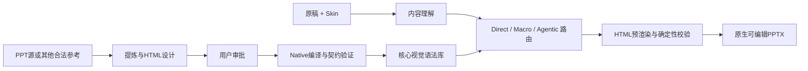

# 产品定义

## 一句话定义

PPagenT 是一个面向固定组织场景、基于受控视觉语法与有限代理编排，可靠生成原生可编辑 PPTX 的生产系统。

它不是自由 PPT Agent，也不是静态模板填充器。它把内容理解交给 AI，把可用视觉空间限制在已验证能力内，把最终几何、编译和检查交给确定性程序。

> AI 负责理解、编排与有限迭代；视觉语法负责约束；确定性引擎负责求解、编译与验证。

## 目标用户与问题

第一目标是学校、科研院所、事业单位、央国企和普通企业中反复发生的工作型演示：有明确组织规范，需要快速、体面、稳定且可继续编辑，不追求每页都成为高度定制的视觉作品。

产品优化的不是一次生成的理论最高分，而是在目标场景中稳定越过“可以直接使用”门槛的概率。内容关系可追溯、组织风格一致、失败能够解释、输出仍可编辑，共同构成可靠性。

## 产品对象

### Skin、Shell 与 Content Frame

Skin 保存字体、颜色、Logo 和组织身份；Shell 保存封面、目录、正文、尾页以及标题和页脚结构；Content Frame 是正文表达的统一可用区域。第一阶段以东北大学为正式场景，成熟后再替换 Skin 扩展到其他组织。

### Composition

Composition 是独立的空间运算层，负责把表达放进 Content Frame。目标能力包括 Stack、Split、Grid、Rail、Hero 和受限 Overlay。它们不是整页模板，而是带参数和失败边界的确定性布局操作。

### Expression

页面内容由三种表达组成：

- **Text**：核心观点、段落、列表、引语、标签和大数字等受控文字表达；
- **Media**：图片、截图、图表和其他有来源的媒体；
- **Structure Macro**：只有拓扑本身承载语义时才使用的流程、层级、因果、循环、矩阵、分支、网络等结构。

简单并列通常是 `Grid + Text`，不因为有三项就自动成为 Structure。Structure Group 仍是重要资产，但从默认页面骨架调整为高级 Macro。

### Primitive 与 Compiler

HTML/CSS/SVG 组件给出受控布局的最终计算结果；通用编译器将文字、形状、线、图像和层级机械转换为 Native PowerPoint 对象。HTML 不是交付格式，也不是面向任意网页的转换器。

## 两条工作流

资产入库线把优秀来源中的表达方法变成已审批能力；正式生成线只调用核心库中的合法能力。两条线唯一的交汇点是核心资产库。

`PPT源/` 是唯一原始 PPT 来源目录。候选资产不能由程序或 Agent 自行晋升，必须由用户确认。

## 目标运行方式

- **Direct Path**：普通文字、弱关系枚举、简单图文和大数字页，由 Composition + Text／Media 确定性完成。
- **Macro Path**：存在明确拓扑时调用已审批 Structure Macro；程序先过滤容量、字段和适用边界。
- **Agentic Path**：只有复合内容和空间制约确实需要迭代时，才允许代理通过小型 Domain Action 逐步形成页面状态，最多进行少量预渲染和一次修复，随后完成或降级。

`PageExpressionPlan` 在目标架构中是运行时页面状态，而不是要求模型一次性填完的巨型答案。Harness 负责驱动动作循环，但必须可替换；PPagenT 的领域 API、资产、Compiler 和 Quality Gate 不依赖某个模型厂商。

## 当前实现边界

当前正式代码已经跑通双导演、候选过滤、已登记 Structure Group、简单文字 fallback、HTML Structure 求解、Native 编译和确定性质量门禁；正式视觉流程仍以“一页一个主 Structure／Composition”为主。

`PageContentBlocks 0.1`、`PageExpressionPlan 0.1`、固定内容 HTML 原型和多表达验证器仍是候选研究代码。Direct／Macro／Agentic 三路径、通用 ExpressionRegion、多表达区域求解和有限代理循环尚未进入正式生产。最新事实以[更新日志](更新日志.md)顶部为准。

## 产品边界

- 不让 AI 不受限制地自由设计和绘制整份 PPT。
- 不把 HTML、截图或整页图片作为最终交付。
- 不承诺任意网页或任意 PPT 无损转换。
- 不要求所有页面使用结构图，也不以 Structure 命中率衡量质量。
- 没有合适结构时使用已登记的文字／图文 Composition；容量仍不合法时拆页或失败关闭。
- 不允许模型发明事实、媒体、数据、因果或层级；展示性压缩必须可追溯。
- 正式能力必须经过资产审批、容量契约和 Native 结果验证。
- 不为低概率风险恢复重试堆叠、全状态穷举和过重治理。

## 产品扩展

东北大学是第一个正式场景，不是最终边界。未来扩展优先替换 Skin、Shell 和合法视觉语法，而不是为每个组织复制一套生成系统。Composition 与 Compiler 应尽可能跨主题共享，主题差异通过 Token、Content Frame 和已验证适配表达。

尚待验证的不是“能否继续增加模板”，而是有限视觉语法能否在真实稿件上以更少模型调用覆盖更多普通页面，并保持稳定、体面和可编辑。
