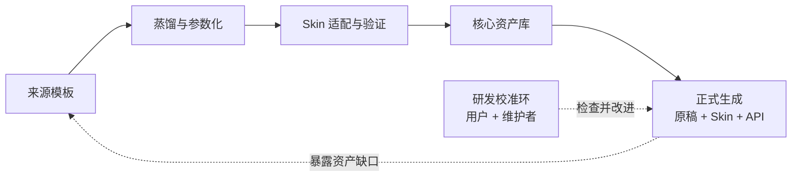

# 产品定义

## 一句话定义

PPagenT 是一个面向固定使用场景、以可靠生成原生可编辑 PPT 为核心目标的系统。

## 核心做法

PPagenT 不让 AI 直接完成整份 PPT 的设计和绘制。AI 负责理解原始稿件，把自然语言内容转化为固定、可校验的结构化字段，并在已验证的范围内选择表达方式；规则和代码负责调用 Skin 与核心资产，先形成可确认的 HTML 预渲染，再从同一计算结果确定性生成 PowerPoint。

> AI 负责理解和结构化，规则负责约束，代码负责生成。

## 核心价值

PPagenT 首先追求可靠，而不是每次都产生完全不同的视觉创意。这里的可靠包括：

- 内容关系和重点能够从原稿追溯。
- 页面遵守指定场景的视觉规范。
- 相同输入和规则能够得到稳定结果。
- 字号、重叠、越界和容量具有明确检查。
- 输出为原生可编辑的 `.pptx`，用户可以继续修改。

## 第一阶段与扩展

第一阶段以东北大学为具体落地场景，建立对应的 Skin、提示词、核心资产和质量规则，并用真实稿件把完整流程跑通。

这套能力成熟后，可以替换场景规范和资产，扩展到其他学校、单位或组织。东北大学是第一个正式产品场景，不是 PPagenT 的最终边界。

## 资产与主题（Skin）

资产积累从各种来源模板中提取有价值的表达样式，把它们转化为可按数量和内容变化的参数化结构，而不是保存只能照搬的一张静态页面。

核心资产采用“自描述能力包”：一个资产目录保存 `asset.json`、轻量运行契约、参数映射、HTML Component 和示例 PPT。正式生成先只扫描 `asset.json` 形成精简索引，粗筛后才读取少量入围资产的容量与容器契约，最终选定后才加载生成代码和 PPT 编译依赖；视觉导演只看结构化能力卡，不读取源码。迁移后的 Structure Group 以 HTML/CSS/JS 为唯一布局真源，由通用编译器机械转换为 Native PowerPoint 对象，不再手写第二份同义布局。

主题是固定场景的完整视觉方案，代码中称为 Skin。它负责字体与字号层级、颜色、版心、间距、Logo、页眉页脚、标题区、正文安全区和基础版型。视觉导演不在每次生成时重新发明主题，而是在主题允许的范围内编排文字、结构图和图片版式。

不同主题的基本区域可能相似，但可用空间并不完全相同，因此蒸馏出的结构不能直接原样贴入所有主题。

当前保持 `Skin → Shell → Content Frame` 的整页几何分层，并把 Content Frame 内的表达扩展为 Structure、Text、Media 三种类型。Logic 表示并列、顺序、对比、层级等语义能力，一个 Logic 下可以登记多个互补的 Structure Group，用不同拓扑、阅读路径、内容角色、容量、密度或媒体条件覆盖该 Logic 的主要表达需求，每组再由同一组件求解不同数量和容量 State。页面可以同级组合三种表达；一级 Structure 可以承载二级 Structure、Text 或 Media，二级 Structure 不得继续嵌套 Structure。页面级和结构内文字共用 `TextRegion → 受控 Markdown → Renderer`；传统流式与复杂命名区域模板消费同一份 Markdown，背景、边框和色块属于 Surface，不构成第四种内容表达。只改变配色、圆角、阴影和装饰的换肤不构成新的 Structure Group。视觉导演只在已登记合法能力中编排，程序负责区域、State、字号与几何求解。具体契约与当前实施状态见[Shell 与 Logic 契约](Shell与Logic契约.md)和[正式生成线架构决策](工作流/正式生成/生成线架构决策.md)。

资产进入某个主题时必须完成一次版式适配：在正文安全区内等比例缩放和重新定位，并根据内容数量选择已经验证的排列状态。空间或容量仍不合适时，应换版式、拆页或停止生成；不得压扁图形、无限缩小文字或临时改造一个未经验证的新结构。

## 工作流体系

PPagenT 有两个主工作流和一个建设期校准环：

两条路线的详细边界、唯一交汇点和无结构资产兜底见[可编辑 Draw.io 架构图](架构/PPagenT-资产入库线与正式生成线.drawio)。

- [资产积累与入库工作流](工作流/资产积累与入库/工作流.md)：把优秀来源转化为经过验证的核心资产。
- [正式生成工作流](工作流/正式生成/工作流.md)：把原始稿件和选定 Skin 转化为 PPT。
- 研发校准环：建设期检查内容导演、视觉导演和最终画面，修改提示词、Schema、规则、Skin 或资产；它不属于未来每次生成。

正式生成没有合适结构 Structure Group 时，先退化为 Shell 内已经登记的简单文字排版；这不等于现场创造结构图。简单排版也无法满足容量和字号边界时，才拆页或失败关闭并登记缺口，再返回入库工作流。

## 最终系统形态

最终系统由四部分组成：

- API：接收原稿和 Skin，调用内容导演与视觉导演。
- 固定 Schema：内容导演传递页面核心信息、内容块和两级语义关系，视觉导演传递稀疏的整页表达方案与可追溯展示性派生。
- 核心资产库：保存可自动发现的自描述资产包；每包包含能力、State、TextRegion、Markdown Renderer／区域模板、可选 ExpressionRegion、字段映射、HTML 组件和示例声明，旧包可暂保留兼容 Text Layout 与 Builder。
- HTML 预渲染与确认：用受控组件展示最终内容、组合、换行、图片和层级；确认不增加导演 API 调用。
- 确定性编译与质量门禁：把已确认的受控 HTML 最终布局机械转换为原生对象，并检查最终 PowerPoint。

视觉设计的主要成本发生在建设期：人和工具共同提炼、扩散并确认 Structure Group；正式运行时模型只做内容规划、合法选择和参数填写。Structure Group 工厂采用 HTML/CSS 表达视觉语法、响应布局和可填区域，正式运行只对已登记组件求解布局并编译为 Native 对象。HTML 是内部布局表示，不是产品交付格式。

## 产品边界

- 不是让 AI 不受限制地自由设计 PPT。
- 不是静态模板下载站。
- 不限定为科研 PPT，也不为每种汇报场景建立一套独立系统。
- 不把 HTML、截图或整页图片当作交付物；HTML 只作为可审计的布局真源，交付仍是原生 PowerPoint。
- 不承诺任意网页无损转 PPT；正式生成只使用已经过 HTML／Native 对照验证的组件和视觉原语。
- Structure 最多嵌套两层；正式生成只能调用已登记、已审批且空间契约合法的结构，不现场创造第三级结构或自由绘图。

## 尚待确认

- 对外使用的正式副标题。
- 面向普通用户时采用的产品类别表述。
- 东北大学版本的具体命名方式。
