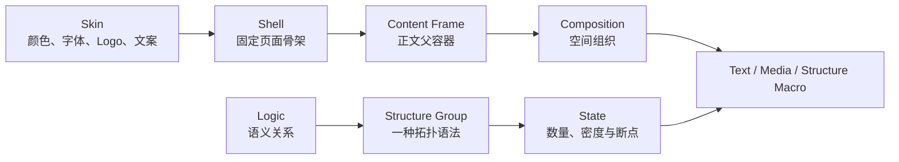

# Shell、Content Frame 与视觉能力契约

本文保存不随阶段讨论频繁改变的稳定契约。当前运行行为见[正式生成工作流](../工作流/正式生成/工作流.md)，候选下一代架构见[正式生成线架构决策](../工作流/正式生成/生成线架构决策.md)。

> 2026-09-06：以下固定 Shell 为现有正式运行契约。新的 Codex 试做采用 [Theme＋LayoutGuide](../工作流/正式生成/Skin主题与排版分离.md)组合及结构参考重组；源 Content Frame 不限制参考重组的新表达。尚未迁移的正式接口仍按下文执行。

## 固定分层

- **Skin**：学校或组织的颜色、字体、Logo 和文案。
- **Shell**：封面、目录、正文、尾页及标题区、Logo 槽、页码和页脚骨架。
- **Content Frame**：正文表达的统一父容器。
- **Composition**：表达怎样在父容器内分区、排列和留白。
- **Logic**：流程、层级、因果、循环等语义关系，不等于视觉样式。
- **Structure Group**：某个 Logic 下的一种具体拓扑语法。
- **State**：同一 Structure Group 在不同数量、密度或断点下由同一组件确定性求解的结果。
- **Text／Media／Structure Macro**：目标架构中的三种表达。当前正式线已经使用 Text 和单个主 Structure；多表达组合仍是候选。

Logic 只有在现有语义无法保留关键关系时才新增。时间、单调递进、角色泳道等优先作为已有 Logic 的属性或 Structure Group，而不是为了名称齐全扩张目录。

## 当前固定 Shell

几何来源是 `PPT源/PPT模板-封面正文尾页.pptx` 第 3 页。正式契约位于 `src/runtime/shells/academic-report.mjs`；Skin 引用该契约，不另写正文坐标。

画布为 `1280 × 720 px`。正文页主要槽位如下：

| 槽位 | x | y | width | height | 所有者 |
| --- | ---: | ---: | ---: | ---: | --- |
| 页码 | 44.45 | 31.90 | 71.23 | 48.47 | Shell，运行时填文案 |
| 栏目／章节 | 98.87 | 31.90 | 177.93 | 45.24 | Shell／Skin |
| Logo | 984.21 | 20.82 | 280.94 | 62.29 | Shell 定位，Skin 替换 |
| 标题带 | 35.17 | 87.55 | 1209.67 | 52.42 | Shell／Skin |
| 页面标题 | 9.04 | 88.85 | 1250.55 | 48.47 | Shell 定位，稿件提供 |
| **Content Frame** | **55** | **166** | **1170** | **492** | Composition／表达能力 |
| 底部预留 | 35.17 | 658 | 1209.67 | 62 | Shell／Skin |

标题下分隔线位于 `y = 147.22`，底线位于 `y = 689.24`。Structure 和 Composition 的设计基准是 `1170 × 492`，不是整页 16:9。正文组件不得重复绘制标题、Logo、页码、背景或页脚。

## Structure Group 核心包

正式 Structure Group 由以下真源组成：

1. `asset.json`：身份、Logic、来源、语义边界、State、空间和轻量入口；
2. `runtime.mjs`：粗筛入围后才加载的容量、区域和 PageContent Mapper；
3. `review.mjs`：看板使用的 HTML 组件、示例参数和 State 解析；
4. `generate.mjs`：调用通用 HTML → Native 编译能力；
5. HTML 与正式运行共用的预览参数和 State；
6. 按 State 生成的 Native PPTX 及其缓存预览。

`asset.json` 是发现真源，不维护中央注册表。预览 PNG、看板 JSON 和临时 PPTX 是可再生缓存，不是第二份数据库。

每个核心包必须声明：

- `logicId / structureGroupId / stateContract`；
- 适用关系、必需字段、数量范围、媒体要求和 `doNotUseWhen`；
- 自然尺寸、最小尺寸和真实 TextRegion；
- 可编辑、程序生成、固定和未开放字段；
- 从正式 PageContent 到组件输入的可达性见证；
- HTML 审批和 Native 对照结果。

看板样例文字只是预览值，不能代替字段契约。媒体必填时只能使用稿件或已登记来源，不能用虚构图片、Logo 或装饰补齐。图标查询只描述语义，由本地程序选择已登记图标，不能反向改变 Logic。

## HTML 单源与 Native 编译

一个 Structure Group 只维护一份 HTML/CSS/SVG 布局实现。不同数量是同一组件的 State，不是多份独立页面。浏览器求解后的 DOM、文字、SVG 和层级由通用编译器转换成原生 PowerPoint 对象；Native 端不得再写一套同义布局。

如果 HTML 与 PPT 不一致，应修共享编译能力或受控组件。不能把 HTML 截图放进 PPT 冒充可编辑，也不能删除已批准的关键视觉元素来换取编译通过。

当前 35 个正式 Structure Group 已采用这条单源路线。准确库存以 `catalog/logic-map.json`、`assets/资产索引.md` 和各资产 `asset.json` 为准。

## 文字与容量

结构只声明真实连续 TextRegion，不在结构代码中为了标题、正文、数字或标签的组合建立大量页面分支。受控 Markdown 解析为稳定 Token，再由 Renderer 在真实区域中排版；空间分离或形状不连续的承载面保留不同 `regionId`。

字号由 Skin 语义角色提供，当前组件档位为 `25 / 23 / 21 / 19 / 17 / 15 pt`，普通正文默认 17 pt。Renderer 只能在离散档位中选择能完整容纳的最大一级；15 pt 仍放不下时，必须调整区域、换 Composition、拆页、换 Macro 或拒绝，不能连续缩字硬塞。

Slot Map 从 HTML 的 `data-slot-*` 和浏览器计算样式派生，不能手写第二份坐标表。正式运行只读取已固化契约，不展开全状态笛卡尔积。

## 审美与几何边界

共享设计语言是简约、克制、有数学秩序的生成式几何：用少量可编辑基础图形、同色系明度层级、连续关系和负空间建立结构；避免卡片堆叠、廉价拟物、复杂插画和无语义装饰。

资产不得靠非等比例缩放适配 Content Frame。固定短标签使用真实 Flex／Grid 居中，不用行高假装垂直居中。来源中的第三方图片、Logo、雪山或样例字段必须参数化或删除。

## 候选多表达区域

目标架构会让 Text、Media 和 Structure Macro 进入同一受控 Region，并允许一级 Structure 的已声明区域承载一个子表达。现有 TextRegion 和 Content Slot 是迁移基础；候选名称为 ExpressionRegion。

ExpressionRegion 至少需要声明允许类型、真实矩形、内边距、自然／最小尺寸、文字或媒体要求、遮挡策略和 fallback。页面根不计 Structure 深度，二级 Structure 不得继续嵌套 Structure。

这些能力尚未接入正式生成。当前正式流程仍以单个主 Structure／Composition 运行；`PageContentBlocks 0.1`、`PageExpressionPlan 0.1` 与固定内容原型只能作为研究候选。具体字段必须经最小实验确认后再固化，不能在本契约中提前制造兼容负担。

## 正式选择边界

- 只能调用 `status=core` 且经用户确认的能力；
- 内容导演提供真实内容和关系，不输出资产、坐标或样式；
- 程序按语义、数量、容量、媒体和空间先做硬过滤；
- 视觉决策只能在合法候选和可编辑参数内发生；
- State、坐标、字号、图标文件和 Native 参数由程序确定；
- 无合适 Structure 时保留原 Logic 与缺口，退回合法文字／图文 Composition；
- 正式生成只能报告缺口，不能自行启动入库或晋升候选。

Luna 只用于来源 PPT 的资产蒸馏与入库，不参与正式生成线。

## 标注页

- [可编辑 PPTX 标注页](../../experiments/shell-content-frame-contract/output/shell-content-frame-contract.pptx)
- [生成脚本](../../experiments/shell-content-frame-contract/generate-shell-contract.mjs)
