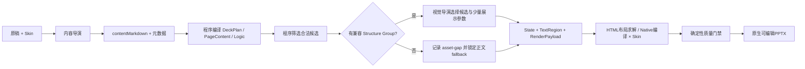

# 正式生成工作流

> 状态：当前生产行为

本文只描述当前代码实际运行的正式生成线。下一阶段候选架构见[正式生成线架构决策](生成线架构决策.md)，资产建设见[资产积累与入库工作流](../资产积累与入库/工作流.md)，固定几何见[Shell、Content Frame 与 Logic 契约](../../契约/Shell与Logic契约.md)。

## 当前流程



当前正式视觉模型仍以“一页一个主 Logic、Structure Group 和 Composition”为主。候选2+3 Schema、固定内容原型和 `PageExpressionPlan 0.1` 不在这条生产线上。

## 统一入口

用户上传和 Codex 代为提交都必须进入同一个 PPA 生产工作台，形成相同运行目录并调用相同工作流。Codex 只负责提交、监控和诊断，不能另建一条手工拆稿或渲染旁路。

工作台读取仓库中的提示词、Logic 目录、核心资产、Skin 和 Renderer。中间产物由运行生成，不要求用户预先编写 JSON。

## 当前角色

| 角色 | 负责 | 不负责 |
| --- | --- | --- |
| 内容导演 | 整稿叙事、H1 拆页、H2/H3 内容层级、来源块、每页主 Logic | 资产 ID、坐标、颜色、绘制 |
| 视觉导演 | 在程序提供的合法候选内选择 Structure Group、文字布局和少量展示参数 | 改写正文、重新判 Logic、自由绘图、代码 |
| 程序 | 编译内容、过滤候选、求解 State、绑定 TextRegion、生成 RenderPayload、编译和检查 | 发明事实或现场创造结构 |

`contentMarkdown` 是唯一可编辑内容稿。程序把它确定性编译为现有 `DeckPlan / PageContent`；需要修订时必须回到 Markdown，再重新编译。视觉导演的非法或缺失选择只能在已披露候选中确定性收口。

## 渐进披露

1. 内容导演看到完整精简 Logic 目录，以及由正式资产契约自动生成的匿名承载能力；它用于防止丢掉真实关系，不允许反向套图。
2. 程序按 Logic、关系子型、数量、容量和媒体要求过滤核心资产。
3. 视觉导演只看到少量合法能力卡，不读取源码、完整 DOM、Builder 或整个资产库。
4. 选定后才加载 Region、Mapper 和精确运行契约；真正绘制时才加载 HTML/PPT 编译依赖。

结构性页面没有兼容核心资产时，保留原 Logic 和 `asset-gap`，使用已登记的通用正文候选完成交付，不跨 Logic 硬套，也不临时画结构。只有实际容量超限时才记录 `content-capacity-gap`；两者不能混淆。

## 调用和兜底

正常基线是一次内容导演调用、一次视觉导演调用。当前内容阶段最多允许一次恢复，视觉阶段不进行第二次模型调用；确定性收口和正文 fallback 不增加 API 请求。

模型超时、视觉 JSON 或候选选择失败可以由程序在合法候选内接管，并记录 `delivered-with-fallback`。内容真实性必须有原稿来源支持；最终字体、越界、裁切、明显碰撞、模板和编译依赖属于不能伪造通过的硬门禁。

当前运行继续生成候选、fallback、Structure 使用和重复情况统计，但不根据单次缺口自动启动资产入库。结构资产第一轮建设已冻结；只有重复、明确的拓扑缺口经用户确认后才另开入库任务。

## 与下一阶段的边界

下一阶段先用小实验验证 Composition + Text／Media 与现有 Structure 的组合能否覆盖普通页面。复杂页面是否需要预渲染后的反馈修正，将单独比较收益、成本和失败边界。

在实验通过并正式接入前：

- 当前内容导演和视觉导演提示词继续代表生产契约；
- 不把候选 `PageExpressionPlan` 当作正式输出；
- 不让 Agent 在运行时生成 HTML、SVG 或 PPT 代码；
- 不因新方向删除当前可交付的确定性路径。

## 命令

```powershell
npm run agent:run:deepseek -- `
  --input <稿件.md> `
  --output <输出.pptx> `
  --run-dir <运行记录目录>
```

日常可双击 `启动PPA生产工作台.cmd`，或运行 `npm run production:workbench`。具体界面和运行记录见[正式生成工作台](生产工作台.md)，Provider 与密钥边界见[运行配置信息](../../契约/运行配置信息.md)。
