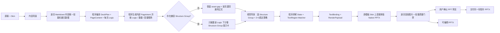

# 正式生成工作流

本文只定义正式生成线。资产怎样建设见[资产积累与入库工作流](../资产积累与入库/工作流.md)，固定几何与资产契约见[Shell 与 Logic 契约](../../契约/Shell与Logic契约.md)。

下一版正式生成线已经确认的职责、候选、State 所有权、共享恢复预算、交付状态和日志契约见[正式生成线架构决策](生成线架构决策.md)。该文档是后续实现依据；在改造完成并验证前，本页与实际代码仍代表当前运行行为。

## 流程



正式线只有内容导演和视觉导演两个模型角色。程序直接在原模板 Skin 上排版 Native PPTX，再把这份 PPTX 渲染成逐页图片供用户确认；这里不调用模型，也不要求视觉模型。整套 HTML 不再参与正式生成。当前自动混合页只开放“一个明确分点块使用真实登记 Structure + 一个独立文字块”的受控组合，其余2+3形态仍需逐类验收。内容审查和视觉审查属于建设期校准，不是日常业务模型步骤。

## 统一执行入口

无论稿件由用户在网页上传，还是由 Codex 代为提交，都必须进入同一个正式生成工作台、形成同一种运行目录，并执行本页定义的同一条生产线。用户要求“用 PPagenT 正式工作流生成”时，Codex 只负责提交指定稿件、监控运行和按需诊断，不得绕过工作台自行充当内容导演或视觉导演，也不得另建一套生成实现。

Codex 是否在场不影响生产线运行：工作台使用已配置的 API 和仓库提示词独立完成生成；Codex 需要介入时，只读取同一次运行留下的输入副本、事件、调用详情、中间产物和交付结果。

## 两个导演怎样配合

| 角色 | 负责 | 不负责 |
| --- | --- | --- |
| 内容导演 | 用 H1 页面、H2/H3 页内标题与列表形成整套叙事、拆页、页序、主节点、节点内支撑、每页 Logic、原文证据与判断置信度 | 具体 Structure Group、坐标、颜色、组件 ID |
| 视觉导演 | 在已确定 Logic 下选择 Structure Group、2+3整页表达策略、块级结构模式、兼容 Text Layout、整套节奏、中心短标签与图标语义查询 | 重新判断 Logic、重写正文、输出坐标字号、绘图或生成代码 |
| 程序 | 候选过滤、求解 State、把 PageContent 绑定到 TextRegion、校验排版选择、生成 RenderPayload 与渲染 | 改变原稿事实、现场创造结构 |

`contentMarkdown` 是唯一可编辑内容稿；程序把它确定性编译为 `DeckPlan / PageContent`，并投影为 `PageContentBlocks`，不需要视觉导演选完结构后再退回内容导演重填。视觉导演返回 `candidateId / expressionStrategy / blockStructureModes / textLayoutChoices / centerLabel / iconQueries`；程序生成 `PageExpressionPlan`、TextBinding、RenderPayload 和最终区域。Typography Matcher 是普通程序，不是第三个 Agent；非法或不适配的块级模式按节点数量回到安全模式。正式线不允许视觉方案直接修改编译后的 `PageContent`，修订必须回到 Markdown 再编译。

层级等拓扑内容也遵循同一原则：内容导演在 `PageContent` 中填写分层节点文字与相邻层关系矩阵，视觉导演只选择适配的 Structure Group。程序可以用相邻布尔矩阵乘法派生跨层可达关系，用于校验节点是否完整归属；渲染器只读取节点表和相邻矩阵生成坐标与连线，不要求视觉导演填写坐标，也不把默认预览状态当成正式数据。

## Skill 式渐进披露

1. 内容导演看到完整的精简 Logic 目录，以及程序从当前核心资产契约自动生成的匿名 `structureCapabilities`。能力摘要只披露内容形状、项数、必需字段和关系特征，不披露资产 ID；它用于防止内容结构在压缩时丢失，不允许反向套结构。
2. 内容导演一次性输出逐页 Markdown 和同序 `pageMetadata`：每个 H1 就是一页，H2 是页内主节点，H3 是可选节点内小标题。程序生成稳定 pageId，并由标题、段落与列表编译旧 `DeckPlan / PageContent`；复杂 Logic 的 `relationBindings` 只引用 Markdown 节点，不复制正文。然后再把 `logicIntent` 转为内部 `PageIntent`。
3. 程序读取核心资产的轻量声明，按 Logic、关系子类型、数量、容量和媒体要求过滤少量 Structure Group。内容密度只参与候选排序，不能单独把语义正确的结构硬拒绝。
4. 视觉导演只在这些候选中选择，不读取资产源码、全部 DOM、Builder 或历史材料。结构性页面没有已就绪候选时，程序保留原 Logic 与 `asset-gap`，只披露通用正文候选以完成该页；不得用相近 Logic 掩盖缺口，也不得把退回后的页面改记为 `editorial`。
5. 选定后程序才加载该组的 Region、兼容排版、字段 Mapper 与精确契约；真正绘制时才加载 HTML/PPT 编译运行库。

候选为空时必须先区分原因：如果已有语义兼容资产，只是某个标题或正文超过其登记容量，记为 `content-capacity-gap` 并保存具体页面、字段和上限；只有不存在语义兼容结构时才记为 `asset-gap`。两者不能用同一个“缺资产”错误掩盖。正式生产允许容量问题使用唯一一次内容兜底，优先拆分超容量 H1 页面；第二次仍不合法则停止。

这与 Agent Skill 的使用方式一致：先知道“有哪些能力”，命中后再读取该能力的表单和实现。资产数量增加不应线性增加模型 Token。

## Markdown 层级与调用次数

默认由内容导演直接从原稿完成拆页、节点与 Logic 判断，不在它前面放额外模型。普通输入 Markdown 标题只作为来源章节，不再限制输出页数；内容导演输出中的每个 H1 就是最终页面，H2/H3 与列表表达页内主节点、小节和支撑点。整套标题、核心结论与叙事弧保存在轻量 `deckMetadata`。完整行的“第 X 页”仍是唯一硬页面边界。旧 `structuralGuides / structuralHints` 研究能力保留，但正式新路径不调用结构模型、不用 sectionKey 覆盖 Markdown 编译结果。

程序先把原稿段落编号为 `sourceBlockIds`，内容导演选择本页实际使用的全部必要编号，不再抄写逐字锚点。程序只拼接实际选中的段落来生成逐页 `sourceAnchors / sourceText`，不会把未选中的中间段落卷入本页；允许页面按叙事需要回看、重排或部分交叠来源，完全相同的证据集合不能重复生成两页。

生产基线为：

- 内容导演：1 次；
- 视觉导演 Skill 路由：每批最多 8 个正文页；8 页以内通常 1 次，长稿按原页序分批；
- 模型式结构批量读取：正式路径关闭；
- 受限节点内细化：正式路径关闭。

短稿通常保持一次内容调用和一次视觉调用，但 API 连接数不再是硬约束。正式默认 `maxContentAttempts=2 / maxVisualAttempts=1`：内容仍不合法时最多消耗一次修订；视觉阶段按每批最多 8 页调用，后续批次只携带此前的紧凑候选选择来维持整套节奏。每批空响应或非法 JSON 时允许一次受控重答。两次内容均失败后由程序生成忠实原稿保底页；视觉批次、视觉 JSON 或确定性复核失败后由程序在合法候选中排序，必要时锁定主题正文候选。视觉导演逐页输出 `pageId / candidateId / centerLabel`，可选输出 `expressionStrategy / blockStructureModes`，不能复写正文、坐标和完整候选合同。

程序在整稿范围记录 Structure Group 使用次数：同页存在多个同等合法候选时，优先使用尚未出现或使用更少、且不会增加媒体负担的候选。没有同等候选时允许重复，不能为了形式变化牺牲语义。

## 渲染与失败边界

正式生产采用“模型优选、程序收口、正文保底”的失败策略，并把每次接管原因写入 `workflow/resilience-report.json`。只要输入可读取、Skin 与正文兜底资产存在、确定性渲染依赖可用且质量门禁能够通过，工作流应产出 `delivered` 或 `delivered-with-fallback`，不因模型超时、JSON、来源空白、候选容量或组件溢出而整条中止。操作系统、磁盘、模板损坏、缺少渲染依赖或最终质量门禁失败仍属于不可伪造成功的硬故障。

正式生成只能调用 `status=core` 且已确认的 Structure Group。结构性 Logic 没有适配资产时，不硬套其他 Logic，也不现场画新结构；该页退回通用正文 Composition，整套继续交付。运行结果必须逐页暴露退回事实、原 Logic、缺口原因，并按既有 Logic 聚合出“建议补充的 Structure Group”；它只形成报告，不自动启动入库任务。

每次成功运行同时写入 `workflow/production-statistics.json`，最小统计包括：正文页总数、结构页数、退回页数、结构覆盖率、实际使用的 Structure Group、各组使用页码与次数、发生重复的组及重复次数、各 Logic 的使用分布，以及由退回报告聚合出的资产补充建议。统计还逐页保留紧凑的候选诊断：同一 Logic 下有哪些合法候选、哪些资产因语义／变体／容量条件被排除、最终是否只有一个合法候选；不写入资产源码和完整运行对象。同一 Logic 在本稿出现至少两次且每页始终只有同一个候选时，另记为 `diversityGaps`，供下一次独立入库任务选择补充通用 Structure Group 或同组视觉变体。统计只读取本次生产事实，用于判断“缺资产、契约不匹配、单候选必要复用还是选择偏科”，不参与当次生成决策，也不自动触发入库。

每次渲染都直接复用真实模板 Skin，在复制出的模板页上填写动态 Skin 文字、Composition 和视觉导演实际选中的登记资产，生成暂存 Native PPTX；随后从该 PPTX 导出逐页 PNG 并执行字号、边界和组件内收门禁。正式工作台等待用户确认这些 PPT 渲染图；确认后只把同一份暂存 PPTX 放入交付目录，不重新选择 Structure、Composition，也不重新排版。未通过视觉验收的 `text-plus-structure / multi-structure` 只允许在人工调试检查点试验。

每次渲染只保留最小字号、页面边界、组件内收和明显碰撞等确定性门禁。SHA-256、全状态矩阵、多轮视觉审查和重复读图不是日常正式生成步骤。

## 命令

```powershell
npm run agent:run:deepseek -- `
  --input <稿件.md> `
  --output <输出.pptx> `
  --run-dir <运行记录目录>
```

入口只接受原稿、Skin 和运行配置。中间 JSON 是工作流产物，不是要求用户预先编写的输入。

日常使用可以双击项目根目录的 `PPA生产工作台.exe`。它只是把本工作流暴露为本地网站：接收用户上传或 Codex 代为提交的稿件、启动同一条正式生成线，并查看各阶段真实输入、提示词、API 调用、输出和耗时；不会复制资产、写死提示词或依赖 Codex。内容导演读取原稿，视觉导演使用独立多模态模型读取逐页内容、合法候选能力卡和候选 Structure 预览，填写逐页 Composition 与整套 `rhythmPlan`；确定性解析器随后执行容量、组合合法性和整套节奏审计。视觉导演表单调试暂停仍为可选；正式检查点展示暂存 PPTX 的逐页渲染图。具体见[正式生成工作台](生产工作台.md)。
