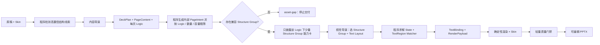

# 正式生成工作流

本文只定义正式生成线。资产怎样建设见[资产积累与入库工作流](../资产积累与入库/工作流.md)，固定几何与资产契约见[Shell 与 Logic 契约](../../Shell与Logic契约.md)。

## 流程



正式线只有内容导演和视觉导演两个模型角色。内容审查、视觉审查和人工复核属于建设期校准，不是未来每次生成的业务步骤。

## 两个导演怎样配合

| 角色 | 负责 | 不负责 |
| --- | --- | --- |
| 内容导演 | 整套叙事、拆页、页序、主节点 `items`、节点内 `points`、来源依据、每页 `logicIntent` | 具体 Structure Group、坐标、颜色、组件 ID |
| 视觉导演 | 在已确定 Logic 下选择 Structure Group、兼容 Text Layout、整套节奏、中心短标签与图标语义查询 | 重新判断 Logic、重写正文、输出坐标字号、绘图或生成代码 |
| 程序 | 候选过滤、求解 State、把 PageContent 绑定到 TextRegion、校验排版选择、生成 RenderPayload 与渲染 | 改变原稿事实、现场创造结构 |

`PageContent` 就是内容表单，不需要视觉导演选完结构后再退回内容导演重填。视觉导演只返回 `candidateId / textLayoutChoices / centerLabel / iconQueries / refinementItemIds`；程序依据所选 Structure Group 的轻量 Region 契约，把已有 `title / body / points / metrics` 确定性展开为 TextBinding 和 RenderPayload。Typography Matcher 是普通程序，不是第三个 Agent；非法选择只在该资产预先登记的候选集合内归一化。只有原稿明确存在、但内容导演漏掉节点内分点时，才允许一次受限结构补充；它不是常规往返。

## Skill 式渐进披露

1. 内容导演看到完整的精简 Logic 目录，包括暂时没有 Structure Group 的 Logic；它按原稿语义选择，不得按当前资产库存量反推关系。
2. 程序把 `logicIntent` 确定性转为内部 `PageIntent`，再读取核心资产的轻量声明，过滤出该 Logic 下数量、容量和媒体均合法的少量 Structure Group。
3. 视觉导演只在这些候选中选择，不读取资产源码、全部 DOM、Builder 或历史材料。
4. 选定后程序才加载该组的 Region、兼容排版、字段 Mapper 与精确契约；真正绘制时才加载 HTML/PPT 编译运行库。

这与 Agent Skill 的使用方式一致：先知道“有哪些能力”，命中后再读取该能力的表单和实现。资产数量增加不应线性增加模型 Token。

## 结构线索与调用次数

默认由内容导演直接从原稿完成拆页、节点与 Logic 判断，不再在它前面放一个额外模型替它生成内容节点。程序会把可确定解析的枚举、对比、流程和架构等线索作为 `structuralGuides` 一并交给同一次内容导演调用，并检查其关系与节点数量没有退化；模型式结构读取仅作为显式启用的备用能力，不属于生产基线。

生产基线为：

- 内容导演：1 次；
- 视觉导演 Skill 路由：1 次；
- 模型式结构批量读取：默认关闭；显式启用时有命中才调用 1 次；
- 受限节点内细化：确有遗漏时最多 1 次。

基线主流程因此只有两次导演调用。Schema 或合法选择失败可以有限重答，但不得形成无限反思循环。视觉导演路由输出保持紧凑，不能再次要求模型复写正文、坐标和完整候选合同。

## 渲染与失败边界

正式生成只能调用 `status=core` 且已确认的 Structure Group。结构性 Logic 没有适配资产时返回 `asset-gap` 并停止交付，正式线到此结束，不自动记录需求或启动入库任务。只有原稿本身确实没有可视化关系、内容导演明确选择 `editorial` 时，才使用简单文字 Composition。运行现场不能临时画新结构。

每次渲染只保留最小字号、页面边界、组件内收和明显碰撞等确定性门禁。SHA-256、全状态矩阵、多轮视觉审查和重复读图不是日常正式生成步骤。

## 命令

```powershell
npm run agent:run:deepseek -- `
  --input <稿件.md> `
  --output <输出.pptx> `
  --run-dir <运行记录目录>
```

入口只接受原稿、Skin 和运行配置。中间 JSON 是工作流产物，不是要求用户预先编写的输入。
