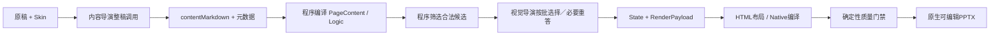
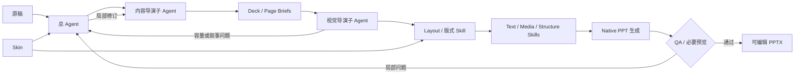

# 正式生成工作流

> 状态：现行生产行为与下一代迁移目标

本文先描述当前代码确实能够执行的生产线，再给出已经确定、但尚未完成实现的 PPT 专用 Harness 目标。详细角色与 Skill 契约见[生成线架构决策](生成线架构决策.md)。

## 现行生产链路



当前代码仍以“一页一个主 Logic、Structure Group 和 Composition”为主。内容导演以整稿问答生成内容；视觉导演可因长稿分批或失败恢复进行多次请求，但每次仍是受 Schema 约束的请求—响应，并不具备持续任务状态和自主工具循环。没有兼容 Structure 时，程序记录 `asset-gap` 并使用已登记正文 fallback。当前内容导演和视觉导演提示词继续代表这条生产契约。

统一业务入口为 PPA 生产工作台；Codex 或用户提交稿件都必须形成相同运行目录并调用相同正式入口。当前命令为：

```powershell
npm run agent:run:deepseek -- `
  --input <稿件.md> `
  --output <输出.pptx> `
  --run-dir <运行记录目录>
```

当前链路在目标架构的最小纵向切片通过前继续保留，不删除、不伪装成新 Harness。

## 目标生产链路



目标链路不是把现有两次 API 外面简单套一层循环。变化有四点：

1. 总 Agent 保存状态并决定下一步，只局部返工；
2. 视觉导演先规划整套节奏和页面区域，再选择与组合能力；
3. Skin 与 Layout 并列，Layout 在 Content Frame 内组合 Text、Media 和 Structure Skills；
4. 资产从“候选 ID + 固定填表”升级为包含执行器和适配边界的 Skills。

## 目标角色

| 角色 | 负责 | 不负责 |
| --- | --- | --- |
| 总 Agent | 任务状态、调用顺序、预算、反馈路由、QA 收口、交付 | 亲自替代两个导演做全部页面设计 |
| 内容导演 | 整稿叙事、分页、页面职责、内容层级、来源真实性、按页修订 | 资产 ID、坐标、颜色、绘图和代码 |
| 视觉导演 | 整套节奏、页面 Composition、Content Regions、Skill 路由与组合、受限视觉修正 | 发明事实、素材和关系，静默改写核心 Skill |
| Skill 执行器 | 在契约内生成或适配 Native 对象 | 决定稿件叙事和跨页结构 |
| 确定性 QA | 字号、越界、碰撞、容量、可编辑性和必要关系检查 | 判断全部审美问题或虚构“通过” |

Skill 执行器默认不是子 Agent。只有内容导演和视觉导演是专业子 Agent；能力域、Logic 和具体 Style Group 是逐层加载的信息与工具，避免把三层 Skill 错做成三层 Agent 调用。

## 渐进披露与 Skill 调用

1. 总 Agent 首先只读取能力域索引和当前任务状态；
2. 总 Agent 加载用户指定的 Skin，并把组织规范和 Content Frame 写入 Deck Brief；
3. 内容导演读取原稿与必要内容规则，输出整套 Deck／Page Briefs；
4. 视觉导演先确定 Layout、页型、区域和所需表达能力；
5. 只有需要结构时才读取 Structure Logic 索引；只有需要图片时才读取 Media 规则；
6. 候选缩小后才加载具体 Skill 的容量、禁用条件、实现和示例；
7. Skill 在 Content Frame 中生成 Native 对象；
8. QA 只反馈可定位的问题，总 Agent 决定局部修订或降级。

不得把完整资产库、全部源码和所有示例一次性塞入模型上下文。不得为每个 Skill 层级都增加一次模型调用。

## 页面策略

视觉导演先判断页面的整体构成，而不是先问“该用哪个结构图”：

- 单一观点、解释、证据、引语或大数字，优先 Text Skill；
- 图片、截图、图表承担主要信息时，优先 Media + Text；
- 拓扑本身承载语义时，调用 Structure；
- 页面需要多个表达时，先由 Composition 划分区域，再组合少量 Skills；
- 一个大的成熟结构能够完整承担页面时，可以独占主内容区域；
- 内容超出合理容量时，换 Composition、请求内容重组或拆页，不缩小字号硬塞。

## 适配、降级与资产边界

正式生成只调用核心 Skills。具体 Skill 可以声明可调整的数量、尺寸、间距、颜色、文字、媒体槽和布局模式；Agent 只能在该范围内适配。

若标准执行器基本适用但需要小改，允许在本次运行目录中生成临时派生实现，并记录来源 Skill 和差异。该实现不覆盖核心资产、不进入正式索引、不自动晋升。

页面按以下阶梯收口：

1. 精确匹配 Skill；
2. 契约内适配；
3. Text／Media／Structure 组合；
4. 重组内容或拆页；
5. 成熟文字／图文 fallback；
6. 触发内容、依赖或几何硬失败。

`asset-gap` 表示缺少合适能力；`content-capacity-gap` 表示内容容量不合法；二者不能混淆。fallback 必须保持事实、来源和原生可编辑性，不能用整页图片、伪造媒体或错误 Logic 关闭问题。

## HTML 与 Native 的迁移边界

现有生产链仍包含 HTML 布局到 Native 编译，当前核心资产继续可用。目标生产链中，HTML 不再是所有页面必须经过的运行时真源：

- 入库线继续用 HTML 复现、组件化、扩散和人工审核；
- 正式线由视觉导演面向 Content Frame 调用 Native PPT Skills；
- 同一能力不得长期维护互相独立的 CSS 布局和 Builder 布局；
- 迁移以单个 Skill 为单位，验证一致后再替换，不一次性重写全库。

## 调用预算与反馈边界

目标 Harness 默认：内容导演形成一次整稿方案，视觉导演形成一次整套编排。只有明确页面问题才触发局部反馈；每页至多一次内容修订和一次视觉修正，确定性修复不增加模型调用。

模型超时或 Agent 输出失败时，总 Agent 可以重试对应步骤或进入降级阶梯，但不能整稿无限重跑。内容真实性、依赖、可编辑性、字体、越界、裁切和明显碰撞属于硬门禁。

## 当前迁移步骤

先做一个包含普通文字页、结构页和复合页的最小纵向切片，并只封装少量代表性 Skills。对比现行链路和目标链路的内容完整性、视觉质量、可编辑性、Token、耗时与 fallback。验证通过后，才逐步迁移提示词、运行对象和更多资产。

日常仍可双击 `启动PPA生产工作台.cmd`，或运行 `npm run production:workbench`。界面和运行记录见[正式生成工作台](生产工作台.md)，Provider 与密钥边界见[运行配置信息](../../契约/运行配置信息.md)。
