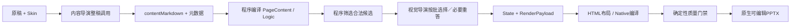

# 正式生成工作流

> 状态：现行生产行为与下一代迁移目标

本文先描述当前代码确实能够执行的生产线，再给出已经确定、但尚未完成实现的 PPT 专用 Harness 目标。详细角色与 Skill 契约见[生成线架构决策](生成线架构决策.md)。

## 现行生产链路



当前代码仍以“一页一个主 Logic、Structure Group 和 Composition”为主。内容导演以整稿问答生成内容；视觉导演可因长稿分批或失败恢复进行多次请求，但每次仍是受 Schema 约束的请求—响应，并不具备持续任务状态和自主工具循环。没有兼容 Structure 时，程序记录 `asset-gap` 并使用已登记正文 fallback。当前内容导演和视觉导演提示词继续代表这条生产契约。

统一业务入口为 PPA 生产工作台；Codex 或用户提交稿件都必须形成相同运行目录并调用相同正式入口。当前命令为：

```powershell
npm run agent:run:deepseek -- `
  --input <稿件.md> `
  --output <输出.pptx> `
  --run-dir <运行记录目录>
```

当前链路在目标架构的最小纵向切片通过前继续保留，不删除、不伪装成新 Harness。

## 目标生产链路

一个 PPT Agent 分内容与视觉两个阶段，通过持久化 Deck Project 交接；模型默认不接收图片。区域 PageComposition 与上屏 PageView 分离，程序以网格、文字布局、对齐、间距、密度和几何问题提供局部反馈。通过后输出原生 PPTX，图片预览供人工查看。

目标架构、对象、工具与反馈边界统一见[架构决策](生成线架构决策.md)。当前实验位于 codex/penguin-harness-v2，未替换上面的正式入口。另一台电脑的 main 建设版式与规则，见[分支分工](../../分支分工.md)。

普通文字、结构和图文都是正常页面表达。先依据稿件提出区域方案，再按能力的真实容量协商调整；禁止把候选表当成完整页面设计，也不为达到混排数量而强行混排。
