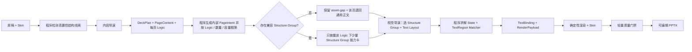

# 正式生成工作流

本文只定义正式生成线。资产怎样建设见[资产积累与入库工作流](../资产积累与入库/工作流.md)，固定几何与资产契约见[Shell 与 Logic 契约](../../Shell与Logic契约.md)。

## 流程



正式线只有内容导演和视觉导演两个模型角色。内容审查、视觉审查和人工复核属于建设期校准，不是未来每次生成的业务步骤。

## 统一执行入口

无论稿件由用户在网页上传，还是由 Codex 代为提交，都必须进入同一个正式生成工作台、形成同一种运行目录，并执行本页定义的同一条生产线。用户要求“用 PPagenT 正式工作流生成”时，Codex 只负责提交指定稿件、监控运行和按需诊断，不得绕过工作台自行充当内容导演或视觉导演，也不得另建一套生成实现。

Codex 是否在场不影响生产线运行：工作台使用已配置的 API 和仓库提示词独立完成生成；Codex 需要介入时，只读取同一次运行留下的输入副本、事件、调用详情、中间产物和交付结果。

## 两个导演怎样配合

| 角色 | 负责 | 不负责 |
| --- | --- | --- |
| 内容导演 | 整套叙事、拆页、页序、主节点 `items`、节点内 `points`、每页 Logic、原文证据与判断置信度 | 具体 Structure Group、坐标、颜色、组件 ID |
| 视觉导演 | 在已确定 Logic 下选择 Structure Group、兼容 Text Layout、整套节奏、中心短标签与图标语义查询 | 重新判断 Logic、重写正文、输出坐标字号、绘图或生成代码 |
| 程序 | 候选过滤、求解 State、把 PageContent 绑定到 TextRegion、校验排版选择、生成 RenderPayload 与渲染 | 改变原稿事实、现场创造结构 |

`PageContent` 就是内容表单，不需要视觉导演选完结构后再退回内容导演重填。视觉导演只返回 `candidateId / textLayoutChoices / centerLabel / iconQueries / refinementItemIds`；程序依据所选 Structure Group 的轻量 Region 契约，把已有 `title / body / points / metrics` 确定性展开为 TextBinding 和 RenderPayload。Typography Matcher 是普通程序，不是第三个 Agent；非法选择只在该资产预先登记的候选集合内归一化。只有原稿明确存在、但内容导演漏掉节点内分点时，才允许一次受限结构补充；它不是常规往返。

层级等拓扑内容也遵循同一原则：内容导演在 `PageContent` 中填写分层节点文字与相邻层关系矩阵，视觉导演只选择适配的 Structure Group。程序可以用相邻布尔矩阵乘法派生跨层可达关系，用于校验节点是否完整归属；渲染器只读取节点表和相邻矩阵生成坐标与连线，不要求视觉导演填写坐标，也不把默认预览状态当成正式数据。

## Skill 式渐进披露

1. 内容导演看到完整的精简 Logic 目录，以及程序从当前核心资产契约自动生成的匿名 `structureCapabilities`。能力摘要只披露内容形状、项数、必需字段和关系特征，不披露资产 ID；它用于防止内容结构在压缩时丢失，不允许反向套结构。
2. 内容导演为每页一次性输出 `logicIntent.logicId / reason / evidenceFragments / confidence` 和完整 `PageContent`。程序先删除被模型改写、未逐字出现于该页原文的片段，再把冗余证据确定性收口为前 3 条并将 `logicIntent` 转为内部 `PageIntent`；只要仍有合法原文证据，这类不改变内容语义的元数据问题不得触发整套内容重写。过滤后没有合法证据时仍然失败关闭。
3. 程序读取核心资产的轻量声明，按 Logic、关系子类型、数量、容量和媒体要求过滤少量 Structure Group。内容密度只参与候选排序，不能单独把语义正确的结构硬拒绝。
4. 视觉导演只在这些候选中选择，不读取资产源码、全部 DOM、Builder 或历史材料。结构性页面没有已就绪候选时，程序保留原 Logic 与 `asset-gap`，只披露通用正文候选以完成该页；不得用相近 Logic 掩盖缺口，也不得把退回后的页面改记为 `editorial`。
5. 选定后程序才加载该组的 Region、兼容排版、字段 Mapper 与精确契约；真正绘制时才加载 HTML/PPT 编译运行库。

候选为空时必须先区分原因：如果已有语义兼容资产，只是某个标题或正文超过其登记容量，记为 `content-capacity-gap` 并保存具体页面、字段和上限；只有不存在语义兼容结构时才记为 `asset-gap`。两者不能用同一个“缺资产”错误掩盖。正式生产不为容量问题再次调用内容导演；研发验证可显式开启定向重试。

这与 Agent Skill 的使用方式一致：先知道“有哪些能力”，命中后再读取该能力的表单和实现。资产数量增加不应线性增加模型 Token。

## 结构线索与调用次数

默认由内容导演直接从原稿完成拆页、节点与 Logic 判断，不再在它前面放一个额外模型替它生成内容节点。程序会把可确定解析的枚举、对比、流程和架构等线索作为 `structuralGuides` 一并交给同一次内容导演调用，并检查其关系与节点数量没有退化；模型式结构读取仅作为显式启用的备用能力，不属于生产基线。

稿件只使用一套页边界解析：完整行的“第 X 页”标记优先，兼容 Markdown 标题和普通文本；没有页标记时，才使用 H2–H6 中实际出现的最浅层级。结构线索、页数范围与章节覆盖共用同一 `sectionKey`，不再各自猜标题。显式封面、目录和结束语仍保留来源依据，但在 Shell 阶段映射为固定页面，不重复生成。

生产基线为：

- 内容导演：1 次；
- 视觉导演 Skill 路由：1 次；
- 模型式结构批量读取：默认关闭；显式启用时有命中才调用 1 次；
- 受限节点内细化：生产默认关闭；研发验证显式开启时最多 1 次。

基线主流程因此严格只有两次模型连接。生产中的超时、Schema、来源、容量或合法选择失败直接关闭本次运行并保留诊断，不自动重答；研发验证可以显式设置重试次数。视觉导演路由只强制逐页输出 `pageId / candidateId / centerLabel`，图标、文字排版、局部细化与理由均在非空或确有判断需要时才输出，避免长稿因重复空字段形成过长 JSON；它不能再次复写正文、坐标和完整候选合同。

程序在整稿范围记录 Structure Group 使用次数：同页存在多个同等合法候选时，优先使用尚未出现或使用更少、且不会增加媒体负担的候选。没有同等候选时允许重复，不能为了形式变化牺牲语义。

## 渲染与失败边界

正式生成只能调用 `status=core` 且已确认的 Structure Group。结构性 Logic 没有适配资产时，不硬套其他 Logic，也不现场画新结构；该页退回通用正文 Composition，整套继续交付。运行结果必须逐页暴露退回事实、原 Logic、缺口原因，并按既有 Logic 聚合出“建议补充的 Structure Group”；它只形成报告，不自动启动入库任务。

每次成功运行同时写入 `workflow/production-statistics.json`，最小统计包括：正文页总数、结构页数、退回页数、结构覆盖率、实际使用的 Structure Group、各组使用页码与次数、发生重复的组及重复次数、各 Logic 的使用分布，以及由退回报告聚合出的资产补充建议。统计还逐页保留紧凑的候选诊断：同一 Logic 下有哪些合法候选、哪些资产因语义／变体／容量条件被排除、最终是否只有一个合法候选；不写入资产源码和完整运行对象。同一 Logic 在本稿出现至少两次且每页始终只有同一个候选时，另记为 `diversityGaps`，供下一次独立入库任务选择补充通用 Structure Group 或同组视觉变体。统计只读取本次生产事实，用于判断“缺资产、契约不匹配、单候选必要复用还是选择偏科”，不参与当次生成决策，也不自动触发入库。

每次渲染只保留最小字号、页面边界、组件内收和明显碰撞等确定性门禁。SHA-256、全状态矩阵、多轮视觉审查和重复读图不是日常正式生成步骤。

## 命令

```powershell
npm run agent:run:deepseek -- `
  --input <稿件.md> `
  --output <输出.pptx> `
  --run-dir <运行记录目录>
```

入口只接受原稿、Skin 和运行配置。中间 JSON 是工作流产物，不是要求用户预先编写的输入。

日常使用可以双击项目根目录的 `PPA生产工作台.exe`。它只是把本工作流暴露为本地网站：接收用户上传或 Codex 代为提交的稿件、启动同一条正式生成线，并查看各阶段真实输入、提示词、API 调用、输出和耗时；不会复制资产、写死提示词或依赖 Codex。具体见[正式生成工作台](生产工作台.md)。
