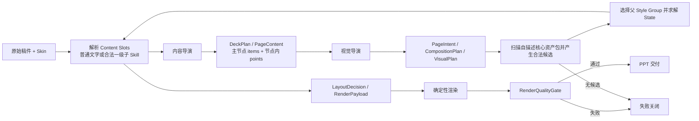
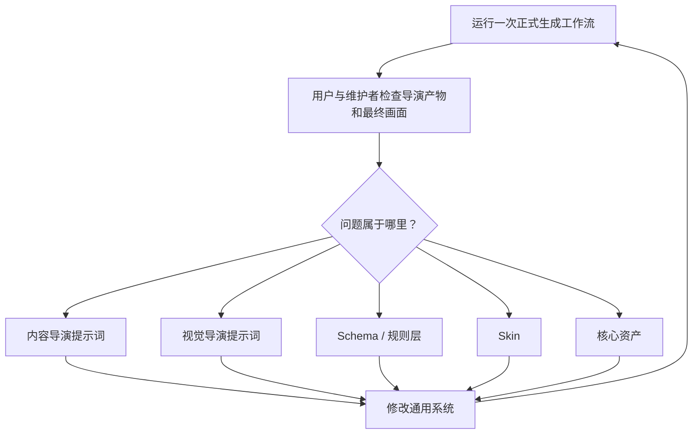

# 正式生成工作流

本文定义正式生成：稿件如何经过双导演、规则层和确定性代码成为 PPT。它不重复产品定位、视觉规范或[资产积累与入库工作流](../资产积累与入库/工作流.md)；整体关系见[产品定义](../../产品定义.md)。

## 流程图

正式产品每次只运行这条链。内容审查、视觉审查和人工复核不属于正式链；建设期对它的改进由本文后面的“研发校准环”完成。

## 完整运行链

PPagenT 有两个职责不同的导演角色：

- 内容导演面向整篇稿件，输出 `DeckPlan` 和 `PageContent × N`，决定怎么讲、讲几页以及每页保留什么。
- 视觉导演面向整套 PPT，根据 `DeckPlan` 和各页内容形成 `PageIntent`，选择版式家族、视觉变体和页面节奏。

在内容导演之前，程序只对枚举、重复职责、直接对比和明确转化等高置信线索发起相互独立的小型结构读取请求。它不替代内容导演，而是防止长上下文把原稿关系压成概括段落。原稿每个 Markdown 二级标题默认必须有对应内容页；遗漏章节不能静默缩页。结构读取结果作为确定性提示覆盖对应页，模型不得把辅助说明提升为同级节点。

视觉导演在合法候选上同时输出 `VisualPlan` 与 `CompositionPlan`：前者先按 Visual Skill 确认语义能力，再在该 Skill 下选择具体 Style Group，并控制整套轮廓、密度和重复；后者决定每页的文字、组件和媒体槽位。数量 State 由内容和父 Content Frame 确定性求解，不是视觉导演临时重画。程序扫描 `status=core` 且带 `runtime` 声明的资产包，把关系、用途、数量范围、容量、轮廓和可选 `slotContract` 整理成精简能力卡。父 Style Group 与 State 确定后，程序才解析该 State 的真实 Content Slots；槽内默认承载普通文字，未来只有在 Schema 提供合法候选与受控绑定时才允许一级子 Skill。之后才进入 `LayoutDecision → RenderPayload → 确定性绘制 × Skin → RenderQualityGate → 交付`。分层和固定区域见[Shell 与 Visual Skill 契约](../../Shell与Visual Skill契约.md)。

两个导演都不生成 HTML、CSS 或 PPT 绘图代码。正式运行中的“生成”是参数化调用：视觉导演选定 `skillId / styleGroupId`，程序定位核心资产包，资产的 Mapper 把 `PageContent` 转为 `RenderPayload`。`html-component` 资产由本地浏览器求解已登记 DOM/CSS/SVG，通用编译器机械生成 PPT 原生对象；未迁移资产暂由旧 Native Builder 生成。HTML 是内部布局真源，不是导演输出，也不是截图式交付。

Content Slot 不增加第三个导演。父资产自己的 resolver 根据父 State 返回槽位 frame、绑定、方向和容量；程序据此过滤子候选。子 Skill 只在精确槽位内工作，最多一级，不得改变父拓扑。当前运行时已经能发现并解析循环闭环的 Slot 契约，但 `CompositionPlan` 尚未开放子 Skill 绑定字段，因此现阶段统一使用父资产的 `plain-text` 兜底；最小嵌套实验通过后再接入，不先扩张 Schema。

当视觉导演已经选中允许节点内 `points` 的 Style Group，同时发现原文明确含有但 `PageContent` 漏掉的二级枚举时，可以在同一次编排响应中附带 `semanticRefinementRequests`。程序把全套请求合并为一次小型结构调用，只读取命中页面及节点，补充有原文依据的 `points`，随后重新计算内容统计和合法候选；原视觉编排不重跑。正常页面不增加调用，整套最多执行一次这种批量细化；该调用最多尝试一次并以 30 秒为上限，超时或 JSON 无效时直接保留原内容与原编排。没有原文依据、候选不支持 `points` 或属于视觉导演负责的 `componentBindings` 时不触发。当前最小实现只补节点内 `points`，不建立通用递归 Agent、任意 JSON Patch 或无限反馈循环。

### 调用次数与对象所有权

这条链路只有两个导演角色，不是每个中间对象对应一个 Agent。production 模式的导演基线调用为：

| 阶段 | 执行者 | 产物 |
| --- | --- | --- |
| 全稿叙事与内容结构 | 内容导演，一次模型调用 | `DeckPlan`、`PageContent` |
| 页面语义关系 | 视觉导演，第一次模型调用 | `PageIntent` |
| 合法候选生成 | 程序 | 按 Skill 分组的 Style Group 候选 |
| 整套编排与组件绑定 | 视觉导演，第二次模型调用 | `CompositionPlan`、`VisualPlan` |
| 父 State 与 Content Slots 求解 | 程序 | 动态槽位及合法内容模式 |
| 可选节点内细化 | 小型结构模型，整套至多一次 | 有来源依据的 `items[].points[]` 补充 |
| 复核、映射与绘制 | 程序 | `LayoutDecision`、`RenderPayload`、PPTX |

`PageIntent → CompositionPlan / VisualPlan → LayoutDecision → RenderPayload` 是逐步收窄责任和保留审计依据的数据链，不是四个额外智能体。视觉意图必须先形成，程序才能按关系、数量、容量、媒体和 Skin 生成合法候选，因此当前两阶段视觉调用有实际依赖；在没有延迟或质量证据前不盲目合并，也不再增加新的 Agent、Schema 层级或门禁。

正式命令默认使用 production 模式，不调用内容审查、渲染前视觉审查或渲染后视觉审查。development 模式才启用独立审查者；模型重答只用于来源锚点、Schema、容量或合法选择失败，并受最大次数限制，不能形成无限反思循环。

DeepSeek Provider 当前还启用了局部结构线索解析器：程序先识别枚举、直接对比、重复职责或明确转化等高置信片段，再对命中的片段发起至多 8 个并行小请求，结果只约束对应页的主节点与来源分点。它解决了已观察到的长上下文漏项，但会增加实际请求数，不是新的导演或长期扩展点。2026-08-14 的两页最小 A/B/C 中，内容导演直出只需 1 次请求但两类结构均错层；逐 cue 解析用 4 次请求得到正确结构；单次批量预读用 2 次请求得到同样正确的结构。当前生产仍保留逐 cue 实现，待完整真实稿件的内容阶段验证后再决定是否用批量预读替换；不继续增加检测规则。

产品入口只接受两个业务输入：原始稿件和 Skin。测试阶段没有显式指定 Skin 时使用东北大学 Skin；中间对象由工作流自动产生，不要求用户预先编写 JSON。

项目内原始稿件统一从 `稿件/<文件名>` 读取，与 `PPT源/` 的视觉来源分开管理。正式输出写入 `outputs/`；临时验证产物写入 Git 忽略的 `.tmp/`。`workbench/` 不再是当前架构的一部分。

工作流必须通过可替换的 DirectorProvider 实际调用内容导演和视觉导演。中间 JSON 是 Agent 输出和审计证据，不是产品输入；没有可用 DirectorProvider 时应停止，不能回退到人工准备 `pages`。

两个导演的交接对象必须符合版本化 JSON Schema；前端可以把这些对象显示成表单，但 API 传输和程序校验以固定字段、枚举、引用关系和必填项为准。自然语言只允许出现在声明为说明或正文的字段中，不能代替结构字段。Schema 的演进来自真实稿件回归，并保留版本迁移，不能在单次任务中临时增加资产专属字段。

正式运行不调用内容审查者或视觉审查者，但每次渲染都必须经过程序化 `RenderQualityGate`。它检查最小字号、页面边界、组件容器内收及碰撞域重叠；失败即不交付。这是确定性代码门禁，不是第三个 Agent，也不要求模型具备识图能力。

内容导演和视觉导演分别以[内容导演提示词](内容导演提示词.md)与[视觉导演提示词](视觉导演提示词.md)为唯一系统提示词来源；API 运行时直接读取这两份文件，避免说明文档与实际提示词分叉。

当前研发阶段仍可在正式链路外围增加独立审查、人工复核和冻结回放，用于改进提示词、契约、Skin 和资产；这些研发审查不得写成产品的固定业务步骤。

## 确定性基础门禁

- 资产入库以“代码生成的主要版式扩散状态已经由用户查看并确认”为依据；核心登记必须写清 `layoutExpansion` 的模式、范围和重排规则。
- 每次生成整套 PPT 后，渲染器检查最小字号、页面边界、组件容器内收和明显碰撞；只有 `qualityAudit.status=passed` 才允许交付。
- SHA-256、完整证据闭包、全状态矩阵和磁盘治理是可选诊断或发布归档工具，不是日常入库及用户确认后的重复门禁。

正式流程不会在现场自动改写核心资产代码。门禁失败时本次任务失败关闭；建设期由维护者把问题修回通用资产、Skin 或规则，再从原稿和 Skin 重跑受影响页面。

Skin 还必须声明文字角色，而不只是颜色和组件主题。封面标题、副标题、汇报信息、正文标题、正文层级和尾页分别使用固定字体及少量离散字号档位。渲染器在写入前依据文本框宽高、中文词语边界、标点和允许行数计算排版；不得让 PowerPoint 在交付时自行无限缩字。最低档仍不能容纳时，返回内容导演压缩、视觉导演换骨架或拆页。

关系线由确定性运行时根据形状边框锚点生成。每条受检连接必须登记起点形状、终点形状和两端锚点；形状与 Skin 等比例变化时，线与形状必须使用同一坐标变换。直接向画布写入未变换的裸线段不属于合法资产实现。

## 研发校准环

本环只适用于建设期。每个问题必须修回通用系统并重新运行正式入口，不能只手工修正某份 PPT。若问题是缺少合适资产，应转入[资产积累与入库工作流](../资产积累与入库/工作流.md)，待资产通过后再重跑。

### 研发复核原则

建设期复核寻找原稿遗漏、关系误判、拆页与容量问题、整套节奏、Skin 不一致和最终画面问题，并优先确认所用资产已经进入核心库且具有复现或蒸馏来源。没有来源的临时结构即使画面可用也必须判为失败。

复核强度按风险决定，不固定要求独立审查 Agent、多轮记录或完整问题 Schema。维护者先检查导演产物和最终页面，用户再判断可用性；发现问题时记录“问题、归因、通用修复、结果”即可。确定性门禁未通过或用户明确指出的问题未修复时不得交付；用户已经确认的未受影响页面不重复生成和审查。

## 工作流对象

- `DeckPlan`：内容导演对整套叙事的规划，连接原始稿件与逐页内容。
- `PageContent`：一页实际保留的内容及其原稿依据。
- `ContentReview`：研发阶段对 DeckPlan 和 PageContent 的对抗审查记录，不是产品必需对象。
- `PageIntent`：视觉导演对单页表达关系的判断。
- `VisualPlan`：整套视觉语言、家族与变体分配，以及已使用轮廓的节奏记录。
- `CompositionPlan`：整页布局及每个内容项进入文字、组件或媒体槽位的安排。
- `LayoutDecision`：规则层对某页合法候选和最终选择的可审计结果。
- `RenderPayload`：内容到组件参数的映射及遗漏。
- `VisualReview`：研发阶段对 VisualPlan、各页决策和渲染结果的对抗审查记录，不是产品必需对象。

对象只保存工作流确实需要的信息；具体 schema 以真实稿件实现为准，不为理论完整预设无证据字段。

`PageContent` 必须保持版式中立，内容项不得使用 `source-*`、`app-*`、`platform` 等组件专属命名。`items[]` 表示页面主关系中的同级语义节点；某一节点内部的说明维度、例子或枚举进入该 item 的 `points[]`，不得提升为新的同级节点。内容到视觉槽位的角色分配属于视觉导演和 `RenderPayload` 映射阶段。

### 内容颗粒度契约

内容颗粒度的责任不能留在内容导演和视觉导演之间，但来源语义分点与组件视觉分点必须分开：

- 内容导演负责主关系、主节点，以及原稿本来就存在的节点内 `points`。它不能为了适配某个组件预先制造固定行数，也不能改变语义层级。
- Visual Skill 在自描述资产包中用 `contentContract` 声明 item 的语义角色以及 `points` 是否允许；需要重复短卡、标签或对比条目时，再用 `contentContract.bindings` 声明视觉适配接口，包括绑定 ID、目标字段、每组最少/优先/最多数量、单条字数、跨组均衡和来源约束。
- 父 Style Group 用 `slotContract` 声明它在某个 State 下能把内容放在哪里。它描述空间，不创造来源语义，也不等同于 `contentContract.bindings` 或整页 Composition 槽位。
- 视觉导演只在程序给出的合法候选中选择 Skill、Style Group 和 Composition；选择带 `bindings` 的 Skill 后，由它在 `CompositionPlan.componentBindings` 中根据本页内容决定实际分成几点和每点文案。它可以压缩表达，但不得改变事实、不得把整段正文塞成单条，也不得把来源 `points` 提升为同级节点。
- 规则层按主节点数、来源分点数和文字容量做候选硬过滤，并对视觉绑定的 ID、数量、字数、均衡及来源依据做确定性校验；Composition 还必须证明 `title`、`body` 和 `points` 都被承载。接口不满足时反馈视觉导演重编排；Skill 本身不适配时才换组或正文兜底，不能带病渲染。

例如“页面只有在规律被提炼后，才能从作品变成能力”应形成三个主节点 `作品 → 规律 → 能力`；“表达、容量、变化、禁忌”属于“规律”的 `points`，不是四个流程阶段。

## 六个运行对象

运行链路拆成六个对象，避免把文案、语义、整页布局和组件参数混在一起：

1. `PageContent`：这一页实际要说什么，保存标题、内容项和备注。
2. `PageIntent`：内容要表达什么关系，不承载具体组件参数。
3. `CompositionPlan`：正文安全区采用什么整页骨架，各内容项进入哪个槽位。
4. `LayoutDecision`：哪些资产合法、最终选择什么，或是否需要退化。
5. `RenderPayload`：把组件内容映射为生成器参数，并记录遗漏。
6. PPT：确定性代码按 CompositionPlan、Skin 与资产代码生成的最终页面。

对应 schema 位于 `schemas/`。第一份真实稿件已经接通四层对象、资产运行时和东北大学 Skin；新增稿件仍必须沿用同一入口，不能在稿件目录内另写生成逻辑。

## 视觉源前置约束

当任务已经指定学校模板或其他视觉源时，渲染必须先按页面映射复制源模板，形成可编辑 starter，再在继承页面内写入内容。此时不得新建空白演示、另起通用主题或用相似配色代替母版；结构组件只能进入模板声明的正文安全区。

嵌入组件时，页面标题和栏目名只由稿件内容及 Skin 槽位产生。组件自身的结构名称、容量标签和蒸馏说明只用于 JSON 检索与审计，不得作为可见文字进入 PPT；组件也不得覆盖 Skin 背景或重复绘制独立案例页头。

这条约束先于组件匹配。模板继承失败时应停止生成，而不是继续输出一套视觉上“差不多”的 PPT。

## 受控目的与自由说明

`PageIntent` 使用：

- `purposeKey`：受控词表键，只用于程序匹配。
- `purposeText`：AI 对本页目的的自然语言说明，不参与字符串匹配。

允许的键集中登记在 `catalog/purpose-vocabulary.json`。这样可以保留自然语言理解能力，同时避免同义表达造成随机 `no-match`。

## 基础关系与关系属性

顶层 `baseRelation` 只保留并列、顺序、层级、对比、矩阵、中心辐射、分层、因果、网络等基础关系。时间轴、闭环、泳道等通过关系属性表达：

- 时间轴：`sequence + temporal`。
- 闭环：`sequence + cyclic`。
- 泳道：`sequence + dimensions=2 + secondaryDimension=role`。
- 分支流程：`sequence + branched`。
- 鱼骨：`causal + converging`。

新增顶层关系必须证明无法由现有基础关系与属性组合表达，避免把模板爆炸变成 relation 爆炸。

## 自描述资产包

`asset.json` 是资产运行时的单一入口，同时负责来源、生成入口、参数、案例文件和适用条件。`runtime` 至少声明：

- 资产家族、变体和视觉轮廓；
- 支持的基础关系与特定用途；
- 内容项数量范围；
- 内容接口 `contentContract`：item 的语义角色、是否允许来源节点内 `points`，以及可选的重复视觉单元 `bindings` 契约；
- 主节点标题、正文、节点内分点数量与单个分点字数容量；
- 对 `html-component` 资产声明组件、Mapper 与通用编译入口；需要二层内容时再声明 `slotContract` 及其 resolver；
- 对 `legacy-builder` 资产声明兼容 Builder 与 PageContent Mapper；
- 自适应状态及必要的语义约束。

程序把这些字段转成候选能力卡。视觉导演只看能力卡，不需要理解目录、模块路径或历史验收材料。

抽象层仍分为：

- `foundation`：基础表达语法。
- `composite`：只有特定 `purposeKey` 和关系同时成立时才合法。
- `deferred`：暂不参与运行时选择。

`status=core`、运行声明完整且入口确实导出 Mapper，以及对应的 HTML Component 或兼容 Builder 时，新资产才能进入自动流程。声明了 `slotContract` 的资产还必须导出可加载的 resolver。来源、容量或导出缺失时不暴露给视觉导演。

核心结构资产还必须在 `asset.json` 声明空间契约：源坐标系、内容框、最小与推荐尺寸、等比例缩放方式、最小字号、安全边距和允许进入的 `compositionId`。程序先验证槽位尺寸，再允许调用；不得靠非等比例压缩、无限缩字或临时改图把组件塞进页面。整页布局目录与渲染代码也参与核心质量报告的哈希绑定。

## Visual Skill、Style Group 与整套节奏

选择所有权固定为：视觉导演提出 `PageIntent`；程序根据 AssetContract 先按语义关系过滤 Visual Skill，再按数量、文字容量、媒体要求、Content Frame 和 Skin 过滤父 Style Group；视觉导演在整套合法父候选上安排页面节奏；程序求解父 State 与 Content Slots。未来启用二层绑定后，程序再按每个 Slot 的 frame、容量、媒体和语义过滤已登记子 Skill，视觉导演只从这些合法子候选中选择。AI 不能选择非法候选，子 Skill 也不能反向改变父选择。

视觉导演必须知道整套 PPT 已经使用过哪些 Style Group 和轮廓；内容适配度相当时，对相邻或高频重复施加惩罚，但不设绝对禁用。没有更合适替代时可以复用，不得为了变化而改变原文关系。目标 `LayoutDecision` 应分别记录 `skillId`、`styleGroupId`、`state` 和适配状态；当前 `familyId / variantId` 仅是待迁移的兼容字段。

`LayoutDecision` 还需记录 `silhouette`、最终资产和选择所有者；程序必须证明 Style Group 来自视觉导演看过的合法候选，State 来自该组登记的响应规则，不能在解析阶段替导演换组或生成新结构。

只有自描述资产包中 `status=core` 的正式变体才能进入自动候选。未晋升资产和实验变体即使已有代码也不得暴露给视觉导演。迁移后的正式结构资产通过资产包内已登记 HTML Component 和通用编译器生成，旧资产暂走兼容 Builder。中央合同、变体目录和静态 Builder 表不再承担新资产注册。

资产建设采用轻量主线：典型来源单页 → HTML Component 初稿 → 在 HTML 中完成审美优化、State 扩散与可选 Content Slot 求解 → 用户确认 HTML → 通用编译 Native → 生成 Skin PPTX → 检查转换结果 → 核心晋升。来源观察以完整页面为单位，不能只提取孤立形状；至少保留正确的关系、核心拓扑、视觉中心和来源链。来源是审美起点而不是像素级上限；如果优化后核心视觉语法已经实质改变，则登记为同一 Visual Skill 下新的 Style Group。

视觉导演没有“现场设计结构图”的权限。如果没有合法结构 Style Group，规则层先返回已经登记的简单 Composition，例如单观点、标题加要点或基础列表；这属于无结构资产时的受控兜底，不是新建结构。简单排版也无法满足容量和字号边界时，才拆页或停止本次交付，并进入独立资产建设流程。不得为让一次任务继续而临时新增组件，也不得把新轮廓挂到旧 `assetId` 下规避来源检查。

## 内容统计与适配度

文字统计由程序根据 `PageContent` 计算，而不是让 AI 猜测，包括：标题字数、内容项数量、最大/平均/最小长度、标题与正文字数上限，以及不均衡比。

当前契约中的文字预算仍为 `unverified`，因此统计值暂时用于记录和后续验证，不会在没有证据时擅自拒绝内容。

多个合法候选之间采用确定性适配信号排序，不使用拍脑袋的总分：

- 特定目的是否精确匹配。
- 数量是否落在 `preferred` 区间。
- 是否已经验证和经过真实稿件测试。
- 自适应程度。
- 基础语法或复合模板层级。

只有第一名具有明确优势时才产生 `ranked-match`；信号相同时仍返回 `needs-ranking`。

## ResolutionPlan

匹配器不再只返回“不合法”，还会生成退化计划：

- 内容过少、过多或过长时，读取契约中的 fallback。
- 顺序流程超过当前上限时可以计算拆页数量。
- 没有语义兼容的资产时退化为简单排版。
- 缺少已验证规则时返回 `defer-to-review`，不虚构处理方法。

退化计划的机器定义位于 `schemas/resolution-plan.schema.json`。

## 失败案例库

`catalog/failure-cases.json` 专门记录“合法但很丑、映射失败、渲染失败或被正确拒绝”的真实案例，不使用人工构造案例冒充经验。每条案例需保存 PageIntent、候选资产、失败原因、处理方案和复核状态。

真实稿件阶段还应保留一份轻量运行记录：稿件类型、页数、两个导演的 Token/时间、各页关系与最终资产、无候选或渲染失败、人工修改及最终是否接受。这些数据首先用于按失败频率安排产品开发；未来是否扩大为论文 benchmark 另行决定。

## 当前边界

当前正式候选只允许来自核心资产库；没有适用结构资产时退化为已登记的简单排版，不能临时自创结构图。正式生成只调用核心资产已登记 Native Builder；HTML 只用于入库建设与审查。
