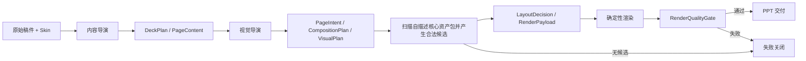
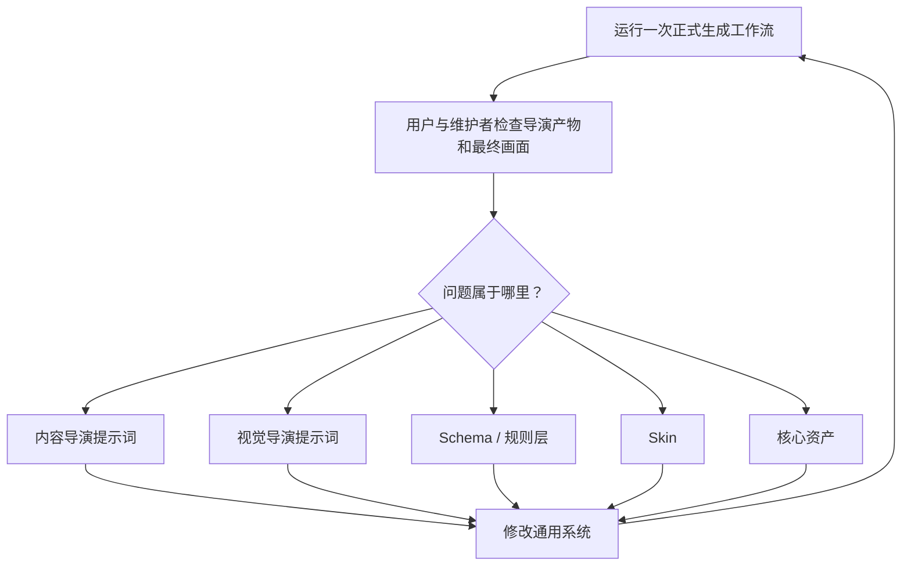

# 正式生成工作流

本文定义正式生成：稿件如何经过双导演、规则层和确定性代码成为 PPT。它不重复产品定位、视觉规范或[资产积累与入库工作流](../资产积累与入库/工作流.md)；整体关系见[产品定义](../../产品定义.md)。

## 流程图

正式产品每次只运行这条链。内容审查、视觉审查和人工复核不属于正式链；建设期对它的改进由本文后面的“研发校准环”完成。

## 完整运行链

PPagenT 有两个职责不同的 Agent：

- 内容导演面向整篇稿件，输出 `DeckPlan` 和 `PageContent × N`，决定怎么讲、讲几页以及每页保留什么。
- 视觉导演面向整套 PPT，根据 `DeckPlan` 和各页内容形成 `PageIntent`，选择版式家族、视觉变体和页面节奏。

视觉导演在合法候选上同时输出 `VisualPlan` 与 `CompositionPlan`：前者决定整套家族、变体和节奏，后者决定每页的文字、组件和媒体槽位。程序不维护一份与资产目录分离的手工白名单，而是扫描 `status=core` 且带 `runtime` 声明的资产包，把关系、用途、数量范围和轮廓整理成精简能力卡交给视觉导演。之后才进入 `LayoutDecision → RenderPayload → 确定性绘制 × Skin → RenderQualityGate → 交付`。

产品入口只接受两个业务输入：原始稿件和 Skin。测试阶段没有显式指定 Skin 时使用东北大学 Skin；中间对象由工作流自动产生，不要求用户预先编写 JSON。

工作流必须通过可替换的 DirectorProvider 实际调用内容导演和视觉导演。中间 JSON 是 Agent 输出和审计证据，不是产品输入；没有可用 DirectorProvider 时应停止，不能回退到人工准备 `pages`。

两个导演的交接对象必须符合版本化 JSON Schema；前端可以把这些对象显示成表单，但 API 传输和程序校验以固定字段、枚举、引用关系和必填项为准。自然语言只允许出现在声明为说明或正文的字段中，不能代替结构字段。Schema 的演进来自真实稿件回归，并保留版本迁移，不能在单次任务中临时增加资产专属字段。

正式运行不调用内容审查者或视觉审查者，但每次渲染都必须经过程序化 `RenderQualityGate`。它检查最小字号、页面边界、组件容器内收及碰撞域重叠；失败即不交付。这是确定性代码门禁，不是第三个 Agent，也不要求模型具备识图能力。

内容导演和视觉导演分别以[内容导演提示词](内容导演提示词.md)与[视觉导演提示词](视觉导演提示词.md)为唯一系统提示词来源；API 运行时直接读取这两份文件，避免说明文档与实际提示词分叉。

当前研发阶段仍可在正式链路外围增加独立审查、人工复核和冻结回放，用于改进提示词、契约、Skin 和资产；这些研发审查不得写成产品的固定业务步骤。

## 确定性基础门禁

- 资产入库以“代码生成的主要版式扩散状态已经由用户查看并确认”为依据；核心登记必须写清 `layoutExpansion` 的模式、范围和重排规则。
- 每次生成整套 PPT 后，渲染器检查最小字号、页面边界、组件容器内收和明显碰撞；只有 `qualityAudit.status=passed` 才允许交付。
- SHA-256、完整证据闭包、全状态矩阵和磁盘治理是可选诊断或发布归档工具，不是日常入库及用户确认后的重复门禁。

正式流程不会在现场自动改写核心资产代码。门禁失败时本次任务失败关闭；建设期由维护者把问题修回通用资产、Skin 或规则，再从原稿和 Skin 重跑受影响页面。

关系线由确定性运行时根据形状边框锚点生成。每条受检连接必须登记起点形状、终点形状和两端锚点；形状与 Skin 等比例变化时，线与形状必须使用同一坐标变换。直接向画布写入未变换的裸线段不属于合法资产实现。

## 研发校准环

本环只适用于建设期。每个问题必须修回通用系统并重新运行正式入口，不能只手工修正某份 PPT。若问题是缺少合适资产，应转入[资产积累与入库工作流](../资产积累与入库/工作流.md)，待资产通过后再重跑。

### 对抗审查记录

内容对抗审查寻找原稿遗漏、无依据补充、叙事断裂、拆页失衡和过度压缩；视觉对抗审查寻找关系误判、容量不适配、节奏单调、Skin 不一致和几何问题。

研发审查还必须优先核查两项来源问题：所选资产是否已经登记在核心库；所用视觉轮廓是否能追溯到该资产的复现或蒸馏来源。没有来源的临时结构即使画面可用也必须判为失败。

审查必须是与生成分离的一次独立调用，并保存问题严重度、证据、影响对象、处理状态和复核结论。`error` 级问题未关闭时不得进入下一阶段。视觉审查分成渲染前和渲染后：前者检查语义、容量、家族、变体和整套节奏，后者检查几何、连接、Skin、文字和最终画面。

审查通过只代表当前研发实验可以继续，不等于产品能力已经成立。工作流不得把有限循环次数当作通过，无法关闭问题时应明确失败退出。

## 工作流对象

- `DeckPlan`：内容导演对整套叙事的规划，连接原始稿件与逐页内容。
- `PageContent`：一页实际保留的内容及其原稿依据。
- `ContentReview`：研发阶段对 DeckPlan 和 PageContent 的对抗审查记录，不是产品必需对象。
- `PageIntent`：视觉导演对单页表达关系的判断。
- `VisualPlan`：整套视觉语言、家族与变体分配，以及已使用轮廓的节奏记录。
- `CompositionPlan`：整页布局及每个内容项进入文字、组件或媒体槽位的安排。
- `LayoutDecision`：规则层对某页合法候选和最终选择的可审计结果。
- `RenderPayload`：内容到组件参数的映射及遗漏。
- `VisualReview`：研发阶段对 VisualPlan、各页决策和渲染结果的对抗审查记录，不是产品必需对象。

对象只保存工作流确实需要的信息；具体 schema 以真实稿件实现为准，不为理论完整预设无证据字段。

`PageContent` 必须保持版式中立，内容项不得使用 `source-*`、`app-*`、`platform` 等组件专属命名。内容到视觉槽位的角色分配属于视觉导演和 `RenderPayload` 映射阶段。

## 六个运行对象

运行链路拆成六个对象，避免把文案、语义、整页布局和组件参数混在一起：

1. `PageContent`：这一页实际要说什么，保存标题、内容项和备注。
2. `PageIntent`：内容要表达什么关系，不承载具体组件参数。
3. `CompositionPlan`：正文安全区采用什么整页骨架，各内容项进入哪个槽位。
4. `LayoutDecision`：哪些资产合法、最终选择什么，或是否需要退化。
5. `RenderPayload`：把组件内容映射为生成器参数，并记录遗漏。
6. PPT：确定性代码按 CompositionPlan、Skin 与资产代码生成的最终页面。

对应 schema 位于 `schemas/`。第一份真实稿件已经接通四层对象、资产运行时和东北大学 Skin；新增稿件仍必须沿用同一入口，不能在稿件目录内另写生成逻辑。

## 视觉源前置约束

当任务已经指定学校模板或其他视觉源时，渲染必须先按页面映射复制源模板，形成可编辑 starter，再在继承页面内写入内容。此时不得新建空白演示、另起通用主题或用相似配色代替母版；结构组件只能进入模板声明的正文安全区。

嵌入组件时，页面标题和栏目名只由稿件内容及 Skin 槽位产生。组件自身的结构名称、容量标签和蒸馏说明只用于 JSON 检索与审计，不得作为可见文字进入 PPT；组件也不得覆盖 Skin 背景或重复绘制独立案例页头。

这条约束先于组件匹配。模板继承失败时应停止生成，而不是继续输出一套视觉上“差不多”的 PPT。

## 受控目的与自由说明

`PageIntent` 使用：

- `purposeKey`：受控词表键，只用于程序匹配。
- `purposeText`：AI 对本页目的的自然语言说明，不参与字符串匹配。

允许的键集中登记在 `catalog/purpose-vocabulary.json`。这样可以保留自然语言理解能力，同时避免同义表达造成随机 `no-match`。

## 基础关系与关系属性

顶层 `baseRelation` 只保留并列、顺序、层级、对比、矩阵、中心辐射、分层、因果、网络等基础关系。时间轴、闭环、泳道等通过关系属性表达：

- 时间轴：`sequence + temporal`。
- 闭环：`sequence + cyclic`。
- 泳道：`sequence + dimensions=2 + secondaryDimension=role`。
- 分支流程：`sequence + branched`。
- 鱼骨：`causal + converging`。

新增顶层关系必须证明无法由现有基础关系与属性组合表达，避免把模板爆炸变成 relation 爆炸。

## 自描述资产包

`asset.json` 是资产运行时的单一入口，同时负责来源、生成入口、参数、案例文件和适用条件。`runtime` 至少声明：

- 资产家族、变体和视觉轮廓；
- 支持的基础关系与特定用途；
- 内容项数量范围；
- Builder 与 PageContent 映射器的导出名称；
- 自适应状态及必要的语义约束。

程序把这些字段转成候选能力卡。视觉导演只看能力卡，不需要理解目录、模块路径或历史验收材料。

抽象层仍分为：

- `foundation`：基础表达语法。
- `composite`：只有特定 `purposeKey` 和关系同时成立时才合法。
- `deferred`：暂不参与运行时选择。

`status=core`、运行声明完整且入口确实导出 mapper 和 builder 时，资产才能进入自动流程。来源、容量或导出缺失时不暴露给视觉导演。

核心结构资产还必须在 `asset.json` 声明空间契约：源坐标系、内容框、最小与推荐尺寸、等比例缩放方式、最小字号、安全边距和允许进入的 `compositionId`。程序先验证槽位尺寸，再允许调用；不得靠非等比例压缩、无限缩字或临时改图把组件塞进页面。整页布局目录与渲染代码也参与核心质量报告的哈希绑定。

## 家族、变体与整套节奏

选择所有权固定为：视觉导演提出 `PageIntent`；程序根据 AssetContract 产生合法表达家族和变体候选；视觉导演在整套候选集合上安排页面节奏；程序复核最终选择并形成 `LayoutDecision`。AI 不能选择非法候选，逐页 matcher 也不能独自决定整套结果。

视觉导演必须知道整套 PPT 已经使用过哪些轮廓；内容适配度相当时，优先避免相邻或高频重复，但不得为了变化而改变原文关系。`LayoutDecision` 需要分别记录 `familyId`、`variantId` 和适配状态，不能只留下一个混合语义与画面的 `assetId`。

`LayoutDecision` 记录 `familyId`、`variantId`、`silhouette`、最终资产和选择所有者；程序必须证明这些值来自视觉导演看过的合法候选，不能在解析阶段替导演换方案。

只有自描述资产包中 `status=core` 的正式变体才能进入自动候选。未晋升资产和实验变体即使已有代码也不得暴露给视觉导演。现有核心资产已全部迁移；中央合同、变体目录和静态 Builder 表只容纳实验或非核心能力，不再承担核心资产兼容注册。

资产建设采用轻量主线：典型来源单页 → 黄金状态忠实复现 → 声明版式扩散范围 → 生成主要布局状态 → Skin 实稿 → 用户确认 → 核心晋升。来源观察以完整页面为单位，不能只提取孤立形状；需要保留原页的表面关系、对齐轴、对称与均衡、视觉重量、层次、留白和强调语法。多个来源页只有在语义关系和视觉语法均一致时才能合并为同一变体。

视觉导演没有“现场设计结构图”的权限。如果所有核心资产都不适配，规则层必须返回无候选并停止本次交付，再进入独立的资产建设流程：选择来源页 → 蒸馏 → 参数化 → 生成案例 → 登记核心资产 → 重跑原稿。不得为了让一次任务继续执行而临时新增 builder，也不得把新轮廓挂到旧 `assetId` 下规避来源检查。

## 内容统计与适配度

文字统计由程序根据 `PageContent` 计算，而不是让 AI 猜测，包括：标题字数、内容项数量、最大/平均/最小长度、标题与正文字数上限，以及不均衡比。

当前契约中的文字预算仍为 `unverified`，因此统计值暂时用于记录和后续验证，不会在没有证据时擅自拒绝内容。

多个合法候选之间采用确定性适配信号排序，不使用拍脑袋的总分：

- 特定目的是否精确匹配。
- 数量是否落在 `preferred` 区间。
- 是否已经验证和经过真实稿件测试。
- 自适应程度。
- 基础语法或复合模板层级。

只有第一名具有明确优势时才产生 `ranked-match`；信号相同时仍返回 `needs-ranking`。

## ResolutionPlan

匹配器不再只返回“不合法”，还会生成退化计划：

- 内容过少、过多或过长时，读取契约中的 fallback。
- 顺序流程超过当前上限时可以计算拆页数量。
- 没有语义兼容的资产时退化为简单排版。
- 缺少已验证规则时返回 `defer-to-review`，不虚构处理方法。

退化计划的机器定义位于 `schemas/resolution-plan.schema.json`。

## 失败案例库

`catalog/failure-cases.json` 专门记录“合法但很丑、映射失败、渲染失败或被正确拒绝”的真实案例，不使用人工构造案例冒充经验。每条案例需保存 PageIntent、候选资产、失败原因、处理方案和复核状态。

## 当前边界

v0.3.0 因调用无蒸馏来源的临时视觉变体而失去正式通过资格。当前正式候选只允许来自核心资产库；缺少表达能力时会失败关闭。下一步不是继续追求一份看起来完成的 PPT，而是用同一真实稿件逐项修复核心资产和系统提示词，直到不依赖临时 Agent 设计也能生成合格结果。
