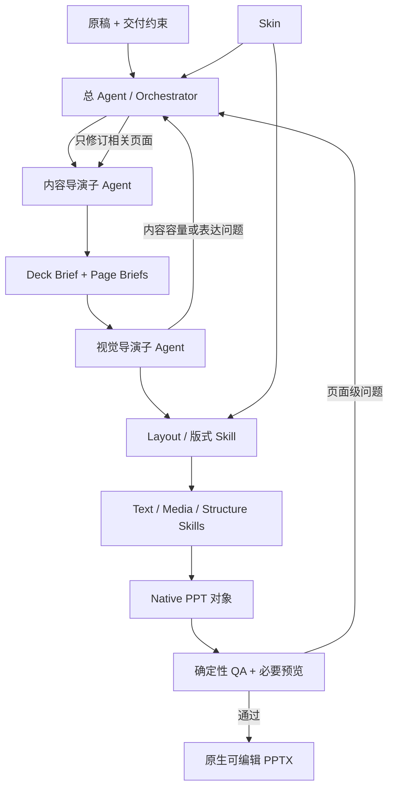

# PPT 专用 Harness 架构决策

> 状态：目标架构，等待最小纵向切片验证
> 更新日期：2026-09-04

当前生产行为仍以[正式生成工作流](工作流.md)中的“现行链路”为准。本文定义下一阶段要验证的结构，不代表代码已经完成迁移。

## 决策摘要

PPagenT 不再把下一步理解为“再写一个更复杂的工作流程序”，而是建立一个很薄的 PPT 专用 Harness：

- 一个总 Agent 持有整套任务状态并调度两个子 Agent；
- 内容导演负责从原稿到可讲述的页面方案；
- 视觉导演负责整套视觉节奏、每页 Composition、区域和 Skill 调用；
- Skin 与版式是并列的视觉能力；版式再组织文字、图片和结构 Skills；
- 程序继续负责确定性生成与 QA，但不再提前穷举每种页面决策；
- HTML 留在资产建设和审核侧，正式目标线直接生成原生 PPTX。



## Harness 与 API 的关系

本阶段放弃的是“一次请求得到整稿、再一次请求填写视觉表单”的单次对话方案，不是放弃模型 API。Harness 仍通过 API 调用模型，但在 API 之上提供任务状态、工具、Skill、上下文裁剪、局部反馈和停止条件。

固定次数的重答、分批和确定性 fallback 可以继续作为异常恢复，但不能再冒充页面智能。目标 Harness 是否采用 Penguin 或其他产品仍由纵向切片验证；PPagenT 的任务对象、Skills 和 Native 生成不能绑定某个 Harness 的私有格式。

并发属于部署层而不是页面语义层。一份 PPT 对应一个可独立运行的 Harness 任务；未来可以用任务队列和多个 Worker 横向扩展，不需要为了未来高并发继续牺牲当前单份稿件质量。

## 视觉能力关系

```text
视觉系统
├─ Skin
│  └─ 身份、主题、Shell、Content Frame、安全区
└─ Layout／版式
   ├─ Composition、整套节奏、区域与留白
   ├─ Text Skills
   ├─ Media Skills
   └─ Structure Skills

公共执行层
└─ Native PPT 生成与 QA
```

Skin 与 Layout 是两个并列约束：Skin 回答“在什么组织规范和空间边界内生成”，Layout 回答“这一页怎样组织信息”。Text、Media 和 Structure 不是 Layout 的继承子类，而是由 Layout 放入不同 Content Regions 的三类表达能力。Native／QA 服务所有能力，不另建一套视觉资产分类。

## 角色边界

### 总 Agent

总 Agent 是任务控制面，不直接替代两个导演设计页面。它负责：

- 保存原稿、Skin、页面状态、已调用 Skills、运行预算和 QA 结果；
- 决定何时调用内容导演、视觉导演、执行 Skill 或停止；
- 把视觉导演提出的具体页面问题交回内容导演；
- 把 QA 的确定性问题交给视觉导演或具体 Skill 做局部修正；
- 防止整稿无意义重跑、无限循环和核心资产被运行时改写；
- 汇总降级情况并交付最终 PPTX。

### 内容导演子 Agent

内容导演负责“讲什么、为什么这样讲”：

- 通读原稿，形成叙事弧、章节和页序；
- 为每页定义职责、标题、核心结论、支撑内容和来源；
- 在不改变事实的前提下压缩、分点、合并或拆页；
- 根据视觉导演给出的容量或表达反馈，只修订受影响页面；
- 不选择资产 ID，不写坐标、颜色、PPT 代码或具体形状。

### 视觉导演子 Agent

视觉导演负责“这一页怎样呈现，以及整套怎样不单调”：

- 先看整套 Page Briefs，规划节奏、页型变化和重点页；
- 为每页确定 Composition 和 Content Regions；
- 判断该页需要 Text、Media、Structure 或它们的组合；
- 通过渐进披露查找并调用具体 Skills；
- 在 Skill 允许范围内调整数量、尺寸、参数和组合；
- 观察必要的渲染结果并做受限修正；
- 不发明内容、图片、数据和关系。

视觉导演不是只选择一个结构 ID，也不是无约束的绘图 Agent。它的自由度来自可组合 Skills 和明确的适配面。

## Skill 分层

### 第一层：视觉大类

运行开始时只披露精简索引：

- `skin`
- `layout`

Skin 通常由业务输入指定，不由视觉导演自由挑选。视觉导演进入 `layout` 后，才看到 Composition 摘要以及 `text / media / structure` 三类表达能力。

### 第二层：表达能力或 Logic

视觉导演确定页面需求后才进入相关分支。例如 Structure 下再披露 `comparison / parallel / sequence / hierarchy / cycle` 等 Logic；Text 下可披露 `statement / evidence / key-number / list / quotation`；Media 下可披露 `hero-image / screenshot-with-notes / gallery / chart-with-takeaway`。Composition 负责把选中的能力放进页面区域。

### 第三层：具体 Skill／Style Group

只有候选范围收窄后，才读取具体能力包。一个能力包至少包含：

```text
skill/
├─ SKILL.md              # 语义、输入、容量、禁用条件和调用方法
├─ manifest              # ID、版本、Skin 兼容、来源与状态
├─ examples/             # 缩略图、黄金状态和必要变体
├─ scripts/              # Native 生成或适配执行器
└─ checks/               # 该能力特有的确定性检查
```

现有核心资产应直接成为能力包实现，或由 Skill 通过唯一 ID 引用。不得把相同几何分别复制到资产注册、HTML、提示词和 Skill 中维护。

三层是信息披露层级，不是三个自主 Agent 层级。每层都启动 Agent 会增加 Token、延迟和错误传播，不是默认方案。

## Skill 的可适配范围

每个 Skill 都要区分三类信息：

1. **不变量**：语义关系、主视觉秩序、连接方向、Skin 安全区、字号底线；
2. **允许变化**：数量、文本、尺寸、颜色映射、对齐、局部间距、可选媒体和声明过的布局模式；
3. **禁止变化**：改变 Logic、删减事实、伪造素材、越过 Content Frame、把整页转成不可编辑图片。

当现有脚本只差少量适配时，Agent 可以为当前运行生成一个临时派生实现；派生实现必须保留来源 Skill、改动范围和 QA 结果，只进入本次运行目录。它不会覆盖核心 Skill，也不会因为成功一次就自动入库。

## 页面生成与降级阶梯

视觉导演按以下顺序解决页面：

1. 直接调用完全匹配的 Skill；
2. 在契约允许范围内调整一个 Skill；
3. 在同一 Composition 中组合少量 Text／Media／Structure Skills；
4. 请求内容导演重组或拆分页；
5. 使用成熟的文字或图文 Skill 交付；
6. 只有内容、依赖或几何硬门禁仍不合法时才明确失败。

因此，系统追求的是“合法输入尽量总能得到可编辑结果”，不是“任何内容都硬套进某张结构图”，也不是“视觉质量永不失败”。

## HTML 的位置

HTML 仍适合：

- 从 `PPT源/` 复现和理解参考结构；
- 把可变数量做成组件并快速比较；
- 在看板中做审美审核；
- 作为某些现有核心资产的迁移期实现。

HTML 不再承担目标正式生成线的唯一布局真源。正式运行中，视觉导演面向 Content Frame 和 Skill 契约规划页面，Skill 直接生成 Native PowerPoint 对象。迁移期间已有 HTML-to-Native 能力继续可用，但新架构不能再产生一份 CSS 逻辑和一份 Builder 逻辑的双重设计真源。

## 最小任务状态

目标 Harness 只围绕四个对象传递工作，不先设计覆盖全部未来页面的巨型 Schema：

| 对象 | 主要所有者 | 只保存什么 |
| --- | --- | --- |
| `DeckBrief` | 总 Agent／内容导演 | 任务目标、受众、叙事弧、Skin ID、全局限制和整套节奏提示 |
| `PageBrief` | 内容导演 | 页面职责、标题、核心结论、内容块、来源引用、优先级和是否允许拆分 |
| `PageComposition` | 视觉导演 | 页面版式、Content Regions、各区域的 Text／Media／Structure 用途、Skill 调用及少量参数 |
| `ArtifactState` | 总 Agent／执行层 | Native PPTX、逐页预览、QA 结果、临时适配记录、降级情况和待修正问题 |

四个对象的边界是：

- 原稿事实和页面正文只在 `PageBrief` 保持一份，其他对象通过稳定 ID 引用；
- `DeckBrief` 不重复逐页正文，`PageComposition` 不改写原稿内容；
- 具体 Skill 输入挂在对应 Content Region 下，不建立另一套整页表单；
- `ArtifactState` 记录结果和问题，不反向成为设计真源；
- Skin ID 属于 `DeckBrief`，Layout 与三类表达能力属于 `PageComposition`；
- 字段只在纵向切片确有消费方时加入，不为可能发生的状态预先穷举。

这里先固定语义责任，不提前发布 JSON Schema。最小实验通过后，再把实际稳定字段移入 `docs/契约/` 和正式 Schema。

## 反馈边界

反馈只允许针对明确问题：视觉导演可以指出某页信息过载、缺图或关系不清；QA 可以指出越界、碰撞、字号或不可编辑对象。总 Agent 只重开相关页面，默认每页至多一次内容修订和一次视觉修正。

## 最小验证与停止条件

第一轮只使用一个真实小稿和少量代表性 Skills，比较当前正式线与新纵向切片：

- 内容完整性和叙事是否改善；
- 普通页、结构页和复合页是否都能自然表达；
- 是否仍为原生可编辑对象并通过轻量 QA；
- Token、调用次数、延迟和人工返工是否可接受；
- 是否真的减少专稿补丁，而不是把补丁藏进 Agent 提示词。

若结果主要依赖总 Agent 临时写大量专稿代码，或调用成本明显增加却没有稳定视觉收益，就停止扩张，先缩小 Skill 自由度和反馈次数。只有最小切片成立，才决定采用现成 Harness、Agent SDK 还是自建薄调度层。

目标架构和 Skill 契约先在 `main` 固定。文字／整页排版与图片区域能力可以随后分别从 `main` 拉分支实现；两条分支都必须消费同一种 Page Brief、Content Region 和 Skill 契约，不能各自发明一套页面模型。
