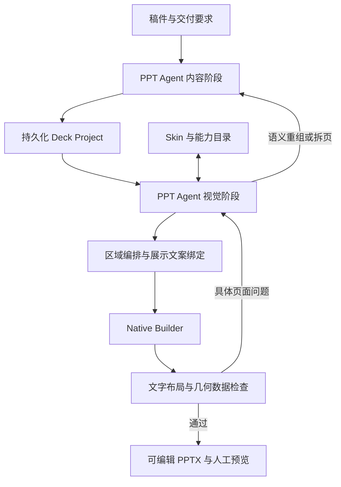

# PPT 专用 Harness 架构决策

> 2026-09-05；用户确认的目标架构。实验在 codex/penguin-harness-v2，正式入口尚未迁移。

## 决策

一个逻辑上的 PPT Agent 分内容、视觉两个阶段工作，阶段使用独立上下文，通过持久化 Deck Project 交接。内容导演与视觉导演是职责，不要求三个自主 Agent 相互传话。程序管理阶段、状态、预算、局部修订和交付。

默认模型只接收文本与结构化工具结果，不接收图片。视觉编排依靠内容、能力契约、网格区域、实际文字布局与几何反馈。人工可以查看最终预览；图片不是模型闭环的前提。

## 页面能力

Skin 管组织身份、字体、颜色、Shell 与 Content Frame。Layout 管区域、阅读顺序、密度和主次。Layout 在区域中调用 Text、Media、Structure。文字页是正常选择；不以结构图或混排数量为质量指标。

网格是空间坐标与诊断基础，不定义因果、层级和顺序。Agent 提出区域方案，程序结合能力自然尺寸与文字容量检查，必要时返回限制供局部调整。成熟整页结构可以独占正文区；未声明区域适配能力的结构不能任意缩小。

## 最小持久化对象

| 对象 | 责任与内容 |
| --- | --- |
| DeckBrief | 目标、受众、Skin、页序、限制与整套节奏 |
| PageBrief | 本页职责、结论、支撑内容、来源和优先级 |
| PageComposition | 区域、网格位置、阅读顺序、主次、能力 ID 与参数 |
| PageView | 区域中实际显示的标题、短正文、素材及来源绑定，挂在区域下 |
| ArtifactState | 版本、输出、反馈、修订次数、已通过页与待处理问题 |

PageBrief 不受某一结构槽位字数限制。PageView 允许提炼短标签；完整解释保存在 PageBrief 和必要备注。数字、限定条件、否定和逻辑关系不能无依据改变。来源 ID 只能证明绑定存在，不能代替语义真实性核查。第一轮可用逐字来源片段约束适配，再验证自由改写。

修改页面只使该页产物失效；修改 Brief 使该页 View/Composition 失效。业务真源是项目文件，不是聊天历史。

## Agent 工具与 Harness

最小工具面：读稿件、增量写内容、读项目概览、查能力、提交区域与展示文案、检查页面、按问题修改页面、完成提交。批量读写减少往返；反馈定位 pageId/regionId/字段。

Penguin 负责模型连接、会话、工具循环、上下文与调用记录。PPagenT 负责项目状态、能力契约、执行和检查。项目对象与能力不绑定 Penguin 私有格式。模型只做语义与编排判断；程序做坐标、字体测量、编译、引用检查和重复执行。

达到有效提交即停止，不依赖最终聊天文字决定完成。有限轮数与逐页修订预算分别记录。超限明确报告，不能把未通过页标为成功。全部资产与源码不整库灌入上下文。

## 无图片反馈

逐步覆盖：区域矩形、实际文字行与包围盒、字号、对齐、重叠、越界、间距、占用热图、最大连续空区、来源覆盖与整套重复。

区分区域分配面积和实际内容占用，禁止用大空框伪造密度。网格密度与留白阈值是可配置经验规则，不是审美定律。几何通过不等于整体美观或语义正确。照片可依据尺寸、裁切与人工提供的主体元数据排版；无语义证据时不声称自动判断了照片内容或主体裁切。

本轮正文采用一个文字对齐系统、合理区域间距、避免过密和大片无目的空白。结构编号/连接线属于自身契约，不能冒充正文对齐；正文对齐不兼容时应披露限制或选择合法文字表达。

## 能力和执行边界

能力提供语义、来源、状态、数量/尺寸/容量、可调参数和执行器。只引用既有登记资产，不复制几何真源。HTML 保留在入库及现有资产内部实现，页面交付复用 Native Builder。运行时适配不改核心库、不自动晋升。

局部处理顺序：调整区域/展示文案 → 换能力 → 重组/拆页 → 正常文字表达 → 对硬失败停止。Text 本身不是降级，只有不得已替换方案才记录 fallback。

## 分支与验收

本分支验证有限既有能力下的稿件驱动编排、网格诊断与局部修正。另一台电脑的 main 建设版式、结构和规则，见[分支分工](../../分支分工.md)。

先构建有不同信息职责的小稿，再输入 Agent；不把逐页版式答案写入提示词，不追求页型配额。检查内容覆盖、表达、几何、可编辑性、局部返工和成本。实验记录区分已验证与待验证，通过后再迁移生产工作台。
