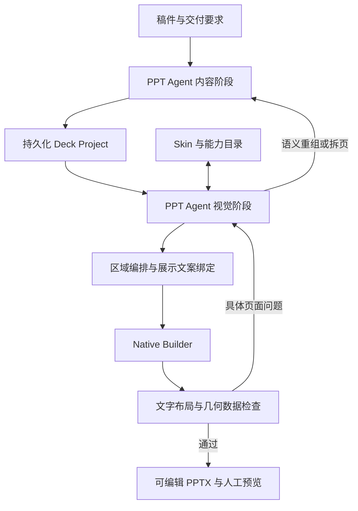

# PPT 专用 Harness 架构决策

> 当前设计候选为[咨询式整页设计指南 v2](../../设计手册/咨询式整页设计指南-v2.md)，以第四篇极简指南为主要来源，明确 Skin 负责整页图文组织、结构 Skill 负责局部关系表达。整页 v1 首轮、v2 反馈修订及此前手册均未通过风格评审；正式 Skin 与 Harness 尚未迁移。

> 2026-09-05；用户确认的目标架构。实验在 codex/penguin-harness-v2，正式入口尚未迁移。

## 决策

一个逻辑上的 PPT Agent 分内容、视觉两个阶段工作，阶段使用独立上下文，通过持久化 Deck Project 交接。内容导演与视觉导演是职责，不要求三个自主 Agent 相互传话。程序管理阶段、状态、预算、局部修订和交付。

默认模型只接收文本与结构化工具结果，不接收图片。视觉编排依靠内容、能力契约、网格区域、实际文字布局与几何反馈。人工可以查看最终预览；图片不是模型闭环的前提。

Agent 可以按规则直接组合原生文字、形状、线条和媒体；现成文字模板、版式和结构资产均不是前置条件。工具执行与可检查规则仍然必要。有效规则见 [Agent 排版规则 v0.2](Agent排版规则.md)。Codex 已完成单稿试做与反馈修订，产品 Harness 尚未完成通用规则接入。

## 决策权与自由边界

架构先规定谁能决定什么；Skin 和 Skill 再给出具体值与可调范围。自由不等于没有规则：Agent 的任务是在当前约束内选择合适表达，不要求每个选择都预先做成模板。遇到多个合法方案时自行判断，不逐项请求用户确认。

| 决策对象 | Agent 可以自行决定 | 本次生成必须保持的边界 | 边界由谁提供 |
| --- | --- | --- | --- |
| 内容组织 | 提炼、分组、页序、分页、主次、哪些细节放备注 | 原意、事实、数据、限定条件、来源与用户指定的必讲内容；指定页数/顺序也属于任务约束 | 原稿与任务要求 |
| 整页构图 | 分栏或堆叠、区域面积、位置、阅读路径、是否混排 | Shell 保留区、Content Frame、可读性、无意外遮挡/溢出及本次对齐要求 | Skin、通用执行底线与任务要求 |
| 文字 | 文本框数量、宽高、位置、合理断行、语义角色和强调对象 | 字体与允许字号档位、同级一致、最低可读性；不能无限缩字或靠删事实塞入 | Skin 的语义排版规范 |
| 颜色与装饰 | 在主题内选择强调位置、底色、分隔线和必要容器 | 主题色域、身份规范和可读性；不能用无关装饰假装提高内容密度 | Skin 与通用规则 |
| 留白与间距 | 在适用规则内按内容安排留白、组内/组间间距 | 不遮挡；满足本次避免严重稀疏/过密的要求。具体阈值只在声明口径内使用；未定义或未执行的检查明确标为未检查 | 任务要求与 Skin 规则 |
| 是否使用结构 | 决定哪组信息需要图示，检索并选择 Skill；也可直接排文字或原生元素 | 关系须有稿件依据；不强制页型配额，不以调用数量作为质量指标 | 内容语义与工具能力 |
| 已调用结构的内部 | 填写内容、选择已支持数量/状态，在声明范围内适配尺寸与主题 | 结构拓扑、极性、连接含义、最小尺寸、文字容量及其内部固定设计；不能现场改核心实现 | 所选 Skill 的真实契约与执行器 |
| 图片与数据图 | 选择已有素材的摆放、尺寸与合法裁切；选择适合的数据表达 | 素材/数据真实，保持比例及关键标注；无主体证据时不擅自判断照片内容 | 来源、媒体元数据与能力契约 |
| 生成与修订 | 编写本次构建代码或调用工具，按反馈局部调整，在预算内重试 | 不伪造成功、绕过检查、擅自放宽限制、修改核心库或把失败页标作交付完成 | Harness/执行环境与任务预算 |

调用现成结构是局部使用更严格的约束：Agent 决定它放在哪、讲什么，Skill 负责已经打磨过的内部结构。直接排普通文字时没有额外的模板槽位，但仍受 Skin 和实际测量约束。例如第 4 页天平可以自主选择是否使用，选中后只能在支持的收益/代价数量与结论倾向中绑定内容，不能随意扭动梁、改变极性来迎合版面。

## 正向指导、边界规则与自主决策

**正向设计指导**告诉 Agent 追求什么效果、怎样组织内容：建立阅读入口，按主次与关系分组，以字体层级、对齐和留白形成清楚的阅读路径，让普通文字页也成为完整设计。指导必须说明目标与组织方法，不能只写“通常左对齐”或“最好美观”。它不要求唯一坐标答案，也不因审美难以机械判定而被删除。

**边界规则**限定不可破坏的条件：原意与证据、Skin 身份和生效样式、真实 Skill 契约、原生可编辑与无遮挡等。Agent 不能自行放宽边界。可测量的边界由实际产物检查；检查未实现时明确标记，不能自称通过。

**自主决策**是在上述指导和边界内判断本页的分页、分组、区域比例、排列、强调和可选结构。自由不是没有审美方向；指导不是逐页模板。比如“用对齐轴建立稳定阅读路径”是正向方法，“本页正文只有一种对齐方式”是边界，具体轴和区域由 Agent 选择。

Skin 同时积累审美语言、编排方法与边界，三者一起作为运行输入。用户已确认先把咨询式参考蒸馏为[独立设计手册](../../设计手册/咨询式分析-v1.md)，从空白画布验证后再接入大学身份，旧大学模板不能自动成为新 Skin 的视觉边界。正式运行时尚未迁移。先验证普通文字页，再验证按内容调用结构 Skill。每轮版本与输入冻结；同一任务逐页反馈后的成功不能冒充独立提示词复现。

## 冲突处理与规则迭代

生成前读取原稿要求、Skin 规则和被选 Skill 的契约，确认适用范围。正文规则不自动覆盖封面 Shell，某个组件的容量也不自动变成全页所有文字的容量。用户明确的配置变更更新本次规则；其他适用规则共同构成约束。无法同时满足时，调整合法的布局、内容分组或表达方式。

例如居中的结构与“本页必须左对齐”冲突时，改用兼容结构或其他合法表达；不能擅自改结构内部，也不能偷偷改本页要求。只有穷尽本次合理修订仍需用户改变要求、补材料时，才带着具体冲突请求输入；日常选型和坐标调整自主完成。

架构维护的是稳定职责边界；Skin 维护可演进的设计规则；结构 Skill 维护特定结构的复用能力；PageComposition 保存本稿的具体选择。一次生成可以产生新页面组合，但不自动改写这三类长期规则/能力。改善规则在独立的规则建设任务中完成：记录问题 → 提炼候选 → 用不同内容验证 → 明确修改规则并记录版本。单页反馈不直接升级为所有 Skin 的禁令，也不要求每次迭代新增模板。

长期指导说明设计目标、组织方法与适用场景；边界说明允许值或禁止条件、检查方式和检查状态，不设置“解释后豁免”。一次生成记录所用规则版本/配置及对重要冲突的处理。此处是接口要求，暂不增设独立 Schema 或审批系统。当前 Codex 试做只实现了其中一部分检查，不能把架构中的完整边界写成已自动执行。

## 页面能力

Skin 提供组织身份与设计规则：字体、颜色、Shell、Content Frame，以及文字层级、间距、对齐、留白和强调方式。大学类 Skin 表达一套适合其场景的排版逻辑与审美，不只是一张背景。通用编排器负责执行规则，不为每个 Skin 复制一套布局引擎。

Layout 是根据本页内容生成的编排结果：区域、阅读顺序、面积分配、密度和主次，不要求先命中某个固定版式 ID。成熟版式可以作为可选参考，但大型版式库不是生成的前置条件。Layout 在区域中调用 Text、Media、Structure；已有结构库提供可复用的语义组件，可以占一个区域，也可以在合适时占满正文区。文字页是正常选择；不以结构图或混排数量为质量指标。

网格是空间坐标与诊断基础，不定义因果、层级和顺序。Agent 提出区域方案，程序结合能力自然尺寸与文字容量检查，必要时返回限制供局部调整。成熟整页结构可以独占正文区；未声明区域适配能力的结构不能任意缩小。

## 内容驱动的排版逻辑

内容阶段先明确本页结论、支撑证据、内容分组、组间/组内关系、优先级和来源，再估计展示量。页数和字数是约束，不能替代叙事组织。同一页允许存在多种关系，例如“三步流程 + 贯穿全过程的例外规则”；不能仅凭一个页面级关系标签把所有内容塞进同一种结构。

编排阶段按以下逻辑工作，允许根据测量结果局部回退：

1. 确定主信息、次信息及阅读顺序；保持语义分组，避免拆散相互依赖的说明。
2. 按信息权重和估计文字/媒体尺寸分配区域，选择适合的分栏、堆叠或主次区域关系；不默认等分面积。
3. 在区域中选择表达：说明用文字，真实媒体按尺寸与语义安排，关系可以用原生元素直接表达或按需调用 Structure。同一种逻辑可以有多种表达，比较关系不强制使用比较图。
4. 依据 Skin 的语义字号角色、行距和间距测量、换行、排放，形成具体坐标。组件的最小尺寸和容量反向约束区域分配。
5. 检查实际内容占用、对齐、溢出、留白和来源；局部调整区域或表达。内容量本身不合理时，再请求内容阶段重组或拆页。

先确定版式意味着先考虑整页的信息组织，不是先冻结矩形、再强行填充。无需为上述每一步启动新 Agent；由同一编排阶段配合程序工具完成。

## Skin 的规则与文字排放

Skin 的排版契约以语义角色组织：页标题、核心结论、组标题、正文、辅助说明、注释等。每个角色给出字号或有限字号档位、字重、行距、颜色；页面规则给出网格、间距允许值、对齐系统和密度判定口径。角色可以共用字号；具体层级数量在未被规则限定时由 Agent 决定，不按单栏/双栏/侧栏建立成套重复文字模板。

文字执行器根据区域宽度测量换行和所需高度，按主次和内容量排放，再把实际高度反馈给区域分配。程序保留最小字号、边界和可读性检查，不能通过无限缩字或任意删文获得通过。固定 Shell 的标题等可以保留固定规则，正文不必统一固定一行标题或等高文字槽。

执行底线、任务要求和 Skin 是不同来源。Skin 同时提供正向设计指导和必须保持的边界；Agent 在设计方向与边界内自主编排。密度规则需声明计算口径和适用页型，不把单一密度数字当作美观证明。

当前网格实验仍采用固定 27/20 号文字和区域内等高分配；现有 Skin 的部分字号角色也仍绑定旧版式槽位。这是已验证闭环的实现限制，尚未完成上述语义角色与测量驱动排放的迁移。后续先在实验目录接入一个 Skin 的规则和通用文字排放，再以同稿验证；不等待更多 Skin 或大量版式入库。

## 最小持久化对象

| 对象 | 责任与内容 |
| --- | --- |
| DeckBrief | 目标、受众、Skin、页序、限制与整套节奏 |
| PageBrief | 本页职责、结论、支撑内容、来源和优先级 |
| PageComposition | 区域、位置、阅读顺序、主次、原生元素及可选能力引用；元素模型待实验接入 |
| PageView | 区域中实际显示的标题、短正文、素材及来源绑定，挂在区域下 |
| ArtifactState | 版本、输出、反馈、修订次数、已通过页与待处理问题 |

PageBrief 不受某一结构槽位字数限制。PageView 允许提炼短标签；完整解释保存在 PageBrief 和必要备注。数字、限定条件、否定和逻辑关系不能无依据改变。来源 ID 只能证明绑定存在，不能代替语义真实性核查。第一轮可用逐字来源片段约束适配，再验证自由改写。

修改页面只使该页产物失效；修改 Brief 使该页 View/Composition 失效。业务真源是项目文件，不是聊天历史。

## Agent 工具与 Harness

最小工具面：读稿件、增量写内容、读项目概览、查能力、提交区域与展示文案、检查页面、按问题修改页面、完成提交。批量读写减少往返；反馈定位 pageId/regionId/字段。

Penguin 负责模型连接、会话、工具循环、上下文与调用记录。PPagenT 负责项目状态、能力契约、执行和检查。项目对象与能力不绑定 Penguin 私有格式。Agent 决定语义、主次和空间安排，也可以提出具体坐标；程序负责坐标转换、字体测量、编译、引用检查和重复执行。程序返回问题与合法范围，不无依据替换 Agent 已选的构图。

达到有效提交即停止，不依赖最终聊天文字决定完成。有限轮数与逐页修订预算分别记录。超限明确报告，不能把未通过页标为成功。全部资产与源码不整库灌入上下文。

## 无图片反馈

逐步覆盖：区域矩形、实际文字行与包围盒、字号、对齐、重叠、越界、间距、占用热图、最大连续空区、来源覆盖与整套重复。

区分区域分配面积和实际内容占用，禁止用大空框伪造密度。网格密度与留白阈值是可配置经验规则，不是审美定律。几何通过不等于整体美观或语义正确。照片可依据尺寸、裁切与人工提供的主体元数据排版；无语义证据时不声称自动判断了照片内容或主体裁切。

本轮正文采用一个文字对齐系统、合理区域间距、避免过密和大片无目的空白。结构编号/连接线属于自身契约，不能冒充正文对齐；正文对齐不兼容时应披露限制或选择合法文字表达。

## 能力和执行边界

通用原生工具提供文字、形状、线条、连接与媒体操作，不要求页面组合预先登记。已有资产提供语义、来源、状态、数量/尺寸/容量、可调参数和执行器；引用时遵守契约，不伪造 ID 或复制几何真源。允许 Agent 自组有内容依据的关系表达，不能发明语义。HTML 保留在入库及现有资产内部实现，页面交付复用 Native Builder。页面生成不改核心库、不自动晋升。

Agent 可按具体问题调整区域、展示文案、元素组织、更换表达或重组/拆页；修复方案由 Agent 选择，修复后必须重新检查。对不可解决的失败停止。文字本身是正常表达，只有不得已替换方案才记录 fallback。

## 分支与验收

实施先后：先让空白 Codex 任务通过明确提供的结构 Skill 入口完成稿件，再把规则、Skills 与原生工具移植到 Harness。当前用户选择 Luna / high 作为独立试做模型，不提供逐页答案；这是对较轻量模型使用 Skills 的实际验证，不声称与 DeepSeek 性能等价。两阶段独立上下文仍是产品目标，Codex 试做不假装已经证明该上下文隔离架构。

本分支验证有限既有能力下的稿件驱动编排、网格诊断与局部修正。另一台电脑的 main 建设版式、结构和规则，见[分支分工](../../分支分工.md)。

先构建有不同信息职责的小稿，再输入 Agent；不把逐页版式答案写入提示词，不追求页型配额。检查内容覆盖、表达、几何、可编辑性、局部返工和成本。实验记录区分已验证与待验证，通过后再迁移生产工作台。
