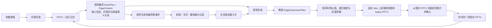

# 正式生成线架构决策

本文记录正式生成线已经确认的架构边界。正式线直接在真实 Skin 模板上排版生成 Native PPTX，再渲染这份 PPTX 供确认；整套 HTML 已退出正式生成。2+3 `PageExpressionPlan` 仍是研发原型，尚未通过视觉验收。当前可运行行为以[正式生成工作流](工作流.md)和实际代码为准。

## 核心目标

PPagenT 不让模型直接绘制页面，而是让模型完成必要的语义判断和有限视觉决策，再由程序依据核心资产契约确定性生成 Native PPT。

下一版继续保留两个模型角色：

- 内容导演把完整原稿整理成全套叙事和逐页内容稿；
- 视觉导演一边读取逐页内容稿，一边读取合法资产能力卡，在资产库边界内寻找最优表达；
- 程序负责内部意图、候选过滤、默认值、字段绑定、状态求解、验证、降级与确定性绘制。

不新增常驻的 Deck Director。整套叙事由内容导演负责，整套视觉节奏由视觉导演负责。

## 数据流



`contentMarkdown` 是唯一规范、可编辑内容稿；`pageMetadata` 只保存 Logic、来源段落 ID、置信度和复杂关系引用。`DeckPlan / PageContent` 是程序编译产物。视觉导演的展示性派生只写入视觉方案，不回写 Markdown 或替换编译后的 `PageContent`。

## 2+3 表达模型

正式生成下一阶段采用“最多两层 Structure 嵌套 + 三种表达”的统一模型：

- 三种表达为 `Structure`、`Text`、`Media`；
- 页面根节点不计入 Structure 深度，页面可以直接组合任意数量的三种表达；
- 一级 Structure 可以承载二级 Structure、Text 或 Media；
- 二级 Structure 可以承载自身的 Text 和 Media，但不得继续嵌套 Structure；
- Text 与 Media 是内容节点，不继续发起 Structure 嵌套；
- 背景、边框、色块和强调边属于可选 Surface，是表达的视觉承载方式，不构成第四种内容表达。

现有 `TextRegion + Text Layout` 不另建页面级副本。页面直接文字、Structure 内文字和 Surface 内文字都调用同一套文字排版能力，区别只在于 TextRegion 由整页 Composition 还是 Structure Group 提供。

`ExpressionRegion` 暂作为父结构可填区域的概念名称：它声明真实矩形、角色、允许的表达类型、内边距、容量、最小尺寸与叠加策略；现有 TextRegion 是只接受 Text 的兼容特例。具体 Schema 字段名和迁移方式待实现前确认。

## Native PPT 排版、预览与交付边界

Native PPTX 是正式生成的唯一页面事实源。程序先用真实 Skin 模板、已登记 Page Composition 和 Structure Group 排版生成暂存 PPTX，再从这份 PPTX 导出逐页图片供用户确认。确认后只复制该暂存文件到交付目录，不重新排版或编译；确认步骤不增加导演模型调用。

HTML 仍可用于单个 Structure Group、文字排版或 Surface 的建设期审查和入库验证，但不负责整套 PPT 的正式排版，也不重建 Skin。新增色块、边框、渐变、裁切或其他表达原语时，可以先完成 HTML 与 Native 对照并固化为稳定 Primitive；正式生成只调用已登记的 Native 能力。

用户在 PPT 图片预览阶段检查内容覆盖、疏密、层级、换行、图片裁切、结构组合和整体节奏。因为图片直接来自暂存 PPTX，不再存在“HTML 看起来正确但 PPT 不一致”的第二套渲染问题。

当前自动正式线只开放 `registered-structure`：视觉导演选择登记 Structure 或正文 Composition，程序在复制出的模板页上填写内容并排版。未经视觉验收的 `text-plus-structure / multi-structure` 与 `blockStructureModes` 不进入自动正式线；既有全页 Structure Group 要进入子区域，仍需先完成响应式运行合同和 Native 目视验收。

## 内容导演

内容导演一次读取完整原稿，从全文编排角度输出一份受控 Markdown 内容稿与同序机器元数据。每个 H1 就是一页，H2 表达页内主节点，H3 只表达节点内小标题，段落与列表表达正文和支撑点；整套标题、核心结论与简短叙事弧保存在 `deckMetadata`。程序按 H1 顺序生成 pageId，再编译现有 `DeckPlan` 和全部 `PageContent`。它负责：

- 全稿叙事、拆页、页序和每页叙事职责；
- 为每页形成一个核心信息和若干版式中立的语义内容块；
- 识别内容块之间的页面级关系，以及每个内容块内部项目之间的 Logic／关系；
- 区分内容块的页面角色与内部 Logic：`role` 表示核心、证据、解释、组成、案例、结论等职责，Logic 表示并列、过程、层级、对比、因果等关系；
- 保留事实、论证关系与原文证据；
- 用 `deckMetadata.narrativeArc` 给出简短整套叙事弧；程序据此生成 `DeckPlan.narrativeArc`。

一页可以没有 Logic、只有一个 Logic、包含多个同级 Logic，或者同时具有块间关系和块内 Logic。内容导演不得为了结构化而给观点、解释、引语、图片说明或过渡语强行添加 Logic。单页语义原则上只整理为“内容块之间 + 块内项目”两级；仍需第三层关系才能说清时，应拆页、概括次要内容或降为普通文字，而不是继续增加结构嵌套。

内容导演不负责 Structure Group、Composition、图标、颜色、坐标、字号或其他视觉决策。它也不能为了命中资产而补造节点、数据、因果、层级或结论。

程序可以向内容导演提供匿名的语义能力摘要，提醒它保留原稿已经存在且结构表达所需的字段；摘要不能包含资产 ID，也不能成为反向套用结构的菜单。

程序先把完整原稿按段落编号，内容导演逐页选择本页实际使用的全部必要 `sourceBlockIds`，至少一个、不选无关段落且不得重复。编号只承担来源证据职责，不承担全文分区职责；程序只拼接实际选中的段落来生成逐字 `sourceAnchors / sourceText`，允许不同页面回看、重排或部分交叠原稿证据，完全相同的证据集合不能重复成页。

## 内部检索条件与候选系统

内部检索条件是程序根据 `DeckPlan + PageContent` 生成的块级查询，不是第三个 Agent，也不是要求用户或内容导演填写的新稿件。当前代码中的 `PageIntent` 可以作为迁移入口，但未来不再假设一页只有一个 Logic。

程序分别为页面关系和内容块内部关系过滤可用的 Structure Group，同时提供合法 Text Layout 与 Media 能力。Structure 候选继续依据 Logic、关系、数量、必需字段、容量、媒体要求、ExpressionRegion、嵌套深度和资产状态过滤 `status=core` 的 Structure Group，并给每个候选标记就绪度：

| 状态 | 含义 | 后续处理 |
| --- | --- | --- |
| `ready` | 内容可直接绑定 | 可进入选择；只有一个候选时程序锁定 |
| `derivable` | 核心语义完整，仅缺允许的展示性派生字段 | 可进入选择；只有一个候选时程序锁定结构，由视觉导演只补展示适配 |
| `fallback` | 真实资产缺口，只能使用通用正文 | 程序锁定正文兜底，视觉导演只可选择合法正文表现 |
| `incompatible` | 缺少核心关系、节点、字段或容量不合法 | 不向视觉导演披露，只进入诊断日志 |

候选系统不是新的模型调用。它是确定性过滤和排序层，负责把整个资产库收敛成少量合法表达能力；视觉导演只在合法候选中做判断。二级 Structure 只有在语义相容、最小尺寸可进入父 ExpressionRegion 且深度合法时才可披露。

即使某页只有一个 `ready` 或 `derivable` 候选，视觉导演仍看到该页内容摘要并参与整套节奏、合法 Composition 和展示适配；它只是不再重复选择已经由程序锁定的 Structure Group。

## 资产能力卡

资产能力卡由程序从核心资产声明动态编译，不能在提示词中手写维护，也不能把资产源码直接交给视觉导演。

能力卡只披露视觉导演完成选择所需的信息：

- 适用 Logic、关系、数量、容量和必需字段；
- 自然尺寸、最小尺寸、ExpressionRegion、允许的子表达类型、媒体条件和嵌套深度；
- 内容区域、允许的绑定方式和可选视觉状态；
- `silhouette`、`visualIntensity`、`continuityClass`、`mediaBurden` 等节奏信息；
- 字段的 `derivationPolicy` 与视觉导演实际拥有的 State 字段。

能力卡不披露 HTML、DOM、Builder、坐标、几何参数或资产源码。

## 视觉导演

视觉导演同时读取整套 `DeckPlan + PageContent` 和每页合法能力卡，负责：

- 规划每页需要哪些 Structure、Text 与 Media 表达，以及它们是同级组合还是两层嵌套；
- 多个合法候选之间的 Structure Group 选择；
- 合法的 Composition、Text Layout、媒体位置、图标语义、Surface 和页面强调；
- 把每个内容块分配到恰当表达与父 ExpressionRegion；
- 统筹整套连续性、对比、轻重和锚点页面；
- 在不改变原意的前提下完成被资产契约允许的展示性派生。

视觉导演输出稀疏 `PageExpressionPlan`，只填写真正需要判断的表达类型、组合关系、内容引用和展示性派生。直接绑定、计数、默认 State、坐标、尺寸、间距、字号和几何参数由程序负责。`PageExpressionPlan` 是当前确认的概念名称，具体 Schema 待实现前确认。

允许的展示性派生包括中心短标签、组名、比较主题、区域短标题、压缩正文、原稿已经蕴含的总结、共同主题和图标查询。禁止派生新的节点、分点、数据、时间、条件、结果、因果、层级、角色阶段、矩阵位置、极性或新结论。

原稿与结构略有不适配时，可以在上述边界内微调展示稿来适应结构，不能要求所有结构无条件适应原稿；所有派生必须保留内容引用、派生类型和结果，并能追溯到 `PageContent` 的来源字段。运行日志至少区分直接引用、压缩、合并和概括，不能无痕改稿。

视觉导演是文本模型角色：它读取文字内容稿和结构化资产能力卡，填写视觉方案表单，不读取页面截图，也不要求多模态视觉能力。渲染后的人工或 Codex 目视检查属于生成线外的质量复核；工作台表单暂停同样只是可选调试入口，不是第三次模型调用或视觉模型门槛。

## State 所有权

每个资产 `stateContract` 字段必须声明唯一 owner：

| owner | 负责内容 |
| --- | --- |
| `content-derived` | 由内容语义确定的项数、层数、分支、极性、反馈、角色阶段等 |
| `program-derived` | 编号、按数量选状态、密度、紧凑模式、空层显示和字号档位等规则结果 |
| `visual-director` | 语义等价的 Composition、可选轮廓或状态、强调方式、图标和文字布局等 |
| `renderer-derived` | 坐标、尺寸、间距、字号、锚点、图标文件、换行、层级和 Native 参数 |

视觉能力卡只披露 `owner=visual-director` 的字段。视觉导演不能覆盖内容状态或底层几何。

## 整套视觉节奏

视觉节奏不是禁止重复，而是区分必要连续、必要复用和可以避免的单调重复。视觉导演输出紧凑的 `rhythmPlan`：

- `anchorPageIds`：视觉锚点页；
- `quietPageIds`：有意收敛的页面；
- `continuityGroups`：需要保持连续语言的页面组；
- `contrastBreaks`：需要形成明显转折的位置。

只有同页存在同等合法候选时，程序才提示或纠正可避免重复。单候选、语义必要复用或有意连续均允许重复，不设置 Structure 配额。

## 模型调用与恢复预算

正常生产基线仍为两次模型连接：

1. 内容导演一次；
2. 视觉导演一次。

整次运行只有一个内容恢复预算，因此最多三次模型连接：内容导演最多两次，视觉导演固定一次。恢复预算不能与客户端或 SDK 的隐藏重试叠加。

- 只有 `CONTENT_MARKDOWN_INVALID / CONTENT_METADATA_MISMATCH`，以及候选阶段按具体 Structure Group、Composition 和文字槽位确认的 `CONTENT_CAPACITY_EXCEEDED`，可以触发第二次内容调用；
- 内容阶段不设置脱离具体版式的通用字数硬门禁；真实容量问题优先压缩重复表达或按不同叙事职责拆页，不能缩字硬塞；
- 来源段落 ID、Markdown、元数据或 Schema 错误先由程序确定性收口，仍不合法才使用唯一内容修订；
- 内容恢复后仍不合法时，正式生产按原稿连续片段生成可审计正文保底，不再伪造 Logic；
- 视觉阶段不再次调用模型，非法选择使用已登记确定性选择或正文 fallback，并记录降级。

## 验证与交付状态

验证按以下顺序执行：

```text
内容稿语义验证
→ 内容块覆盖与来源验证
→ 候选表达合法性验证
→ 视觉决策权限验证
→ Structure 深度与区域适配验证
→ State 完整性验证
→ 确定性绘制与版面审计
```

显示硬门禁至少包括最低字号、区域边界、文字裁切、未经声明的遮挡、Structure 最小尺寸、Media 关键内容和两层嵌套上限；语义硬门禁至少包括必需内容块完整覆盖、Structure 与真实关系相符、不得发明事实和展示性派生可追溯。页面疏密、层级、留白、结构多样性和是否避免卡片化属于合法方案之间的软优化目标，不得为了填满页面制造内容。

最终状态只有三种：

- `delivered`：内容、候选、视觉方案和绘制全部合法；
- `delivered-with-fallback`：内容真实可靠，但部分视觉决策或资产覆盖需要确定性降级；
- `failed`：内容语义、来源或核心关系在使用共享恢复预算后仍不可靠。

视觉失败可以降级；内容阶段只能降级为逐字来源支撑的 `editorial` 保底，不能降级真实性。程序不能为了交付而让视觉导演猜测事实。

## 运行日志与改进指标

每次正式运行必须记录可复现的结构化决策链，而不只是最终错误：

- `runId`、时间、模型、提示词版本、资产目录版本、调用次数和耗时；
- 页面数、Logic 分布、`arcStepId`；
- 每页核心信息、内容块、块间关系和块内 Logic；
- 每页候选、就绪度、保留与排除原因；
- 最终 Structure／Text／Media 表达树、嵌套深度、Composition、可选 State 和选择来源；
- 每个绑定字段属于直接绑定、程序推导、视觉选择还是展示性派生；
- 每项展示性派生的 `contentRef`、派生类型和结果；
- 共享恢复预算的消耗阶段、修复范围和结果；
- fallback 页面、原因、使用的确定性默认值；
- 验证错误、警告、渲染审计和最终交付状态。

日志应能汇总单候选页、多候选页、fallback 页、Logic／Structure 使用频率、展示性派生、必要与可避免重复、阶段失败率、恢复成功率和平均 API 调用次数。正文和提示词不在统计日志中重复存储，通过 `runId` 关联运行输入与调用详情。

这些日志用于区分内容识别不足、候选规则缺陷、资产覆盖不足、视觉选择坍缩和兜底过多，供后续改提示词、补资产和调整规则；它们不反向修改当次内容事实，也不自动启动资产入库。

## 当前实施边界

本决策已经确认。提交 `2dbacf3a` 保存了2+3架构改造前的完整工作区基线。当前本地代码已经接入 Markdown 内容导演主契约、来源与数量层级审计、一次内容恢复、候选四态协议、暂存 Native PPT 排版、逐页图片确认和同文件交付。`PageContentBlocks / PageExpressionPlan` 与最多两层 Structure 已有原型实现，但尚未完成正式视觉验收。

2026-09-03 真实 HTML 检查确认：现有 `multi-structure` 用通用 chain／rail／support-grid 替换了视觉导演已选的登记资产，且用固定左栏和重复网格制造了文字墙、空框和轮廓单一。通过字号与几何门禁不等于视觉通过。因此自动正式运行已恢复为 `registered-structure`，2+3原型只保留给人工调试。

重新开放自动2+3的前置条件是：每个 Structure 表达都绑定一个实际候选资产；候选必须声明可用 Region 的自然／最小尺寸和文字合同；程序在目标 Region 内重新求解 State，不得把全页结果整体缩小；至少完成“主旨+登记结构”和“一页两个登记结构”两类真实 Native PPT 页面目视确认。Media、更多组合模块、`arcStepId`、完整 `rhythmPlan` 和 State owner 契约迁移仍未完成。
