# 资产积累与入库工作流

本文规定如何把来源 PPT 中值得学习的页面，转化为 PPagenT 可复用的核心资产。入库是用户与维护者共同完成的设计积累，不是一次合规审计。

正式稿件生成见[正式生成工作流](../正式生成/工作流.md)，当前资产覆盖见[资产覆盖清单](资产覆盖清单.md)。执行模型统一使用[资产入库执行提示词](入库执行提示词.md)；其中来源理解必须使用固定的[视觉意图提炼系统提示词](视觉意图提炼系统提示词.md)，不再为每个来源页临时重写一份视觉任务书。具体采用 Luna High 或其他模型只属于任务运行配置。

## 目标

理想输入保持轻量：

- 一个来源 PPT；
- 指定页码；
- 目标 Skin；
- 可选的一句话说明，指出最值得保留的特征。

最终得到：来源可追溯、版式扩散范围明确、由代码生成、经用户看过并确认的核心资产包。资产包本身就是正式生成线的发现入口，不再另做多处人工接线。

入库的触发条件改为两类：真实稿件反复暴露了核心库缺口，或一个小范围技术实验需要验证新的设计方法。没有明确缺口时，不以增加资产数量为目标批量蒸馏。入库的准确颗粒度是：Visual Skill 表示语义能力；同一 Skill 下可以有多个 Style Group；一个 Style Group 用同一组件适配声明范围内的数量和密度 State；需要承载二层内容时，再由父 State 导出真实 Content Slots。正式运行只发现、选择并填充这些已建能力，不再次承担低层视觉设计。完整分层见[Shell 与 Visual Skill 契约](../../Shell与Visual Skill契约.md)。

### HTML 蒸馏对象边界

采用 HTML/CSS 时，蒸馏对象是 **Content Frame 内的 Style Group 组件**，不是整个 Visual Skill，更不是来源整页或带说明、对照和结论的报告网页。组件必须与 Shell 分离：页标题、Logo/校徽、页眉页脚、整页背景和页码属于 Shell，不得携带进组件或成为组件身份。

组件保留来源的视觉语法——拓扑、视觉中心、对齐轴、比例、节奏、邻近关系、必要装饰以及密度/断点规则；内容和媒体全部参数化，至少包括 `items[].title/body/icon/media` 与 `centerVisual`。外围图标和中心图像必须可替换，不能把来源照片或第三方 Logo 固化成默认内容。组件 `width/height` 由父 Content Frame 决定，不内置 16:9；当前固定设计与验收框为 `1170 × 492 @ (55,166)`，正式回编译时把组件坐标映射到该区域。

来源页中存在“父结构周围还有可填内容区”时，要把父拓扑和 Content Slots 分开。槽位 frame 必须是排除遮罩、重叠主体、装饰和内边距后的真实可见矩形，并随 State 从同一布局求解器计算；不得把整块装饰面当作可填区域，也不得为 Native 端再抄一份坐标。每个槽位要声明父内容绑定、方向/对齐、容量、允许普通文字或已登记子 Skill，以及 `plain-text` 兜底。当前最大嵌套深度固定为 1。

每组还必须声明媒体契约。必填中心图片只能来自稿件或已登记媒体；若它缺失，该组不参与选择，不能用 Logo、图标或生成图片假装替代。外围标识优先使用内容对应 Logo，不适合 Logo 时可使用已登记图标。同一 Skill 下应同时积累不依赖图片的 Style Group，保证换组或简单排版兜底有路可走。

开发台、来源对照、调试标记和实验说明只属于实验，不得进入组件或正式 PPT。HTML 路线的顺序是：来源对象与渲染理解 → Style Group HTML 初稿 → HTML 审美优化与数量扩散 → 用户确认 HTML → 通用编译器读取最终 DOM/CSS/SVG → 生成原生可编辑 PPTX → 检查 Native 与 Skin 效果 → 用户确认。来源页是关系、拓扑和审美启发；颜色、比例、层级、留白、装饰和响应排布都在 HTML 工作台中完成，不再到资产专属 Builder 中重新实现。

## 固定批次记录命令

日常批次可使用 `npm run intake:batch -- <intake-batch.json>`。开始时只需记录来源、资产、`startPercent`、开始时间和模型；主要结果路径、待看页面、结束时间和 `endPercent` 可在后续补录，验收页会把尚未生成的资产标为“待生成”。工具只计算百分点消耗，不读取 Codex 账户周限。命令会生成或更新 `outputDir/batch.json` 与 `outputDir/用户验收.md`；更新单个返修资产时，未列出的资产和页面会继续保留。显式写入 `allReleased: true` 只记录 `user-approved` 与晋升资格，且要求结束值、每项资产的结果路径和待看页面均已存在；核心库晋升仍由后续操作完成。

## 工作流

```mermaid
flowchart LR
    A["来源 PPT + 页码"] --> B["读取对象与原图"]
    B --> C["固定系统提示词提炼视觉意图"]
    C --> V["visual-intent.md"]
    V --> D["HTML 组件设计模型生成初稿"]
    D --> E["HTML 审美优化"]
    E --> F["声明并切换数量 State"]
    F --> S["求解并检查 Content Slots"]
    S -->|HTML 或槽位仍不好看| E
    S --> G["用户确认 HTML"]
    G --> H["通用 HTML → Native 编译"]
    H --> I["生成原生可编辑 PPTX"]
    I --> M["检查 Builder 与 Skin 效果"]
    M -->|Builder 或画面有问题| E
    M --> J["用户明确通过"]
    J --> K["状态改为 core"]
    K --> L["正式生成线自动发现"]
```

用户确认前产物属于候选。用户确认后，不再因为低概率风险重复渲染、重新读图或重新生成同一批材料。

### 批量制作检查点

新的蒸馏方法第一次使用时，先完整跑通一个 Style Group 并交用户看；用户确认方法成立后，才用同一 Shell、Content Frame、媒体契约和验收格式批量制作其余候选。批量阶段可以合并成一份逐页 PPT 统一审核，但不得把“方法通过”解释成“候选资产全部通过”。

## 一、来源分析

来源 PPT 必须同时读取对象信息和渲染画面：对象信息用于辅助辨认组合、层级和文字；渲染画面是视觉理解的主要证据。把两者与用户可选的一句话交给[视觉意图提炼系统提示词](视觉意图提炼系统提示词.md)，将模型输出原样保存为候选资产目录中的 `visual-intent.md`。

`visual-intent.md` 不是坐标表、形状清单或 HTML 规格。它要说清表达关系、视觉中心、阅读动势、标志性的衔接/重叠/层级、可以重新设计的表面部分，以及同一家族如何适应数量变化。它应保留生成模型的审美判断空间，不预先决定细微尺寸、色值和实现手段。

来源分析只回答这些问题：

- 这一页表达什么关系；
- 正文版心、视觉中心和主要轴线在哪里；
- 同级元素怎样对齐和分布；
- 主次层级怎样形成；
- 哪些留白和比例不能破坏；
- 哪些连接或表面构造是这页的标志性语法。
- 哪些区域是真正可填内容区，它们相对父结构位于哪一侧、可见边界大致多大，以及它们是否会随数量变化。

不要把来源分析写成形状清单，也不要在还没理解页面时直接开始参数化。生成 HTML 时，把 `visual-intent.md` 作为主要设计输入；不再为该页面叠加一份临时、数据化的复刻提示词。

## 二、黄金状态

先在来源数量下形成一个最能代表该视觉语法的 HTML 状态。黄金状态的作用是证明没有误读关系、核心拓扑和视觉中心；它不是单独的重型用户审核批次，也不要求最终组件像素级等同于来源页。审美优化直接在这份 HTML Component 上继续进行，确认后由通用编译器生成 Native 结果。

参数化前至少确认：

- 版心和整体重心正确；
- 应对齐的边缘或中心真正对齐；
- 应对称的结构围绕共同中轴均衡；
- 同级元素等宽、等高或具有明确的比例规律；
- 间距、留白和视觉主次接近来源；
- 连接线使用正确锚点；
- Skin 中没有被压扁或拉长。
- 每个 Content Slot 都是实际可见、安全且非零的区域；它没有把父主体遮挡范围错误计入容量。

HTML 初稿明显逊于来源或仍显单调时，先在 HTML 中调整比例、层级、颜色、间距、装饰和内容密度，不急于生成 PPT，也不继续扩展数量。

## 三、版式扩散

“版式扩散”指同一设计语言适应不同数量、层级或可选内容。它不是为每个数量重新设计一张图。

优先参考前端布局的 `Container`、`Grid`、`Stack`、`Split`、`Gap`、`Padding`、`Align`、`Justify`、`Min/Max` 和 `Breakpoint`：先声明版心、行列、间距、对齐和临界点，再由程序计算坐标。

每项资产必须在自身 `asset.json` 中声明版式扩散和运行能力：

- `mode`：`fixed` 或 `responsive`；
- `range`：代码实际支持的数量范围；
- `rule`：数量变化时保持什么、怎样重新排布。
- 可选 `slotContract`：动态槽位解析入口、坐标空间、内容绑定、最大深度、子资产策略和文字兜底。

扩散规则遵循：

- 从当前数量重新计算位置，不能用最大布局删项；
- 同级元素保持一致尺寸、样式和视觉重量；
- 对称结构围绕共同中轴重新分布；
- 达到临界点时允许换行、换列或切换变体；
- 超过声明范围时换家族、拆页或拒绝，不继续缩小。

只生成会改变真实排布的主要状态。文字长短、非法输入和不改变拓扑的重复组合可以作为开发调试，不进入用户主验收。

## 四、Skin 适配

组件只进入 Skin 的正文安全区，使用等比例 `contain` 和重新居中。组件不得覆盖 Skin 背景、重复绘制页标题，也不得显示资产名称、数量档位或测试说明。

如果结构放不下，依次考虑压缩文案、改变已登记的布局状态、换资产或拆页；不得压扁图形或无限缩小文字。

## 五、轻量检查

日常入库只保留能直接防止坏 PPT 的检查：

- PPT 能生成并保持原生可编辑；
- 字号不低于项目下限；
- 没有越出正文安全区；
- 没有明显重叠；
- 资产声明的对称、等距、共线和连接锚点成立。

维护者随后查看最终 Skin PPT，检查来源忠实、对齐、均衡、间距、断行、留白和视觉重点。程序检查通过不等于美观；维护者和用户的画面判断才是入库依据。

SHA-256、不可变运行目录、全笛卡尔状态、完整证据闭包和磁盘治理保留为可选诊断工具，不属于默认晋升条件。

## 六、用户验收与返工

用户点开一个 Style Group 后，PPA 看板直接调用资产包中的专属 HTML 组件，并列出它声明支持的全部 State 标签；点击标签后，同步刷新 HTML 与通用编译产生的 Native 结果。两者来自同一 DOM/CSS 布局，不额外维护 HTML 截图、逐数量代码或资产专属 Native 排版分支。

用户指出问题后：

- 只修改对应资产或共享布局方法；
- 只重跑受影响的状态；
- 未受影响且用户已经看过的页面不重复审查；
- 把具体事故提炼为通用设计原则或资产专属几何规则，不把事故描述不断堆进总提示词。

用户明确确认后，按本流程新建或完成 HTML 迁移的资产目录至少包含：

- `asset.json`：来源、适用语义、容量、版式扩散、可选 Content Slot 和运行能力卡；
- `visual-intent.md`：由固定系统提示词生成的视觉精髓与扩散意图，不作为正式运行依赖；
- `runtime.mjs` / `review.mjs` 与组件样式：HTML Component 的结构、响应规则、审查示例参数、统一内容映射和可选 Slot 解析器；
- `generate.mjs`：导出 HTML Component、Mapper 与可选 Slot 解析器，并调用统一 Native 编译器生成示例 PPTX；
- `example.pptx`：用户实际看过的代表性案例。

把 `asset.json.status` 改为 `core` 后，正式生成线自动发现它。中央登记表可以作为人工总览或展示材料继续存在，但不是运行依赖，也不需要为新资产重复维护。

默认只运行 `npm run assets:discover`：确认资产声明、Mapper 和 HTML Component 能加载；再对黄金 State 做一次 HTML → Native 编译与可编辑性检查。资产的画面质量由示例和用户验收负责，不为晋升重复生成全状态证据。

## 七、可选的路线实验

当前还没有确定唯一蒸馏技术路线。可以用同一来源页小范围比较：

1. Coding Agent 直接复现并参数化；
2. 先忠实复刻，再做版式扩散；
3. 使用前端式布局规则计算扩散状态；
4. 必要时用图像模型提出异形布局候选，再重建为可编辑 PPT。

比较只看最终画面、人工返工次数、运行时间、Token 消耗和扩散稳定性。哪条路线足够好且更省，就成为默认路线；其他路线作为复杂资产的备用方法，不先建设庞大统一系统。

近期先用循环闭环验证真实 Content Frame 下的 3–6 项 HTML State、动态 Content Slots、统一 Native 编译和原生可编辑 PPTX。槽位声明通过后，只选一个小型无图片子 Skill 做一级嵌套实验；不批量蒸馏子资产，不建立递归 Agent。该编译器只处理已登记组件的受控标注，不是面向任意网页或任意 PPT 的万能转换器。
