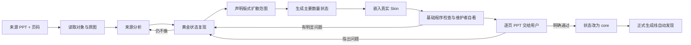

# 资产积累与入库工作流

本文规定如何把来源 PPT 中值得学习的页面，转化为 PPagenT 可复用的核心资产。入库是用户与维护者共同完成的设计积累，不是一次合规审计。

正式稿件生成见[正式生成工作流](../正式生成/工作流.md)，当前资产覆盖见[资产覆盖清单](资产覆盖清单.md)。执行模型统一使用[资产入库执行提示词](入库执行提示词.md)，具体采用 Luna High 或其他模型只属于任务运行配置。

## 目标

理想输入保持轻量：

- 一个来源 PPT；
- 指定页码；
- 目标 Skin；
- 可选的一句话说明，指出最值得保留的特征。

最终得到：来源可追溯、版式扩散范围明确、由代码生成、经用户看过并确认的核心资产包。资产包本身就是正式生成线的发现入口，不再另做多处人工接线。

## 固定批次记录命令

日常批次可使用 `npm run intake:batch -- <intake-batch.json>`。开始时只需记录来源、资产、`startPercent`、开始时间和模型；主要结果路径、待看页面、结束时间和 `endPercent` 可在后续补录，验收页会把尚未生成的资产标为“待生成”。工具只计算百分点消耗，不读取 Codex 账户周限。命令会生成或更新 `outputDir/batch.json` 与 `outputDir/用户验收.md`；更新单个返修资产时，未列出的资产和页面会继续保留。显式写入 `allReleased: true` 只记录 `user-approved` 与晋升资格，且要求结束值、每项资产的结果路径和待看页面均已存在；核心库晋升仍由后续操作完成。

## 工作流

用户确认前产物属于候选。用户确认后，不再因为低概率风险重复渲染、重新读图或重新生成同一批材料。

## 一、来源分析

来源 PPT 必须同时读取对象信息和渲染画面：对象信息用于理解形状、组合、层级、文字和坐标；渲染画面用于理解最终看到的版心、对齐、留白和视觉重量。

来源分析只回答这些问题：

- 这一页表达什么关系；
- 正文版心、视觉中心和主要轴线在哪里；
- 同级元素怎样对齐和分布；
- 主次层级怎样形成；
- 哪些留白和比例不能破坏；
- 哪些连接或表面构造是这页的标志性语法。

不要把来源分析写成形状清单，也不要在还没理解页面时直接开始参数化。

## 二、黄金状态

先复现一个最能代表来源的状态。黄金状态的作用是证明已经理解来源为什么成立。

参数化前至少确认：

- 版心和整体重心正确；
- 应对齐的边缘或中心真正对齐；
- 应对称的结构围绕共同中轴均衡；
- 同级元素等宽、等高或具有明确的比例规律；
- 间距、留白和视觉主次接近来源；
- 连接线使用正确锚点；
- Skin 中没有被压扁或拉长。

黄金状态明显逊于来源时，不继续扩展数量。

## 三、版式扩散

“版式扩散”指同一设计语言适应不同数量、层级或可选内容。它不是为每个数量重新设计一张图。

优先参考前端布局的 `Container`、`Grid`、`Stack`、`Split`、`Gap`、`Padding`、`Align`、`Justify`、`Min/Max` 和 `Breakpoint`：先声明版心、行列、间距、对齐和临界点，再由程序计算坐标。

每项资产必须在自身 `asset.json` 中声明版式扩散和运行能力：

- `mode`：`fixed` 或 `responsive`；
- `range`：代码实际支持的数量范围；
- `rule`：数量变化时保持什么、怎样重新排布。

扩散规则遵循：

- 从当前数量重新计算位置，不能用最大布局删项；
- 同级元素保持一致尺寸、样式和视觉重量；
- 对称结构围绕共同中轴重新分布；
- 达到临界点时允许换行、换列或切换变体；
- 超过声明范围时换家族、拆页或拒绝，不继续缩小。

只生成会改变真实排布的主要状态。文字长短、非法输入和不改变拓扑的重复组合可以作为开发调试，不进入用户主验收。

## 四、Skin 适配

组件只进入 Skin 的正文安全区，使用等比例 `contain` 和重新居中。组件不得覆盖 Skin 背景、重复绘制页标题，也不得显示资产名称、数量档位或测试说明。

如果结构放不下，依次考虑压缩文案、改变已登记的布局状态、换资产或拆页；不得压扁图形或无限缩小文字。

## 五、轻量检查

日常入库只保留能直接防止坏 PPT 的检查：

- PPT 能生成并保持原生可编辑；
- 字号不低于项目下限；
- 没有越出正文安全区；
- 没有明显重叠；
- 资产声明的对称、等距、共线和连接锚点成立。

维护者随后查看最终 Skin PPT，检查来源忠实、对齐、均衡、间距、断行、留白和视觉重点。程序检查通过不等于美观；维护者和用户的画面判断才是入库依据。

SHA-256、不可变运行目录、全笛卡尔状态、完整证据闭包和磁盘治理保留为可选诊断工具，不属于默认晋升条件。

## 六、用户验收与返工

每个任务交付一份可逐页查看的 Skin PPT，稳定展示各资产会改变布局的主要状态。可以附逐页 PNG，但不要求把同一页面反复复制成多套证据。

用户指出问题后：

- 只修改对应资产或共享布局方法；
- 只重跑受影响的状态；
- 未受影响且用户已经看过的页面不重复审查；
- 把具体事故提炼为通用设计原则或资产专属几何规则，不把事故描述不断堆进总提示词。

用户明确确认后，资产目录至少包含：

- `asset.json`：来源、适用语义、容量、版式扩散和运行能力卡；
- `generate.mjs`：生成入口，并导出 Builder 与统一内容映射器；
- `example.pptx`：用户实际看过的代表性案例。

把 `asset.json.status` 改为 `core` 后，正式生成线自动发现它。中央登记表可以作为兼容索引或展示材料继续存在，但不得成为新资产接入时必须重复维护的运行依赖。

默认只运行 `npm run assets:discover`：确认资产声明能读取、运行入口能加载、Builder 与映射器确实导出。资产的画面质量由已经生成的示例和用户验收负责，不再为晋升重复生成全状态证据。

## 七、可选的路线实验

当前还没有确定唯一蒸馏技术路线。可以用同一来源页小范围比较：

1. Coding Agent 直接复现并参数化；
2. 先忠实复刻，再做版式扩散；
3. 使用前端式布局规则计算扩散状态；
4. 必要时用图像模型提出异形布局候选，再重建为可编辑 PPT。

比较只看最终画面、人工返工次数、运行时间、Token 消耗和扩散稳定性。哪条路线足够好且更省，就成为默认路线；其他路线作为复杂资产的备用方法，不先建设庞大统一系统。
