# 资产积累与入库工作流

> 状态：有效，但 Structure Group 第一轮集中建设已于 2026-09-03 到达里程碑并默认冻结。

入库的目标不是复刻某一页，而是把一组优秀参考中“表达某类逻辑的方法”转化为可复用的 Logic。来源负责提供逻辑与审美启发，HTML 负责综合后重新设计和扩展，Native 编译器负责无发挥地转换为可编辑 PPT。

当前不再按 Logic 清单继续批量补结构。只有正式运行多次出现同一种、确由拓扑缺失造成、且现有 Structure Group 和普通 Composition 都无法可靠表达的缺口，才按本流程启动一个独立入库任务；仍需用户逐项确认，不能由日志、Agent 或看板自动晋升。下一阶段的主要建设对象是少量 Composition、Text 和 Media 能力，Structure 作为高级 Macro 维护。

## 一、入库对象

- **Skin**：组织身份与整页规范，包括字体、字号层级、颜色、Logo、标题区和页脚。
- **Content Frame**：所有一级 Logic 共用的正文设计区域。当前固定为 `1170 × 492 @ (55,166)`。
- **Logic**：一种逻辑表达能力，例如循环、对比、层级或过程。
- **Structure Group**：同一 Logic 下的一种可独立调用的结构表达方案。它必须在拓扑、阅读路径、内容角色、容量／密度、媒体要求或适用边界上补足现有组无法可靠覆盖的需求，不能只是换颜色、圆角、阴影或装饰。
- **State**：同一 Structure Group 面对不同项目数量时，由同一组件代码计算出的排布结果。
- **ExpressionRegion**：Structure Group 内真正可填的区域，可声明接受 Structure、Text、Media 中的一种或多种；现有 TextRegion 是只接受 Text 的兼容特例。具体 Schema 名称待实现前确认。

Structure Group 不必填满整个 Content Frame，但必须以该区域为设计上限，并登记每个 State 的自然／最小占用宽高。视觉导演据此决定它适合整区、局部区域、与文字／媒体同级组合，还是作为二级 Structure 进入父 ExpressionRegion。

候选目标允许页面组合 Structure、Text、Media，并由独立 Composition 组织空间；Structure 只在拓扑本身承载语义时使用。一级 Structure 是否承载子表达、ExpressionRegion 的最终字段以及复杂页面如何编排，仍须经过最小实验和用户确认。当前核心资产继续按现有 Content Slot／TextRegion 契约运行，不能把目标架构描述成已经入库。

## 二、完整链路

```mermaid
flowchart LR
    A["一种逻辑表达需求"] --> A1["Logic 必要性判断"]
    A1 --> B["从 PPT源 中组建参考组"]
    B --> C["多来源截图 + 对象摘要 + 参考分工"]
    C --> D["固定提示词提炼视觉意图"]
    D --> E["visual-intent.md"]
    E --> F["视觉模型设计 HTML 黄金状态"]
    F --> G["提取不变量、变量与组件"]
    G --> H["同一组件扩展主要 State"]
    H --> N["HTML 看板待审批"]
    N -->|返修| F
    N -->|用户确认| I["通用 HTML → Native 编译"]
    I --> J["生成各 State 的可编辑 PPTX"]
    J --> K["嵌入统一 Content Frame"]
    K --> L["看板统一展示"]
    L -->|返修| F
    L -->|用户确认| M["正式可达性见证"]
    M -->|通过| O["进入正式生成线"]
    M -->|失败| F
```

确有证据需要新增多个 Structure Group 时，默认严格串行：一个资产完整走到当前约定的审批点并暂停，用户确认后才开始下一个。可以统一列任务清单，但不得为了批量提速而同时生成多个 HTML、复用未经审查的设计判断或跳过单资产检查点。

## 三、各阶段职责

### 0. 判断是否需要独立 Logic 或新的 Structure Group

开始找参考前，先用一句话写清该需求的核心语义关系，并与现有 Logic 的 `description`、`semanticContract` 和 `doNotUseWhen` 对照。关系本身不同才考虑建立独立 Logic；语义相同则继续判断同一 Logic 下是否存在真实覆盖缺口。

资产建设以“最小重叠、最大覆盖”为目标。覆盖包含两个层面：一是尽可能覆盖真实稿件中会出现的 Logic，二是覆盖同一 Logic 内确有差异的表述方式。优先扩大已有 Structure Group 的 State、层数、数量、容量或可选字段，使一个结构能可靠承载更多真实内容；只有出现不可由已有组可靠表达的语义拓扑时才新增组。视觉差异、样例领域差异或固定层级名称不能单独构成新增理由。视觉导演不应面对多个边界近似、用途相同的候选，也不能因过度合并而失去一种真实关系的表达能力。

新增 Structure Group 前必须写一句“覆盖增量”：现有组为什么不能可靠承载这类内容，新组具体补上哪一种拓扑、阅读路径、内容角色、容量／密度、媒体条件或失败边界。出现以下情况时不新增：

- 只改变配色、圆角、阴影、图标容器或装饰语言；这属于以后单独建设的 Style／Skin 变体。
- 只改变现有组件已声明范围内的项目数量；这属于同一 Structure Group 的 State。
- 拓扑、内容字段、容量和 `doNotUseWhen` 与现有组基本相同，只是换一张参考页重新画。

只有新方案能减少“Logic 已识别，但现有 Structure Group 都不适配”的失败，才进入寻找参考。若两个 Logic 的触发语义应当分开、但适合相同结构代码，则在各自 Logic 下分别维护字段契约和适用边界。判断保持轻量，只记录归属 Logic、覆盖增量及一条理由，不建立额外评审材料。

候选池不是永久收藏库。若新建或扩展后的通用组已经覆盖多个候选的语义、拓扑和容量范围，这些候选应合并到通用组或退出候选池，不以不同名称继续并存。保留专用组时必须能指出通用组无法承载的真实关系或媒体条件，而不能只说“样式不同”。

覆盖缺口成立后，还必须通过“普通稿件可填充”检查：先写出一份不含演示样例词的字段表，并说明内容导演能从稿件中的哪类原句或结构化数据得到每个字段。若仍需要设计者临时发明评分、责任代码、坐标、层级或大量装饰性短语，说明该组尚不可调用。此时可以保留为有严格前提的专用组，但必须把前提写入 `fieldContract` 和 `doNotUseWhen`；不能依靠视觉导演猜测缺失数据。

矩阵、PDCA、RACI、二维评分等专用结构遵循“证据先于选图”：稿件明确给出对应等级、四阶段语义、责任分配或真实评分时才进入候选集。没有这些输入时，退回同 Logic 下字段更少的 Structure Group，仍无合适组时使用简洁文字排版。

结构化表示不追求全库统一成一种矩阵。层级树使用分层节点表与父子关系矩阵；二维定位使用横纵坐标点表，可选第三变量控制气泡大小；离散交叉使用完整行列单元矩阵。`矩阵与象限` 第一阶段只保留三类 Structure Group：定性四象限、连续评分定位、行列交叉。责任标记、离散强度和风险格内条目属于同一行列结构的单元排版模式，不再分别建表。

层级树与决策树不得因“都长得像分叉”而混用：层级表示所有节点同时存在的归属关系，每个子节点只有一个父节点，连线上没有条件；决策表示由判断条件触发的替代路径，必须有判断节点、方向和条件标记。若一个待审批决策结构去掉条件后就只是普通归属树，应合并、撤出或重画，而不是跨 Logic 保留近似结构。

### 1. 寻找参考

输入可以只是一类逻辑需求。执行者先从 `PPT源/` 中寻找多张适合参考的页面，也可以使用用户指定的来源。参考组中的页面应明确分工：主要逻辑骨架、审美气质、信息层级、文字承载或关键细节。允许一张页面承担多个角色。

多参考不是平均拼贴。一个 Structure Group 最终只能形成一套自洽的逻辑骨架和视觉语言；发生冲突时必须明确采用哪种做法及原因。无法统一的风格应拆成不同 Structure Group，不能硬合成一页。

资产登记时，`source` 记录主要逻辑来源；可选的 `references[]` 记录辅助参考的文件、页码、参考角色和实际吸收的优点。没有被最终方案采用的参考不写入资产登记。

来源页先生成缓存截图，并读取对象、组合、层级和文本等摘要。截图用于理解整体画面，对象信息只用于辅助辨认关系，不直接转换成最终组件。

### 2. 提炼视觉意图

固定的视觉意图提示词读取整个参考组及其对象摘要，先提取每张参考的优势，再综合成一份 `visual-intent.md`。它重点回答：

- 来源怎样把逻辑关系变成可见结构；
- 阅读路径、主次、共同轴线和视觉中心是什么；
- 对齐、均衡、留白、体量、明暗和装饰形成了什么审美语言；
- 哪些是 Structure Group 的不变量，哪些内容、媒体和数量可以替换；
- 数量变化时应保持什么、允许怎样重新排布。

`visual-intent.md` 应简要记录每项关键原则来自哪张参考，以及冲突时舍弃了什么；但最终描述必须是一套统一方案，不是逐页摘抄。

它不写坐标表和形状清单，也不要求 HTML 机械模仿来源表面。

### 3. 设计 HTML

HTML 视觉模型只读取 `visual-intent.md`、结构化示例内容和 Content Frame 尺寸，默认不看来源截图。这样可以检验提炼结果是否真正传递了逻辑与审美，而不是让模型做一次不稳定的表面临摹。

HTML 阶段负责真正的设计工作：

- 先完成一个最能代表视觉语言的黄金状态；
- 把标题、正文、图标、媒体和项目数组参数化；
- 每个连续、完整的矩形文字承载面只声明一个 TextRegion；结构不预切标题、正文、数值或标签小框。文字内容使用受控 Markdown，Renderer 根据区域尺寸和 Token 决定传统流式或已批准的命名区域模板；仅标题、仅正文和标题加正文不建立结构 State；
- 需要承载子表达的完整可填区域声明 ExpressionRegion，并标明允许 Structure、Text、Media 中的哪些类型、真实内边距、最小尺寸和叠加策略；默认不允许未经声明的遮挡；
- 指标、标签等也先作为完整 TextRegion 入库，例如“≥95%＋结构化通过率”是一个区域绑定“数值说明上下排”，不是结构中的两个固定文字槽；同一语义节点若有空间分离或形状不连续的承载面，以 `regionId` 分开登记；
- 明确登记哪些字段可由稿件替换、哪些由程序生成、哪些固定、哪些当前不开放；
- 用一份中性示例数据实际填满这些字段；如果字段只能靠当前演示样例成立，或普通稿件无法稳定映射，返回字段设计而不是继续美化；
- 区分固定拓扑与可变内容；
- 用 Grid、Stack、Split、环绕或资产专属几何实现数量扩展；
- 从当前数量重新计算位置，不采用“最大布局删掉几项”；
- 对层级、树、网络、汇聚和分流等拓扑型组件，把节点与关系分开登记：节点按层／分组形成节点表，相邻层关系使用 0/1 矩阵或等价父索引。既要允许下一层节点增加，也要允许减少或不变；黄金状态和少／多代表状态只用于审批视觉语言，不能代替运行时真实拓扑；
- 超过支持范围时明确拒绝，不继续缩小文字或压扁结构。

字号、字体和文字层级来自当前 Skin 的统一语义令牌。组件字号固定为 `25 / 23 / 21 / 19 / 17 / 15 pt`：25–21 用于标题层级，19 用于引导语或强调正文，普通正文默认 17。文字排版器根据内容组合和真实 TextRegion 选择能完整容纳的最大规范档位，必要时降到 15；15 仍放不下就调整区域、压缩、拆页、换排版、换组或拒绝。

文字能力在入库时由程序从真实容器、内边距、规范字号、字体度量和行高派生，写入紧凑的 `slot-contract.json`；资产作者不再分别手写标题、正文、仅标题等容量表。契约只保存代表 State 的 TextRegion、Markdown 渲染模式／区域模板、实际字号和适配结果，不做控件笛卡尔积。样例文字若裁切或溢出，资产保持待调整：优先扩大或重排容器，确属次要信息时才降到下一规范字号，最低只到 15。

同一 Structure Group 只有一份 HTML/CSS/SVG 组件代码。不同数量是 State，不是多份互不相关的页面。

### 4. 登记空间能力

每个 State 都要从最终 HTML 布局读取并登记：

- 自然占用宽度与高度；
- 最小可用宽度与高度；
- 文字容量和媒体要求；
- 可选 ExpressionRegion 的实际边界、允许表达类型、最小空间和叠加策略。

看板同时叠加显示每个 TextRegion 与 ExpressionRegion，并列出允许表达类型、字体、字号、对齐、容器尺寸和已计算容量。没有明确矩形承载区、低于最小字号、登记容量大于实际容量、子 Structure 小于最小尺寸或出现未经声明遮挡时，资产保持“待调整”，不能把不可靠数值固化为正式能力。

这些尺寸使用统一 Content Frame 坐标系。组件可以在 Content Frame 中留白，但不得通过非等比例拉伸填满区域。此步骤只建设和审批资产契约，不执行正式稿件编排，也不要求入库时预先穷举所有整页组合。

### 5. 编译 Native PPT

HTML 完成设计后，通用编译器读取最终 DOM/CSS/SVG 的计算结果，把文字、形状、路径、填充、层级和连接关系转换成原生 PPT 对象。

这一阶段不再做设计判断，不重新计算一套资产专属布局，也不改善或改写 HTML。Native PPT 应尽可能与 HTML 一一对应；如果两者不同，应修编译器或 HTML，而不是在 PPT 端手工补一套实现。

遇到编译器暂不支持的 CSS/SVG 表达，应改用视觉等价、可原生编辑的实现；不得通过删除已批准的视觉元素来换取编译通过。

资产的生成脚本只负责提供数据、选择 State、调用通用编译器并输出 PPTX。各主要 State 都应有可直接下载的可编辑 PPTX。

### 6. 放入 Skin

当前 Skin 共用相同的 Shell 几何、Content Frame 和文字层级。Logic 从一开始就在这个正文区域的尺寸约束下设计，因此放入 Skin 时按登记的自然尺寸定位，不再缩放字号或重新适配一套版式。

Skin 负责页标题、Logo、背景、页码和页脚；Logic 不得重复绘制这些内容。

## 四、看板

看板是入库链路的统一查看与验收入口，审批分为两个互不混淆的页面：

- **一轮审批**只看 HTML、State、字段与 Slot Contract；
- **二轮审批**只看同一 State 的 Native PPT 还原与 Skin 结果。

每个 Structure Group 应能看到：

1. 参考来源页的缓存截图；
2. `visual-intent.md` 的逻辑与审美摘要；
3. 固定部分、可变字段和支持范围；
4. 可切换结构 State 的实时 HTML；标题、段落、列表和引语由 Markdown Renderer 自动处理，不作为 State；支持嵌套时还要展示黄金态以及较少、较多两类代表性子表达状态；
5. 每个 State 的实际占用宽高；
6. 与同一 State 对应的 Native PPT 预览；
7. 放入 Skin 后的结果；
8. 从当前 HTML State 自动读取的 Slot Contract：字段、真实尺寸、Markdown Renderer／区域模板、ExpressionRegion、允许表达类型、最小尺寸、字号与媒体是否必填；
9. 可直接下载的组件 PPTX。Skin 结果只用于核对，不重复提供无意义的整页下载。

HTML 和 Native 使用同一组 State 参数。来源截图、Native 预览和 PPTX 可以在首次生成后缓存；切换 State 只是调用既有组件和编译结果，不建立另一套人工展示材料。

用户指出问题后，只修改对应 Structure Group 及受影响 State。看板继续呈现全部主要 State，直到用户明确整体通过。

## 五、入库与用户确认

新资产直接写入 `assets/<分类>/<资产>/`。在 HTML 待确认检查点，资产包至少包含：

- `asset.json`：语义、主要来源、辅助参考组、State、容量、空间尺寸、媒体和运行入口；
- `visual-intent.md`：逻辑表达与审美语言；
- HTML 组件及样式；
- State 参数及自动读取的 Slot Contract。

用户确认 HTML 后创建 `html-approval.json`，范围固定为 `html-golden`；资产随即从看板“一轮审批”转入“二轮审批”，这时才补内容映射、通用编译入口和可编辑示例 PPTX。这样看 HTML 不等于已经完成 Native，也不为未确认方案制造无效产物。

`status` 在两轮审批和正式注册完成前始终保持 `pending-review`。Slot Contract 在一轮审批前即可执行 `npm run assets:slot-contracts -- --assets=<assetId>` 从真实 HTML 生成；Native 示例在 HTML 已审批后可执行 `npm run assets:examples -- --assets=<assetId>`。这两个生成器都不得要求资产预先伪装成 `core`。

用户确认后，HTML、Native 示例和东北大学 Skin 必须在同一次收尾中同步。默认只生成黄金 State 各一次并确认能够正常落入 Skin，不再追加多轮独立视觉审查；只有出现空白媒体、错位、重叠或编译失败时才修对应问题并重跑该资产。

提交用户前，维护者必须把黄金 State 的 HTML、Native 和当前 Skin 以同一画布尺寸并排查看一次，检查整体配色、背景、层级、对齐、字号和可读性，不能分别看三张图后凭印象判断，也不能只看程序报告或局部元素。发现三者不一致时，先修组件或通用编译结果再交付。这是一次轻量目视检查，不扩展为多轮验证。

目视检查固定只回答三个问题：① HTML 与 PPT 有什么差异；② PPT 本身的字号、留白和对齐是否舒服；③ 示例字段中哪些是逻辑必需、哪些应当可选，避免为了套用组件而要求正式稿件补写或虚构内容。三项都成立后才提交用户。

审批不是只看示例画面。用户确认的对象还包括当前主要 State 自动读取出的 Slot Contract；文字区必须能读出真实矩形、Markdown 渲染模式／区域模板和实际字号，必填图标也必须明确。Slot Contract 直接来自 HTML 元素属性与浏览器实际边界，不另建人工审批表。

用户确认 Native PPT 与 Skin 后才创建 `user-approval.json`，范围固定为 `html-golden-and-native`。只有 `status=core`、具备运行入口且两轮审批均完成的资产，正式生成线才自动发现；不再有物理晋升动作。

进入核心库前还必须通过一次轻量“正式可达性见证”：程序只读取 `asset.json`，用正式生成线实际产生的 `logicId / baseRelation / purposeKey / itemCount / structuredData.type` 构造一条合法查询，并确认该资产能被候选筛选命中。见证失败时不能标为正式可调用；不生成 PPT、不读取图片，也不增加另一套人工登记表。

最终收尾统一执行 `npm run assets:intake:finalize -- --asset <assetId>`。该入口先规范正式内容接口，检查两轮审批、`slot-contract.json=ready`、运行产物、Logic 归属和可达性，再原子写入 `status=core` 与 `catalog/logic-map.json`；写入后必须用正式候选查询反证，失败则回滚。不得手工先改 `core` 或单独编辑 Logic 映射。

## 六、轻量检查

默认只检查会直接造成坏 PPT 的问题：

- 声明范围内的主要 State 能正常生成；
- HTML 与 Native 的结构、位置、颜色、字体、层级和连线基本一致；
- PPTX 原生可编辑；
- 没有明显越界、重叠、断行错误或过小文字；
- Skin 中没有压扁、拉长或侵占 Shell。
- 当前 HTML 资产的 Slot Contract 能自动读出 TextRegion、实际尺寸、字号和媒体要求。迁移为 Native Skill 后，这些约束必须由 Skill 的唯一 manifest／运行契约导出，不能再并行维护一份人工坐标表；必填图标槽继续使用本地 Icon 查询。
- 正式可达性见证能够命中该资产；看板和运行时都使用同一结果决定 `autoCallable`。

程序检查不能代替用户判断美观。默认不做 SHA-256 链、全笛卡尔状态、重复独立审查和不可变运行目录；这些只在排查异常时使用。

## 七、当前状态

正式可调用 Structure Group 由各资产 `asset.json` 的状态、审批与运行契约决定，并通过 `catalog/logic-map.json` 建立 Logic 映射；覆盖快照见[资产覆盖清单](资产覆盖清单.md)。东北大学 Skin 和统一 Content Frame 保持不变。Structure 第一轮集中建设已冻结；下一阶段先验证总 Agent、双导演以及 Composition／Text／Media／Structure Skills 的最小纵向切片。任何后来获得批准的新建或修改 Structure Group，仍严格经过“HTML 待审批 → 用户确认 → Native/PPT → 正式可达性”的单资产检查点；正式运行中的临时适配不得反向绕过这条入库线。
