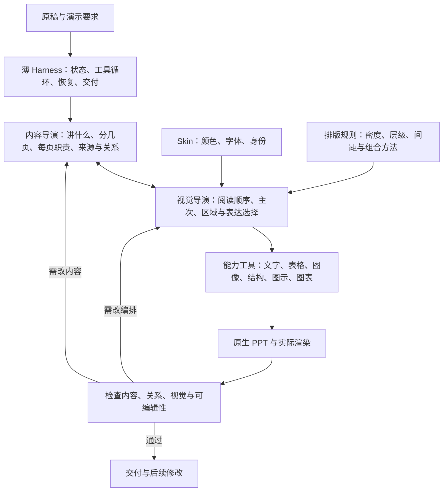

# PPagenT 项目现状与目标里程碑建议

> 2026-09-16 后续决策：本文保留为当时盘点/交接与证据，其中阶段建议及执行安排已由[现行 M1–M5 台账](页面编排能力计划.md)替代，不调度新任务。

日期：2026-09-16。性质：当前工作区的事实盘点与新规划建议，供方向讨论；不替代现行进度台账，不代表用户已接受新里程碑或验收了 PPT。

## 一、结论

**用户复核后的状态更正：当前连内容分区规划都尚未过关。** 已有循环、资产和 PPT 文件不能把项目状态提升为“已有合格规划，接下来优化视觉或验证稳定性”。下方远期里程碑仅保留为提案，当前依据以本节和[新稿实物复核](当前状态与新稿实物复核-2026-09-16.md)为准。

上一轮盘点漏查了工作台临时运行目录，遗漏另一份输入《设备预约试点的阶段回顾》（上传名“验证续跑稿.md”）。该次产物有封面加5个正文页，5页均出现左右分区正文完全重复、只换分区标题的问题。它已经产出，但内容分区失败；不是“没有做过其他稿件”，也不是“新稿复现已成立”。

这份产物生成于2026-09-13凌晨，早于当日晚间 placement 修订。当前代码后来开放了提炼上屏稿，不能把历史缺陷直接说成当前版本重跑结果；但没有找到该稿在后续版本上的合格重跑证据，内容分区能力仍未通过。

PPagenT 已有较多可复用的资产、规则、生成与检查工具，也有仓库自建的工具调用循环和真实 PPT 产物。**已成立的是执行链路和局部修订事实；尚未成立的是合格的内容组织与分区规划。**

尚未证明的是：面对新稿，系统能稳定理解内容关系、形成合适的整页表达、自行发现问题并交付用户认可的可编辑 PPT。

因此不宜给出“项目完成了百分之多少”。资产积累、运行机制、具体样稿质量、跨稿稳定性和产品可用性是不同维度。目前前两项明显领先于后三项。

## 二、产品目标与当前范围

已有产品需求的核心是：用户提供内容与演示要求，系统完成必要的整理、讲述组织和视觉编排，交付内容可靠、表达清楚、视觉合适、可以继续修改的 PPTX，减少用户反复拆页和排版的负担。

需求覆盖四类输入：讲稿转演示、材料转演示、已有 PPT 优化、要点/想法转演示。它们是产品方向，不是已实现清单。东北大学是第一正式场景。

**建议首个可用版本聚焦：已有讲稿 → 一种现有风格的完整 PPT → 用户提出修改 → 更新交付。** 先让这一条用户路径可信。材料理解、旧 PPT 编辑、多风格与更自由的表达随后各自取得证据，不能由一个短稿样例继承通过。

依据：[产品需求](../产品需求.md)、[产品定义](../产品定义.md)。等待时间、成本、客户端兼容范围与首版输入格式仍需在进入产品试用前定标，本次不虚构数值。

## 三、架构：目标、实现与历史分开看

### 1. 目标架构



两个导演是两个专业职责，不等于必须创建两个 Agent 或固定两次调用。Harness 负责让工作持续、可恢复、可追溯；它本身不替代内容和设计判断。

Skin 与 Layout 仍需分开：Skin 管视觉身份；排版规则指导怎样呈现；Layout 是本页实际形成的空间安排。结构是表达手段，不能规定每页都必须使用结构图。当前规则暂定每个 Skin 绑定一个排版体系，多个 Skin 可以共用同一体系。

### 2. 当前真正运行的架构

```text
工作台（默认 runner）或运行器 CLI
  → 模型 HTTP 接口
  → 内容阶段：读取原稿、组织页面、引用来源
  → 视觉阶段：从有限 editorial 文字版式中选取并绑定内容
  → 既有东北大学渲染器 + PPT 引擎
  → 原生 PPT、逐页 PNG、机器审计
  → 工具反馈与修订；状态合格后进入 ready
```

- `src/runner/` 已实现循环、工具派发、状态落盘、恢复；不再仅依赖对话宿主记住进展。
- 实现以 `state.json` 为机器真源。`createCommitter` 从它生成 `state.md` 和 `content.md`；`content.md` 在这条实现中不是可单独手改的正文真源。蓝图与产物由当前状态派生。
- 内容与视觉按阶段使用各自提示和工具，并存在返回内容阶段的修订入口。当前不是任意工具、任意媒介都已开放的 Agent。
- 新运行器的目录过滤为 `editorial-`，构建器固定调用东北大学 Skin。中性 Skin、结构 Skill 与外部图示/图表实验的能力不能算作已经接入本运行器。
- 检查主要回传文字化工具结果。在已检查的 runner 工具链中未见把实际 PNG 作为视觉输入送回制作模型的路径。生成了 PNG，不等于制作模型已经看图自审。
- `ready` / `passed` 表示当前程序检查口径下的状态，不代表用户已验收，也不代表语义与审美全面正确。

代码依据：[运行入口](../../src/runner/run.mjs)、[循环](../../src/runner/loop.mjs)、[状态及内容工具](../../src/runner/tools/generation.mjs)、[构建与检查工具](../../src/runner/tools/build-tools.mjs)、[工作台入口](../../src/tools/serve-production-workbench.mjs)。

### 3. 旧实现的地位

旧 `src/agent/` API 生产线仍保留：内容导演 → 程序筛选候选 → 视觉选择 → 确定性构建与检查。它是兼容入口和能力来源，已不作为新架构主线。A–H、大学排版、结构适配等实验提供设计经验和失败证据；它们并不自动成为新 Harness 的稳定能力。

## 四、已经做到什么

| 维度 | 当前事实 | 还不能由此推出什么 |
| --- | --- | --- |
| 产品定义 | 已有输入分类、可编辑交付与内容改动边界 | 首版服务范围、成本和兼容性尚未完整定标 |
| 运行机制 | 仓库拥有多轮循环、持久状态、续跑与零模型重编译；工作台默认接 runner | 所有中断场景、跨模型和独立部署已验证 |
| 内容组织 | 可引用来源、分页和撰写上屏稿；有覆盖及数字/引号检查 | 引用齐全不证明实际上屏齐全；数字有据不证明意思正确 |
| 页面构建 | 新 runner 可用有限文字版式生成真实可编辑 PPT；最新样本为 5 页 | 自由图文编排、复杂关系或全库调用已接入 |
| 规则与资产 | 实盘 93 份资产声明：39 core、31 pending-review、15 superseded、7 withdrawn、1 candidate | 39 core 不等于 39 个结构；资产数不等于成品能力 |
| 结构基础 | 项目记录有 35 个已审批结构共享中性换色；大中小保真适配确认范围仍为 3 个样板 | 全库任意尺寸、任意 Skin、整页调用均可靠 |
| QA 与修订 | 有实际渲染、几何/断行等检查；最新样本有外部反馈后模型改方案的记录 | 自主发现语义/视觉问题、无人监督完成已证明 |
| 可迁移性 | PPT 引擎入口已集中，依赖边界有记录 | 已脱离 Codex 运行时，或替换引擎只需改一行即可成立 |

PPT 引擎是本地 Codex 运行时提供的私有包。此次读取的本地 `@oai/artifact-tool` 版本为 2.8.59，其 LICENSE 限内部评估与测试，并列有生产、商业等用途限制。这是产品化前需要解决的依赖边界；集中 import 只降低定位成本，不证明替换后的测量、渲染和编辑性兼容。参见[外部依赖](../../harness/外部依赖.md)。

## 五、最新样本支持的结论

最新 R1 样本为 [20260913-r1-placement](../../harness/runs/20260913-r1-placement/state.md)：12 条来源、4 个正文页加封面，5 页 PPT 和 5 张预览均存在。

此前几轮暴露并修订了：把选择准则画成第三个比较对象、把全程规则编号成流程一步、引用存在但实际漏画、把准则全部移到底部导致主区空白。

最新一轮中，“准则一律放底部”的绑定已解除。流程页经过外部看图反馈后，模型重提交方案，形成三个同级步骤及独立的全程规则。此次实看总览及流程页、准则页，确认后两页已有完整主区，流程编号为 01–03；但卡片内部留白较多、表达方式仍有限。

**当前证据支持“受监督修订样本成立”，不支持“系统已自主、稳定制作合格 PPT”。R1 不在本次盘点中关闭。**

原生对象核对：5 页分别有 5 / 16 / 19 / 25 / 23 个 shape，3 / 13 / 13 / 20 / 19 个文字 run，证明该样本不是整页图片冒充。未进行 PowerPoint 桌面逐对象编辑验收。

来源：[本轮复盘](R1页面关系修订与协作复盘-2026-09-13.md)、[外部看图反馈](../../harness/runs/20260913-r1-placement/visual-review.json)、[最终候选 PPT](../../harness/runs/20260913-r1-placement/deck.pptx)。

## 六、为什么已有很多工作，项目状态仍难判断

以下是基于本次核对的判断，不是已验证的单一根因诊断。

1. **能力积累和产品交付混用了一套进度语言。** 新增资产、修好检查、某页变好、新稿成功，分别证明不同事情；累加它们不能直接得到“产品快完成”。
2. **目标表达空间比实际工具空间大。** 规则让模型思考丰富的页面关系，当前执行工具主要提供几种文字框架。需要区分模型判断不当与工具根本表达不了。
3. **运行闭环和质量闭环尚有距离。** 程序能生成、检查并续跑；决定页面是否忠实、合适的关键判断仍部分来自外部看图。
4. **进度描述没有跟上最后一轮证据。** README 仍写“尚未开始新 R1”；台账详细结论仍停留在 revision 的空主区问题；placement 已有进一步修订，但没有充分回流到总表。
5. **文档与代码的责任定义有漂移。** 运行流程仍写 content.md 是正文编辑真源，实际代码与 runs 约定已改为从 state.json 渲染。项目不能同时按这两种约定操作。

这些问题说明下一轮需要先统一“以什么结果算前进”。没有必要据此推翻全部积累，也不能仅靠再写一份更长的架构文档解决。

## 七、新规划建议：以交付目标为里程碑

保留现行 R0–R2 主线；将原来没有明确终点的 R3“扩展与优化”，收敛为表达能力目标，再增加一个首版使用目标。以下为建议，尚未替换[现行唯一台账](页面编排能力计划.md)。

| 里程碑 | 达到什么状态 | 可审核的交付点 | 完成边界 |
| --- | --- | --- | --- |
| R0 认知基线 | 目标、当前架构、已有能力和未证明项一致 | 一张架构图、一张状态表、一个当前焦点 | 过去完成的是文档对齐；本次发现漂移，需刷新，不能算新增产品能力 |
| R1 首个认可样本 | 一份短稿在一种风格下完整、关系准确、基本排版合格，整体表达得到用户认可 | 原稿、可编辑 PPT、全页预览、首版及修订记录 | 允许外部反馈，必须标注；通过只证明这份样本；不强制必须用结构图 |
| R2 新稿复现与恢复 | 新稿和新上下文中，无逐页答案，系统可完成并处理检查反馈；中断后不混用旧内容与旧证据 | 不同内容关系的新稿交付组；一次真实中断续跑记录；自主与外部干预记录 | 建议以 3 份短稿作为首批迁移检查，覆盖比较、流程、论证等差异；样本数量不是质量通过条件 |
| R3 代表性表达能力 | 对主场景所需的典型页面，系统能选择并组合合适表达，设计效果达到事先选定的参考标准 | 一组同风格完整演示，真实覆盖需要的文字、比较、流程、表格/数据或图文；可编辑且关系忠实 | 按真实需求开放能力；不同媒介不设调用配额，不要求全库全风格一次覆盖 |
| R4 首版可用产品 | 用户能提交范围内的讲稿、拿到结果、提出局部修改并得到更新；失败可理解，运行环境可复现 | 明确适用范围的试用入口、完整用户任务记录、修改前后 PPT、依赖与运行说明 | 等待与成本、客户端兼容、运行和分发依赖具备明确可接受边界；四类输入仍可分期覆盖 |

R1 的技术合格与用户对整体表达的认可分别记录；不把测试全绿作为审美分数。R2 要证明的是新稿迁移、自主处理与恢复，不是给旧稿再跑一次。R3 的视觉目标必须用具体参考与成品比较说明，避免用“高级、美观、咨询风”这些词代替交付标准。

里程碑按主要验证问题排序，允许同一产物同时提供其他能力证据；只有相应标准满足时才关闭，不强迫把内容、设计、检查拆成相互等待的工程阶段。

## 八、当前焦点

**当前最值得完成的交付点：让内容分区规划本身过关，并用实际PPT逐区核对。** 每页的目的、每区具体讲什么、区间关系及对应正文必须成立；不能只分两个标题，再把整段原文分别塞进两个区。先审核这层结果，不能把问题只归为美化或留白。

这一焦点应回答：

- 实际 PPT 是否忠实表达原稿关系、内容完整且可读？
- 用户是否认可整份的表达方向，而不只是确认没有明显错误？
- 系统自己发现并改了什么；外部指出了什么；还有什么不能自动判断？

R1 之后才把主验证切到新稿迁移。若为了达到认可样本必须补一个真实缺失的表达工具，可以按证据补；不能把“先做最小闭环”理解为接受明显不合适的版式，也不能顺势重建整套全能框架。

当前不把扩满结构库、增加 Agent、迁移模型、多风格并行和批量平台作为独立目标。已有规则、资产与工具继续按需复用。

长期台账建议每个里程碑只维护：目标、当前结论、最新证据、未解决项、下一交付点。过程细节留在 runs，架构职责留在运行流程，避免三处同时写长篇历史。

## 九、本次核对范围与验证

- 依据当前未提交工作区，而非只读 HEAD。当前 HEAD 为 `2196d363`，本地 main 相对本地缓存的 origin/main 领先 32 个提交；未 fetch，不能解释为远端实时状态。
- 盘点开始时已有 31 个已跟踪文件修改和 7 个未跟踪文件。本次仅新增这份建议文档，不提交或推送，不改动既有实现、台账与历史产物。
- 重跑 6 个相关测试文件：runner-core、runner-run、source-fidelity、composition-plan-structure、page-composition-roles、workbench-runner-adapter，共 **58/58 通过**，无失败、跳过或取消。覆盖相关机制，未替代全量测试与成品验收。
- 当前磁盘重新统计资产声明，核对最新样本 PPTX 的 XML 原生对象、运行状态与反馈；实际查看了 5 页总览及流程页、准则页的大图。
- 未重新调用模型生成，未全量重渲染历史样稿，未执行桌面编辑或远端部署验证。旧文档中的 446 项全量通过等记录属于历史证据，不作为本次重跑结果。
