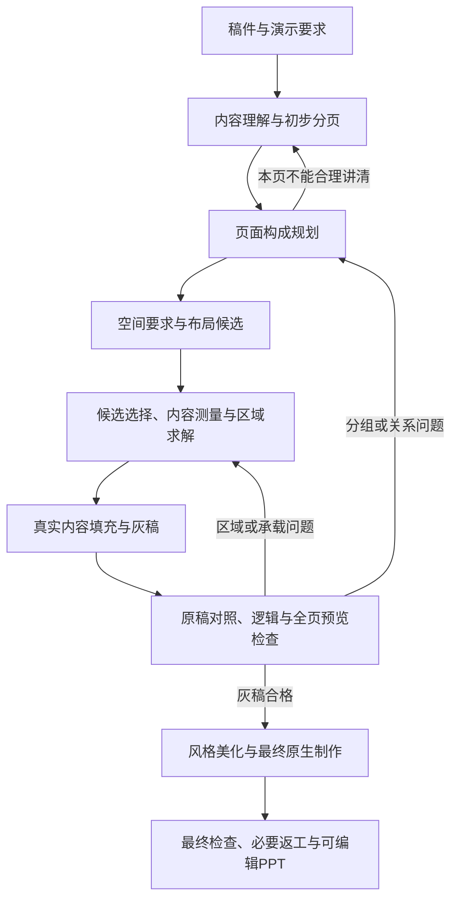

# 页面构成规划与资产架构

2026-09-24 用户确认的目标架构。本文统一资产职责、页面构成规划与布局接口；运行入口及返工执行见 [Harness 运行流程](../../harness/运行流程.md)，进度与验收唯一见 [页面编排能力计划](../方向讨论/页面编排能力计划.md)。目标不等于当前实现。

## 一、四类资产

PPagenT 的资产体系为 **Skin、风格、布局、逻辑与结构图**。这四类是专业设计经验的复用方式，不等于四个 Agent、四次调用或现有看板的四个栏目。

| 资产 | 负责什么 | 不负责什么 |
| --- | --- | --- |
| Skin | 组织视觉身份、字体与色彩来源、Logo、页眉页脚、Shell 和可用内容区 | 不推断稿件关系，不为每个组织复制布局或结构库 |
| 风格 | 在 Skin 边界内提供视觉表现方法、层次、疏密、节奏和细节偏好；必要的字号与间距取值沿用现有真源 | 不改事实、分组、逻辑主次或阅读关系；不在美化时重新发明页面组织 |
| 布局 | 将已确定的空间要求落实为区域；保存适用条件、槽位角色、约束、变化方式和失败反馈 | 不是固定坐标模板清单；不因块数相同就认定逻辑相同 |
| 逻辑与结构图 | Logic 描述内容关系和适用条件，结构图保存表达这些关系的设计方法与可调用实现 | 不强迫每页画图，不从有一个图形资产倒推原稿有相应关系 |

“逻辑与结构图”是同一资产领域内的两个层次：逻辑是选择依据，结构图是可选的表达能力。复用已有 Logic 和结构入口，不再平行建设一套同义逻辑库。一个逻辑可以对应多种结构图；结构可用于局部区域，不要求覆盖整页。

文字、图片、表格和数据图表是内容或表达媒介；测量、渲染、Skill、Harness 是执行能力；来源、审核记录与样例是证据。它们继续保留，但不与上述四类资产并列为新的顶层资产分类。真实图片仍需来源与裁切约束，数据图表仍需数据依据。

现有索引中的 `layout` / `layouts` 曾用于绑定风格，不能与本文的布局规范混为一谈。暂不批量改名资产 ID、目录或接口；当前一个 Skin 绑定一套风格是实现约束，不是四类资产必须永久绑死。

## 二、生成主线

总原则：**先由内容逻辑确定空间关系，再根据实际承载需求和视觉主次分配比例，最后由布局规范计算几何。**

这些是职责，不规定固定调用次数，也不增加逐阶段用户审批。分页依据“一页讲明白一件事”，综合表述结构、信息量与实际内容区，而非按字数阈值切页。主题句可以引出、概括、总结或提出有依据的判断；目录、封面和过渡页按其职责处理，不硬造结论。后续容量反馈可以修订分页。

## 三、页面构成计划

沿用已有页面目的、主题句、groups、blocks、来源和表达说明，逐步补齐影响布局的必要信息。以下是目标语义接口，不是已发布的新 JSON Schema，不要求新增独立文件或复制正文。

| 信息 | 内容与来源 |
| --- | --- |
| 页面任务与主题句 | 说明本页为何存在及读者应理解什么；主题句与正文关系可核对 |
| 内容身份与归属 | 稳定内容 ID、真实上屏文字、来源和必要条件；证据与解释、条目与限定不能被任意拆散 |
| 必要逻辑关系 | 并列、对照、先后、因果、总分、支撑等，仅记录影响表达的关系；不要求逐句关系图 |
| 语义重要性 | 哪些是核心、支撑或补充；重要不等于文字多，也不自动等于面积最大 |
| 表达需求 | 文字、结构图、图片、表格或数据图表及理由；非文字区需保留制作要求 |
| 空间要求 | 必须共同阅读的组、对照对应、先后路径、视觉锚点、必要邻接和可调整偏好 |

原稿关系、模型解释和几何假设须区分。没有依据的因果不能靠箭头补出来；单纯有三个块不能推出流程；并列不必严格等面积；比较不必固定镜像；相册式不要求所有页面有主块或固定主块占比。

## 四、从空间要求到布局

1. 根据页面内容关系和表达需求生成空间要求；逻辑含义由规划负责，几何工具不重新解释原稿。
2. 从已登记能力中筛选少量候选，排除违反必要分组、阅读路径或实际能力边界的方案。数量、比例和横竖形态可变，示例不是候选上限。
3. 选择器比较可行候选，也可返回“无合适候选”。保留选择依据，不能用模型自报置信度充当语义或审美验收。
4. 以稳定内容 ID 绑定槽位角色，再计算区域。角色如主体、支撑、共同注记只描述本页职责，不预先锁死位置或数量。
5. 按实际字体、宽度、换行和组件需求测量。文字所需高度随宽度变化；`minWidth/minHeight` 或面积权重只能作为输入或测量摘要，不能替代真实承载检查。
6. 生成灰稿并检查实际显示结果。几何无重叠、空框铺满内容区都不等于逻辑和阅读质量合格。

硬约束是来源保真、内容归属、必须共同阅读的关系、明确先后及实际承载底线；软偏好包括视觉重心、理想宽高比和节奏。冲突必须反馈，不能悄悄违反硬约束。关系层级靠位置、对齐、标注和表达共同体现，不单靠面积。

## 五、布局规范与已有结构的协作

布局能力记录适用与不适用条件、可承担的空间组织、参数、测量要求、可调整范围、失败原因与验证状态。规范文字用于理解，程序能力声明和检查器用于执行；没有实现的约束不得标作已强制。

当前卡片式、相册式保留为起点。卡片式按同向组织和承载需求变化；相册式可按块数、体量、横竖倾向和分组形成不同拼接。后续接入必要的邻接、同组与阅读约束，不继续靠增加固定组合扩库。

一页可采用主辅布局，主区放流程结构图，辅区放说明。页面构成规划决定这种组织是否忠实；布局分配合法区域；结构图按实际支持范围适配区域；Skin 与风格统一呈现。结构调用或参考重组须如实记录，不因一次适配成功晋升全库能力。

布局库与现有 `gray-layout.mjs` / `resolveLayoutTree` 应共用测量和几何能力，逐步统一预览与正式执行，不复制两套长期求解真源。已有来源审查、PPT 构建、导出与预览继续复用。

## 六、修订和模型边界

空间不足时，先在不改变逻辑和事实的范围内调整区域、比例或同族组合；候选不适用则换族；仍无法承载则返回构成规划或分页。邻区只有保留其承载底线才可缩减。修订受当前运行预算约束，不能无限重试。

事实、条件、分组或关系变化返回内容规划；空间映射错误返回构成规划；测量与区域错误返回求解；对象或导出错误返回制作。修改相关输入后，对应的检查及派生产物失效，需重新生成，不继承旧通过状态。

规划在灰稿阶段已确定有逻辑含义的阅读顺序、主次和区域组织。美化可复核媒介并调整视觉细节，但改变内容或阅读关系必须写回计划、重新检查。灰稿的蓝区是制作说明，不假装已完成内部结构图。

模型可替换：理解与规划可先由现有模型承担，选择器提供有限候选决策接口，将来可换快速决策模型。此处不承诺具体模型准确率、价格或兼容性，也不以更强模型能否一口气做完来取消来源、能力契约和质量标准。

## 七、当前实现与迁移顺序

| 状态 | 2026-09-24 核实边界 |
| --- | --- |
| 已有 | 工作台默认灰稿入口调用 `gray-agent.mjs`；旧 `gray-draft.mjs` 阶段链及通用 runner、legacy 入口仍保留，各有状态与恢复边界 |
| 已有 | `gray-plan-3` 含页面目的、主题句、分组、主次和必要关系；实文测量、灰稿原生构建与预览可复用 |
| 局部实现 | 看板布局栏目、卡片/相册参数试排；`page-layout-library.mjs` 用面积需求、宽高倾向和最小尺寸求矩形分区，不理解完整逻辑关系 |
| 待改 | 旧 `gray-templates.mjs` 仍含按组数/内容特征选默认组合；目标用逻辑和空间要求筛选替代，不在本次说明修改中假称已删除 |
| 待接入 | 构成计划的可执行空间约束、测量支持的候选选择、布局规范到正式灰稿的共同接口 |
| 未验收 | 正式线真实稿件效果、冻结后新稿泛化、完整美化交付及 M1 |

第一步对齐说明与接口职责；第二步在已有工作台灰稿入口接一条真实稿件的最小闭环，显示分页、构成依据、完整原稿和全部灰稿页；第三步修复实际失败并冻结条件，再验证不同稿件。开发检查可保护接口，但不另写绕过正式线的生成脚本来代替质量验证。

以上表格是 2026-09-24 的迁移起点。历史实验及讨论原文保留证据身份，不能直接当成可执行契约。

### 2026-09-26 接入进展与尚未解决的边界

正式工作台已通过 `gray-layout-selection.mjs` 调用看板同源卡片/相册规范。规划检查返回各组在全宽、半宽、三分之一宽度下的实测高度和可行候选；宽高倾向由这些测量样本形成求解偏好，不是模型臆定的面积，也不是最终图片比例。最终坐标仍需再次按实文测量。

布局块当前仍对应 `gray-plan-3` 的组。共同前提、并列对象和组内附注是否正确分组，仍由内容规划承担；求解器不能擅自拆组或改写事实。单区域候选去除同坐标别名，单组规划会提示其无法验证多区域选型，提示本身不等于分组问题已解决。

正式运行 `20260926082118-e744fe` 使用 C03 原稿和 1170×492 内容区，暴露了共同说明被独立成主辅区域、合并后五条正文纵排超容量、24 轮未交付的问题。此运行未通过。上一运行四页单区域灰稿也不能作为多区域布局适配合格证据。接入可运行、布局适配合理、用户验收是三个不同结论。

A03 采购规定的正式运行 `20260926082451-92ee75` 同样被主辅关系限制阻断。因此卡片规范补充“主体＋共同说明横带”：使用已有 primary/supporting 角色，连续说明放在页首或页尾，说明高度取实文测量值，主体使用其余空间且必须高于说明。保留原组序、全部原文和来源，不靠语义关键词猜共同说明，也不支持交错说明的自动归并。候选仍需模型判断说明的适用范围；范围错挂不能由几何检查发现。此能力须以随后正式运行证明，不能用接口测试宣称已验收。

后续 A03 正式运行 `20260926082809-e46fd7` 产生一页左右等分灰稿，但说明文字很少仍占半页，评审不通过。加入主次面积检查及 8–24px 自适应横带间距后，`20260926083052-9237c6` 的 render-9 产生两页单区域灰稿，完整预览仍显示大面积留白；第二页将应急例外与归档共同要求并列，不能证明主辅横带或多区域选型有效。状态 awaiting-user-review 仅说明产生候选，不是质量通过。上述两次均不得计作布局适配合格样本。

下一步必须分离语义组与视觉布局块：同一语义组的并列子项可以形成多个视觉块，共同范围必须保留作用对象，映射只引用原内容 ID。先定义并校验这个映射，再按宽度测量；不能用不断压缩、合组或拆页代替映射建设。正式生成链当前尚未完成这一层。

### 2026-09-26 真实内容人工映射校准

PPA 看板「布局」栏目新增 `/layout-calibration`，使用采购规定 A03、安全通报 A02 的完整原文。`catalog/layout-calibration-*.json` 保存人工划分的内容 ID、逐字引用、语义组、视觉块职责、共同说明作用对象及分块理由。`content-layout-calibration.mjs` 检查来源无遗漏、无重复、无改写及引用有效，再调用已有卡片/相册求解器；同一语义组允许映射为多个视觉块。全部正文保持 22px，空间不足明确报错，不缩字、不删文。

这是用于定位映射与空间规则问题的校准工具：映射和布局家族均由人工指定，只提供 HTML 预览，不替代正式生成和原生 PPT 验收。当前只支持标题、主体块及页尾共同说明，作用对象作为可审查证据展示，尚未通用求解作用范围嵌套。最小尺寸来自文字测量，但相册宽高偏好仍采用固定初值；当前两份三块稿件的相册结果仍接近三列，不能据此认定相册变化能力或空间利用质量通过。浏览器与原生 PPT 字体测量差异也仍需正式线验证。

下一步先通过真实内容比较，调整视觉块及空间偏好的通用规则；规则冻结后，才让模型产生同一映射接口及有限候选选择，并接回正式线。记录自动结果与人工校准的差异，最后用未参与调参的稿件验证。不得把这两份人工校准样本记作自动识别、自动选型或 M1 通过。
