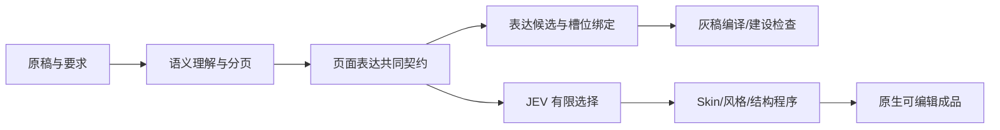

# 页面表达共同契约与编译

2026-09-30 现行架构。PPagenT 只有两个大阶段：**稿件到灰稿、灰稿到成品**。本文是页面表达、版式、槽位和灰稿边界的责任文件；项目状态见[页面编排能力计划](../方向讨论/页面编排能力计划.md)。旧流程只保留在历史快照，不作为入口或调度依据。

## 页面表达与灰稿是一体两面

页面表达是结构化共同契约，灰稿是这份契约的编译视图。表单可以把契约投影成可读、可编辑、可逐项检查的界面；它不产生另一套内容。工作台和日志也只读取运行产物，不把页面截图反向识别成源数据。

共同契约只有一个内容来源。灰稿和成品都引用原始内容 ID；灰稿中显示的蓝区、占位和说明是对“需要哪种表达”的直观检查，不是成品正文的复制。

## 最小契约字段

| 字段 | 作用 | 谁负责 |
| --- | --- | --- |
| `pageId`、`order`、`purpose`、`thesis` | 固定页序、页面目的和主要判断 | 语义理解模型；程序校验唯一性 |
| `sourceBlockIds`、`text`、`qualifiers` | 保留实际上屏内容、来源和必要限定 | 语义理解模型；程序做来源/覆盖检查 |
| `groups`、`priority`、`relations` | 表达共同阅读、对照、先后、支撑、条件和作用范围 | 语义理解模型；程序检查引用存在 |
| `expressionKind`、`expressionReason` | 说明是纯文字、关系结构、图表等及其理由 | 语义理解模型提出；JEV 只在候选中选 |
| `layoutId`、`variantId` | 指向已建设的页面级版式和变体 | JEV 有限选择；程序确认候选合法 |
| `regionBindings`、`slotBindings` | 把内容 ID 绑定到区域和结构槽位 | 程序确定性绑定与测量 |
| `capacity`、`styleEnvelope` | 声明字数/数量/区域容量和允许的样式范围 | 资产与布局程序 |

实际 JSON 仍以调用点和 `gray-plan-3` 为准；表中是职责和最小信息，不等于已经存在的新 Schema。新增字段前必须核对实际消费点。

## 版式的两级结构

页面版式可以分两级建设，二级不是强制层：

1. **一级：页面级版式（macro layout）。** 决定标题/主题句、主要内容区、辅助说明区、页眉页脚和区域之间的比例与阅读方向。它回答“整页如何分区”。
2. **二级：区域内部结构（micro layout / structure variant）。** 在某个区域中决定卡片、顺序节点、对比列、矩阵或其他结构如何排布。它回答“这个区域如何承载已绑定的一组内容”。

一级和二级都必须有候选 ID、适用条件、参数、槽位、容量矩阵、拒绝条件和原生构建入口。没有必要的二级结构时，区域可以使用受限纯文字程序。JEV 只能选择候选 ID，不能输出坐标、临时 SVG 或制作代码。

## 稿件到灰稿：契约编译过程

1. 语义模型读取原稿并保留来源、限定和必要关系。
2. 程序或语义模型提出分页；每页只保留一个主要目的，完整覆盖该目的所需内容。内容“不要太多、不要太少”由语义完整性和承载容量共同判断，不用固定字数阈值。
3. 为每页声明表达需求、一级版式候选和可选二级结构候选。候选来自建设阶段已登记的资产，不现场创造。
4. JEV 从程序给出的合法候选中选择；程序验证关系、数量、文本量和页面容量，并把内容 ID 绑定到区域/槽位。
5. 灰稿编译器生成每页实文、版式轮廓、结构占位、来源和检查结果。灰稿冻结页序、目的、内容、关系、表达、区域和槽位，供用户/Codex 直观检查。

灰稿阶段发现语义问题回契约，发现候选覆盖问题回资产建设，发现绑定或容量问题回程序；不在灰稿里手工“画到看起来对”。

## 灰稿到成品：受限渲染过程

1. 读取冻结的页面表达契约和灰稿结果。
2. 按输入的 Skin 与风格规则解析字体、色彩、页面壳、层级、间距和强调方式。
3. 读取参数化布局/结构资产，在其 `styleEnvelope`、槽位和容量范围内填入同一内容 ID。
4. 程序测量、求解几何、生成原生可编辑对象并输出完整预览、PPTX 和检查证据。

Skin 和风格可以改变视觉 token、字体和装饰；不能改变页面目的、内容归属、关系、页序或槽位语义。如果样式使内容超出能力边界，必须切换已声明变体或返回失败，不能重新解释页面。

## 建设与投入使用边界

建设阶段由用户与 Codex coworker 建资产、程序和规则，Codex 可查看图像进行建设检查；home 可用模拟灰稿先建设后段。投入使用只包含语义理解模型（DeepSeek v4.1 Flash）、JEV 和确定性程序。产品不调用视觉模型，也不依赖 Codex。

JEV 的职责是判断和选择；确定性程序的职责是合法候选、来源、绑定、容量、测量、几何、构建和日志。灰稿、成品和工作台都从同一契约/日志编译，不能把模型输出直接当成可渲染坐标。

## 检查点与失败归属

- **资产检查点：**资产有视觉规则、参数、槽位、容量矩阵、拒绝条件、程序入口和原生可编辑验证。
- **分页检查点：**每页有一个主要目的，必要内容完整，来源和限定可回溯，页间没有重复或遗漏。
- **表达/绑定检查点：**每个内容组都有表达类型、关系、合法候选和区域/槽位绑定，JEV 选择可解释且可回放。
- **灰稿检查点：**实文可读，页序/关系/主次成立，无溢出或未声明占位，用户/Codex 可以直接判断是否进入后段。
- **成品检查点：**内容来源、关系、页序和槽位指纹保持；原生对象可编辑；几何、导出、字体和完整预览通过用户审阅。

失败返回责任边界：语义/分页/关系回共同契约；候选覆盖回资产；内容到区域回绑定；容量/几何回布局程序；导出/字体回构建环境。程序通过、日志完整或固定回放都不等于语义和视觉验收。

当前已接入 gray 布局选择的 JEV provider、来源绑定、实文测量和日志工作台；跨组关系、多图示和完整成品链仍按台账逐步建设。历史实验中的视觉导演、自由局部排版和旧 stage runner 只保留兼容或证据身份。
