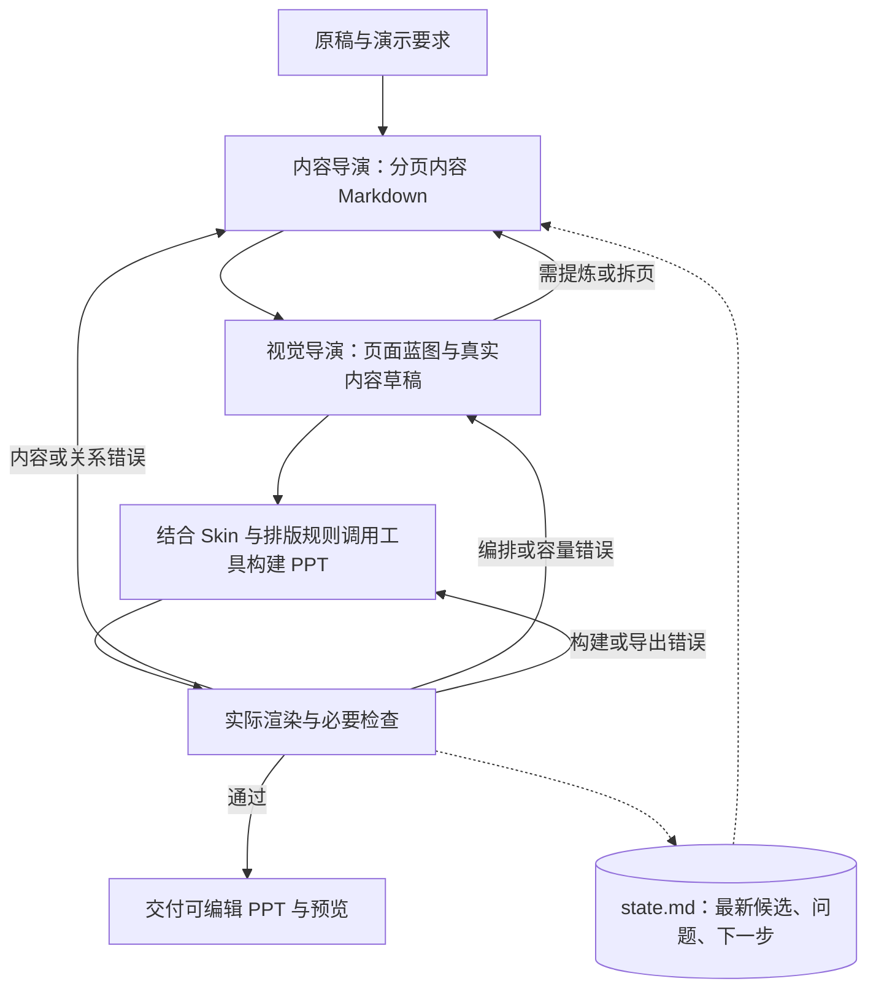

# Harness 架构与最小运行闭环

2026-09-12 用户确认：以 Git `d5efa449` 为重构基线，正式从受限的 API 请求—响应生产方案转向 PPT 专用 Harness。先跑通最小完整闭环，再按真实缺口优化流程。本文是现行架构真源；里程碑与项目进度在[页面编排能力计划](../docs/方向讨论/页面编排能力计划.md)维护，不把生产阶段当作开发里程碑。该进度表属于仓库维护资料，复制本包运行时无需读取它。

## 最小架构

当前由 Codex 宿主提供模型多轮工具调用、文件和执行环境，项目提供 PPT 工作方法、状态与现有能力。当前制作配置仍为实际设置的 `gpt-5.6-luna / high`；不安装 Penguin、不以 DeepSeek 迁移为前置条件。模型可替换是产品方向，跨模型效果尚未验证。

这不是四次固定 API 调用。执行者按工具回执和实际产物自主选择后续动作；可以往返，阶段不要求用户逐步批准。保留内容与视觉两个专业职责，不要求每阶段独立 Agent，也不要求增加总控或审查 Agent。状态、工具调度、恢复与交付是运行责任，可由当前宿主和执行者承担。

## 中间产物及职责

| 产物 | 最小内容与边界 |
| --- | --- |
| 原稿 | 保留原始输入或可读取引用；不被提炼稿覆盖 |
| content.md | 一级标题对应一页，页内内容块使用稳定 ID；页面目的、拟展示的实际内容、必要来源。核心结论仅适用时写，不强迫目录或过渡页造结论 |
| blueprint.json | 引用页面/内容块 ID，记录区域、表达方式、阅读顺序和必要关系；不复制整份正文，不要求固定版式名称或庞大 Schema |
| state.md | 本次目标与输入、资料/工具版本、当前候选位置、未解决问题、下一步；续行前核对实际文件 |
| PPTX 与实际预览 | 首版、必要修订版与最终候选；证据必须对应交付文件，不能用源代码图代替最终 PPT 渲染 |

这是最小文件约定，尚不是已发布的程序协议或通用解析器。蓝图具体字段由首个闭环所需决定，不提前实现完整 IR 框架。现有来源编译器、composition-intent 与 resolver 是可选工具；选择后遵守其契约，不将所有新任务强制转换到旧 Schema。

正文只有 content.md 一份当前编辑真源，蓝图引用它；构建器按当前内容取值。内容变化后更新受影响蓝图/页面，不在几个计划中分别改正文。渲染产物可包含编译后的文字，不作为第二份手工维护真源。暂不建立独立 Visual Plan、角色报告全集或固定阶段审批表。

## 生产阶段

1. **分页内容。** 从原稿与演示目的形成 content.md，保留事实、条件、口径与来源。分页是当前候选，不是锁死的上游答案。
2. **页面蓝图与实文草稿。** 内容与视觉职责协调区域、表达和阅读关系；使用真实文字、表格或关系内容，做基本字号与容量测量。草稿可以是构建过程中的预览，不要求额外导出一套初模 PPT；不能只画空框证明布局成立。
3. **视觉适配与构建。** 读取选定 Skin 和绑定排版规则，复用已有工具生成原生 PPT。结构、图示、图表按实际关系选择，允许不用。无需先完成全库自动路由。
4. **实际渲染、检查与修正。** 从最终候选核对内容、关系、可编辑性及基础视觉。按失败原因返回相应阶段，重渲染受影响页，并确认最终预览完整。

蓝图保留页面目的、信息归属、真实关系与阅读主次；区域比例、字号下的换行、间距及局部分栏允许调整。Skin/字体改变后必须重新测量，不能声称 Layout 永远不变。需要提炼或拆页时回到内容职责，不能缩字硬塞或删掉必要条件。

默认交付完整风格的可编辑 PPT 与预览。只有用户明确要求初模时，才交付实文黑灰草稿；原稿与初模前后对照也不是默认必需。中间文件支持调试和恢复，不增加用户逐阶段审批负担。

## 检查、恢复与停止

最小检查是：原稿事实与条件没有被改错；图表与连线关系有依据；文字/图形可编辑；实际渲染无明显遮挡、裁切、不可读文字和失衡。现有工具按可用能力检查实际对象，不能拿“文件存在”或工具零告警当作全质量通过。方法见[产物审查](产物审查.md)。

检查发现简记在 state.md，详细工具回执保留原文件即可，不重复填写报告。保留首版、自修与外部干预区别；失败版本不覆盖成成功记录。

阶段有实质推进、候选变化或中断前更新 state.md；恢复时读取状态并检查实际文件，再继续。预算和外部限制按本次任务实际记录，不预建复杂调度器。不固定重试次数：同类问题持续无改善时改变诊断或策略；达到真实工具/预算阻塞时保留候选与未解决项，不能无限重试或错误宣称完成。

## 现在实施与后续优化

当前 R0 只建立上述说明与进度基线；R1 必须让一份短稿走完全部阶段，使用一种已有风格和现有制作工具，得到实际可编辑 PPT 并完成检查返工。文档完成不等于 R1 完成。

复杂调度、多审查 Agent、全面 Schema、独立 Visual Plan、全库自动路由、多风格并行验证和批量基准都留到后续，只有真实失败与收益证据才引入。必要的渲染和基础检查不后置。

旧 API 生产线保留为兼容实现与能力来源，不再作为新产品主架构；本次不删除或重写它。A–H 风格实验保留为效果参考和失败证据，不再是项目唯一主目标。已有宿主、文档包与样稿不证明新架构的自主复现、恢复或远端部署已验收。
