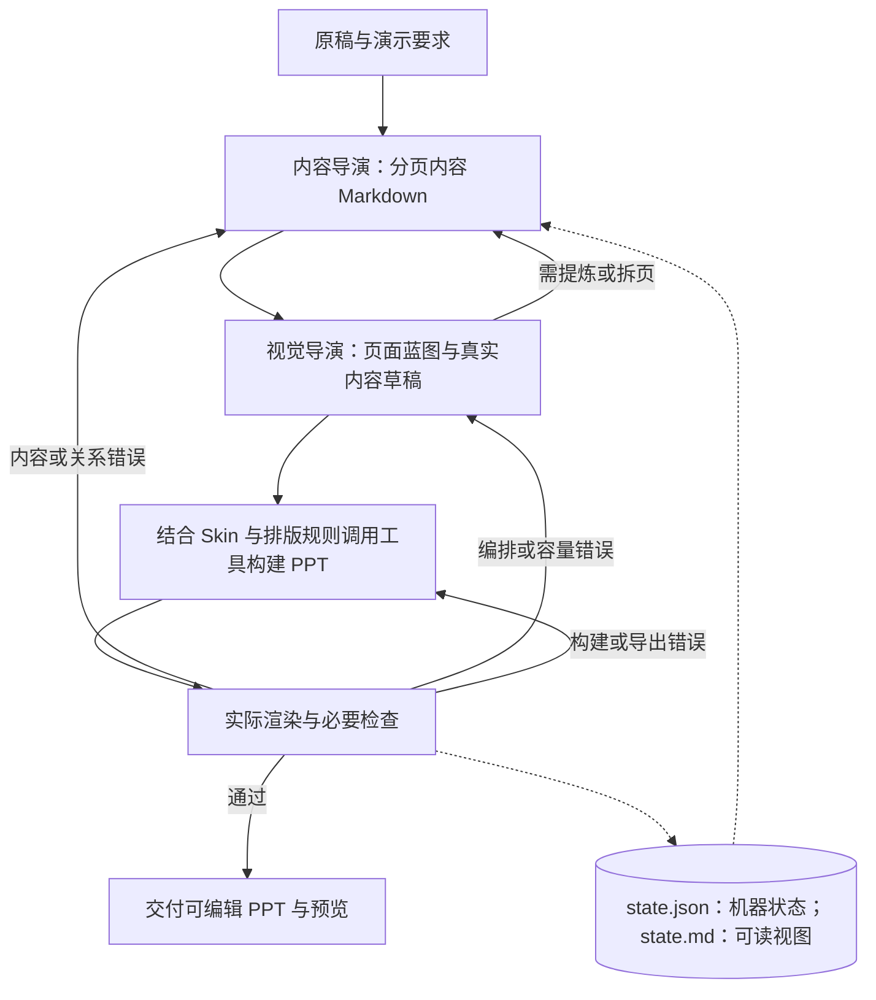

# Harness 架构与最小运行闭环

2026-09-16 对齐产品定义：Harness 对多次模型调用、工具、上下文、规则、状态、检查与返工进行工程化管理，只服务 PPT 制作闭环；自研 Harness 不是产品目标。本文是运行流程真源；现行 M1–M5 与项目进度在[页面编排能力计划](../docs/方向讨论/页面编排能力计划.md)维护，不把制作检查点等同于开发阶段。进度表属于仓库维护资料，不是复制本包运行的前置依赖。

## 两个检查点

**稿件 → 检查点 1：内容与页面规划 → 检查点 2：页面制作与验证 → PPT。**

| 检查点 | 要回答什么 | 通过依据 |
| --- | --- | --- |
| 1 内容与页面规划 | 这页为什么存在、讲什么、哪些内容属于它、彼此是什么关系、什么最重要 | 合理分页、实际内容与区域归属、主次和关系明确；无无意义重复、关系误判、重要信息丢失；考虑真实文字量和基本容量，不锁死精细坐标 |
| 2 页面制作与验证 | 怎样把规划中的内容关系视觉化 | 按需调用 Skin、风格排版、结构库及图表/框图 Skill，产出原生可编辑 PPT；实际渲染与内容、关系、视觉检查成立 |

规划是制作基准，可以因容量或表达问题返回修订，但须记录原因并更新相关内容与产物。检查点 1 的语义错误返回内容规划；规划正确但被制作错误呈现的问题归检查点 2，不仅凭最终症状预断失败环节。检查点不增加用户逐阶段审批。

当前 M1 可以单独审阅规划，并使用真实 PPT 反馈可执行性；完整制作属于 M2 验收。正常用户制作任务仍默认交付完整 PPT。

## 最小架构

多轮工具调用循环自 2026-09-12 起由仓库自建的薄运行器提供（`src/runner/`，只拥有循环、状态落盘、工具派发、恢复四件事；构建与审计一律调既有模块），不再依赖 Codex 宿主。运行环境仍受两处外部约束：PPT 引擎 `@oai/artifact-tool` 来自 Codex 工作区（见[外部依赖](外部依赖.md)），模型走 HTTP 接口、R1 实测为 DeepSeek（`config/deepseek.local.json`，密钥不入库）。不安装 Penguin。模型可替换是产品方向，跨模型效果尚未验证。

这不是四次固定 API 调用。执行者按工具回执和实际产物自主选择后续动作；可以往返，阶段不要求用户逐步批准。保留内容与视觉两个专业职责，不要求每阶段独立 Agent，也不要求增加总控或审查 Agent。状态、工具调度、恢复与交付是运行责任，可由当前宿主和执行者承担。

## 中间产物及职责

页面语义与视觉位置分开决定：`criterion` 可以是准则清单页的主体，也可以是比较页的辅助依据；`global` 表示适用范围，不代表一定放页脚。当前薄运行器的新方案在 `textSlots[].bandItemIds` 显式指定辅助项，默认空数组表示留在主区；仅支持辅助带的区域接受非空值，禁止把区域全部内容抽走。旧方案缺此字段时保留原回放行为。角色标签不是关系或视觉验收凭据。

`read_catalog` 同时返回已有逐页反馈，供恢复后的视觉阶段读取和修订。外部看图反馈与模型自主发现必须分别记账；反馈后模型改方案并重建，仅证明受监督修订，不自动证明无人监督的视觉判断。

| 产物 | 最小内容与边界 |
| --- | --- |
| 原稿 | 保留原始输入或可读取引用；不被提炼稿覆盖 |
| content.md | 一级标题对应一页，页内内容块使用稳定 ID；页面目的、拟展示的实际内容、必要来源。核心结论仅适用时写，不强迫目录或过渡页造结论 |
| blueprint.json | 引用页面/内容块 ID，记录区域、表达方式、阅读顺序和必要关系；不复制整份正文，不要求固定版式名称或庞大 Schema |
| state.json / state.md | `state.json` 是唯一的机器状态真源，只由运行器原子写入，**不手工编辑**；`state.md` 由它渲染出来供人与模型阅读。内容含本次目标与输入、当前候选位置、未解决问题、下一步；续行前核对实际文件 |
| PPTX 与实际预览 | 首版、必要修订版与最终候选；证据必须对应交付文件，不能用源代码图代替最终 PPT 渲染 |

以上描述最小产物职责；当前运行器具体字段受现有工具和状态协议约束，说明文档不扩大程序能力，也不要求另建完整 IR 框架。现有来源编译器、composition-intent 与 resolver 是可选工具；选择后遵守其契约，不将所有新任务强制转换到旧 Schema。

当前运行器以 state.json 为唯一机器真源，content.md 与 state.md 由它派生，不手工改写；blueprint.json 引用对应内容 ID，构建器按当前状态取值。内容变化后更新受影响蓝图/页面，不在几个计划中分别改正文。渲染产物可包含编译后的文字，不作为第二份手工维护真源。暂不建立独立 Visual Plan、角色报告全集或固定阶段审批表。

## 生产阶段

1. **分页内容。** 从原稿与演示目的形成 content.md，保留事实、条件、口径与来源。分页是当前候选，不是锁死的上游答案。
2. **页面蓝图与实文草稿。** 内容与视觉职责协调区域、表达和阅读关系；使用真实文字、表格或关系内容，做基本字号与容量测量。草稿可以是构建过程中的预览，不要求额外导出一套初模 PPT；不能只画空框证明布局成立。
3. **视觉适配与构建。** 读取选定 Skin 和绑定排版规则，复用已有工具生成原生 PPT。结构、图示、图表按实际关系选择，允许不用。无需先完成全库自动路由。
4. **实际渲染、检查与修正。** 从最终候选核对内容、关系、可编辑性及基础视觉。按失败原因返回相应阶段，重渲染受影响页，并确认最终预览完整。

蓝图保留页面目的、信息归属、真实关系与阅读主次；区域比例、字号下的换行、间距及局部分栏允许调整。Skin/字体改变后必须重新测量，不能声称 Layout 永远不变。需要提炼或拆页时回到内容职责，不能缩字硬塞或删掉必要条件。

默认交付完整风格的可编辑 PPT 与预览。只有用户明确要求初模时，才交付实文黑灰草稿；原稿与初模前后对照也不是默认必需。中间文件支持调试和恢复，不增加用户逐阶段审批负担。

## 检查、恢复与停止

最小检查是：原稿事实与条件没有被改错；图表与连线关系有依据；文字/图形可编辑；实际渲染无明显遮挡、裁切、不可读文字和失衡。现有工具按可用能力检查实际对象，不能拿“文件存在”或工具零告警当作全质量通过。方法见[产物审查](产物审查.md)。

检查发现经运行器状态或审查记录保存，state.md 由状态派生；详细工具回执保留原文件即可，不重复填写报告。保留首版、自修与外部干预区别；失败版本不覆盖成成功记录。

阶段有实质推进、候选变化或中断前通过运行器更新状态及派生视图；恢复时读取状态并检查实际文件，再继续。预算和外部限制按本次任务实际记录，不预建复杂调度器。不固定重试次数：同类问题持续无改善时改变诊断或策略；达到真实工具/预算阻塞时保留候选与未解决项，不能无限重试或错误宣称完成。

**验证也是运行。** 为核对接口、规则或统计口径而跑的那一次，和正式稿走同一套阶段与记账：不另起旁路服务绕过流程，也不在看完结果之后删掉记录——被删掉的那次恰好是最该被复核的证据。用途差异用「验证」标注表示，不改变流程本身。

中断与续跑都留在同一条运行记录里，各自作为一次尝试留档。续跑从实际停下的阶段接续，排在前面的阶段沿用上次产物、本次不重新调用模型；这一点按阶段标出，避免把「沿用」看成「重做了一遍」。到 ready 之后只能零模型重编译，它同样是一条可查的记录。

## 技术选型与实现边界

先复用当前运行器，工作流稳定后再评估成熟框架；Agents SDK、LangGraph 等尚未选定。当前新运行器以有限文字版式为主，结构库和外部 Skill 尚未完整接入；按需加载规则是组织原则，不是已完成全部阶段路由的声明。

正式框架、去除 Codex 私有 PPT 引擎依赖、商用条件、并发、隔离、持久化、恢复、成本与部署纳入 M5。已有状态和恢复能力继续使用；模型调用独立不等于制作系统独立部署。

## 历史实施记录（旧 R0–R3，非现行推进计划）

以下保留当时失败、修订与验收边界；其中“当前”“下一步”均指当时，不覆盖现行 M1–M5。

R0 建立上述说明与进度基线。R1 于 2026-09-12 用自建运行器做了第一次实跑：短稿 `runs/20260912-r1-thin-runner/` 走完分页内容、页面方案、原生构建、实际渲染与审计，产出 5 页可编辑 PPTX 与全页预览，`--replay` 可零模型重编译，二进制的状态与蓝图前后一致。**这次实跑成立，不等于 R1 里程碑成立**，缺口见本节末。

首版曾有两处正文断行把单个字与标点挤成独占一行（`slide-03` 卡片 01 的「理」、`slide-05` 卡片 03 的「，」），根因是 `src/render/chinese-typography.mjs` 的字宽系数按 0.95em 估算全角字、而渲染器按 1.0em 排。这是既有缺陷，不是运行器引入的。2026-09-12 经单独授权改为按真实 1em 计算容量，重编译后两处消失、全页「拟合行数 = 引擎行数」，全量测试与资产预览回归通过。同一轮补上了机器门禁 `auditRenderedLineBreaks`：`qa/*.layout.json` 的 `element.textLayout.lines` 记录的是引擎排完之后的真实行盒，比对拟合行数与引擎行数即可判据，不必靠人眼找断行。逐项证据与首版记录见该目录的[审查记录](runs/20260912-r1-thin-runner/审查记录.md)。

**但 R1 仍未完成**（2026-09-12 执行者曾自宣通过，同日经用户否证撤回），缺三条：「关系」判为不合格——**页面实际层级与原稿关系不一致**：比较准则「选择依据」被画成与两个选项并列的第三个对象，贯穿全程的「异常处理」被编号成第四个步骤，页面上还出现了原稿没有的「核心能力」标签。判据是层级是否忠实于原稿，**不是**"有没有调用名为 structure 的工具"；这 4 个正文页恰好都是 `editorial-focus`／`editorial-grid` 纯文字版式，那只是当时的事实描述，不构成否定依据。通过与否不能由执行者自评，本次只有执行者自己的核验，没有用户验收；首版本身未过基础检查，两处断行是事后另行授权修复的，成立的是重编译后的第二版，不能倒过来记作首版通过。2026-09-13 已按该判据修掉层级误表达，并修掉三处会让失败溜过交付关口的缺陷（断行违规未被逐页归因、`check_pages`/`finish_visual` 只看逐页结论、`--replay` 无条件返回交付）；同一短稿重跑并把首版与修订分开留档之后，**由用户验收**，执行者不得自宣。

2026-09-13 用同一份短稿重跑（`runs/20260913-r1-content-relations/`）：上一条修好的部分成立——贯穿全程的「异常处理」进了不编号的底部带、抬头与条目标签只取自原稿、既有设计规则真的进了 system（视觉阶段 50,818 字节、内容阶段 10,307 字节，已记进 transcript 的 `rulesBytes`）。**但「关系」仍不合格**：第 2 页 `editorial-dual-statement` 的 `right` 区绑了「统一登记」与「选择依据」两条，渲染器只画第一条，**「选择依据」整条从交付物里消失**，而 `deckAudit`、逐页记账与 `--replay` 全部报通过。根因是 `renderDualStatement`（`src/render/page-composition.mjs`）及其预检孪生体都只取 `slotItems(...)[0]`，多绑的条目被静默丢弃、容量检查也看不见。既有缺陷，被本轮暴露；详见该目录审查记录。**该缺陷已按用户决定于同轮闭合（失败关闭）**：新增 `planStructureIssues`（`src/render/page-composition.mjs`）判定两类会静默丢件的方案结构——同一区域在 `textSlots` 里写两遍、只画一条的区域被绑多条——并放在 `check_pages` 的**构建之前**作硬闸门，命中即 `accepted: false`、该页落 `failed`、归因 `plan`；两份预检孪生体改为从同一处导入以免再次漂移；`LAYOUT_NOTES`／`BAND_NOTE` 逐条写明各区的条目容量。随后跑的**修订版** `runs/20260913-r1-revision/`（外部工程干预后重跑）证实首版两条关系缺陷已修好、逐页无丢件，但**闸门本次未触发**（模型未产出重复区域），闸门有效性只能看用例证据；修订版另暴露一处基础布局不合格（条目全为准则时主区空掉），未修。文档完成不等于 R1 完成，R1 完成也不等于该项通过。

复杂调度、多审查 Agent、全面 Schema、独立 Visual Plan、全库自动路由、多风格并行验证和批量基准都留到后续，只有真实失败与收益证据才引入。必要的渲染和基础检查不后置。

旧 API 生产线保留为兼容实现与能力来源，不再作为新产品主架构；本次不删除或重写它。A–H 风格实验保留为效果参考和失败证据，不再是项目唯一主目标。已有宿主、文档包与样稿不证明新架构的自主复现、恢复或远端部署已验收。
