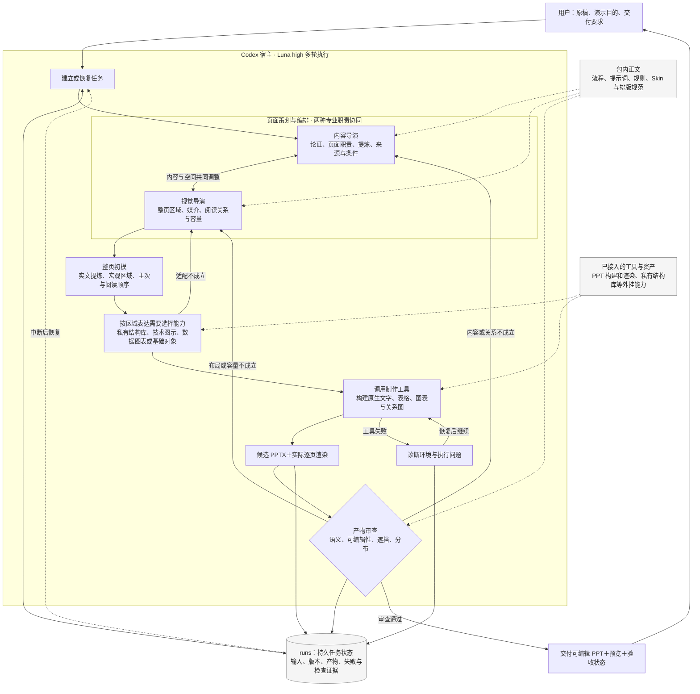

# Harness 体系架构与运行流程

本文描述目标运行闭环和当前宿主实验应遵守的方法，不宣称所有环节已有项目程序实现。实际部署依赖见[外部依赖](外部依赖.md)，任务协议在本包 docs/工作流/正式生成/生成任务提示词.md。

## 当前体系架构

当前采用 **Codex 宿主＋Luna high＋本目录内容包＋制作工具**。宿主负责运行模型与工具循环，内容包提供 PPT 专用工作方法；两者共同构成当前 Harness。下图描述职责与信息流，不规定模型调用次数，也不要求每个框各建一个 Agent。

实线表示执行、产物或反馈流，虚线表示资料/能力支持与恢复读取。制作过程中的重要内容与布局选择也写入 runs；图中只画主要读写关系，避免把每一步都连到状态文件。

**内容提炼和宏观布局是同一轮策划中的协作。** 内容导演回答“这页让读者理解什么、证据与条件是什么”；视觉导演同时回答“哪些内容放哪里、用什么表达、是否放得下”。不能先把摘要写死，再找框容纳。两个职责可在同一执行对话中切换；当前不声称已由程序强制分离成两个上下文。

**Skin 与排版分别提供约束。** Skin 提供身份、颜色和字体；排版规范提供层级、密度、间距和组织方法。视觉导演据内容形成具体页面，结构库服务于选定区域，不主导分页，也不要求每页必须调用。当前 M1 是黑灰白初模，完整品牌美化暂不执行。

**执行顺序是先整页、后局部能力、再美化。** 先把原稿转成有逻辑的真实内容与宏观区域，明确每块放什么、哪里需要图或表；随后判断是否适合调用私有结构库、技术图示或数据图表，填入可读的初模。基础对象即可表达时不调用。局部适配暴露容量或逻辑问题时允许返回调整，不能把先排版理解为坐标一旦确定就不可修改。初模通过后才进入完整视觉润色；两套视觉组合遵循相同顺序。布局初模的交付仍是实际 PPT，不停在中间策划文字。

**审查后按失败原因回到相应环节。** 来源、命题和条件错误回到内容策划；空间、媒介、换行与密度错误回到编排；工具故障修复运行环境后继续。未解决的问题仍标为候选，不沿“通过”分支交付为合格。来源完整或工具零告警都不能替代整页验收。

## 什么已经有，什么仍在验证

| 部分 | 当前实际状态 |
| --- | --- |
| 执行宿主与模型 | 已使用 Codex 项目运行 Luna high；不安装 Penguin。宿主提供调用与工具环境，不是本仓库新实现了一套 Codex。 |
| Harness 内容包 | 流程、提示、规则正文和轻量工具已归拢到目录；原样归入文件通过字节一致性校验。 |
| 双导演协作、审查和恢复 | 当前由执行者遵循文档并使用文件/工具推进；仍需验证是否可靠执行，不是已有代码强制保证的状态机。 |
| PPT 与外挂能力 | 已有本机可编辑 PPT 构建、渲染与检查实验；结构库可外挂。其他机器的工具和字体仍须配置。 |
| 质量与持续推进 | 已出现自主返工，也出现漏检、错误通过声明和请求中断；当前不能宣称稳定自动验收或远端部署完成。 |

主任务目前承担实验调度、外部复核与体系维护。它发现共性失败后修改对应流程、工具或规则，再验证效果；不代写该稿页面答案。这个研发反馈过程与一次制作任务内的自主返工分开记账，不能把人工监督后的结果当成无监督能力。

## 架构图的维护范围

当前架构图只在本文维护，[README](README.md)和[角色说明](角色与提示入口.md)引用本文。包内 `docs/工作流/正式生成/生成线架构决策.md` 已明确标为历史实验记录，其旧图保留追溯，不作为当前执行定义。本文吸收其中仍适用的双导演、持久状态、工具构建和返工关系，按当前宿主及初模要求更新表达，不修改原样归拢的规则正文。

以后只有职责、执行路径、依赖或状态归属发生变化时更新架构图；每次实验的版本、结果和下一步留在 runs 与能力计划中，不把图画成施工排期或固定调用脚本。

## 任务闭环

1. 接收原稿与用户要求，建立本次任务目录。保存来源、交付要求、当前验证问题、模型/推理配置、宿主与工具能力，以及本次读取的协议和规则版本。输入充分时直接推进。
2. 内容导演理解论证并与页面编排反复协调：页面职责、信息提炼、媒介和宏观区域共同形成初模。视觉导演负责空间与表达；需要改变语义时回到内容职责核对。两个职责通过持久产物交接，不等于各调用一次模型后单向结束。
3. 在页面职责、实文与宏观区域明确后，判断局部表达是否需要私有结构库、技术图示或数据图表，再按需读取能力说明、调用工具生成可编辑 PPT、导出实际渲染。工具结果和失败返回当前任务上下文，Agent 据此选择下一步；不是期待一次 API 文本输出包含最终产物。
4. 对实际产物审查来源含义、关系、可编辑性、文字容量、非预期重叠和整页密度。检查反馈须能定位问题并支持返工决策；自动检查覆盖之外的视觉或语义项不能自动记为通过。
5. 发现失败，记录现象、证据、失败层与当前原因假设，选择内容重组、媒介变更、区域调整或工具修复，再生成并复核。反复无改善时改变诊断与策略；不无限重复同一步，也不等用户逐页给修改答案。
6. 交付实际 PPT 与预览，记录证据对应的版本、已完成项和未解决项。未通过者明确为候选，不能用自检声明关闭能力里程碑。

当前 M1 交付完整原稿与已填真实内容的布局初模对照，暂不做品牌美化。多轮是执行过程，首版、自修与外部干预分别保留。

审查阶段按[产物审查](产物审查.md)先完成逐页证据记录，再选择返工；不沿用制作时的通过结论。

## 持久状态与恢复

至少能从任务目录恢复：当前目标、输入和来源、最新候选位置、当前失败与证据、已尝试策略、下一项待验证问题、规则版本及外部反馈。可以使用简单文件，不提前规定复杂 Schema。长任务跨调用、上下文切换或中断后继续读取这些状态，不能依赖聊天记忆猜测已完成事项。

预算、停止条件、重试与异常恢复属于 Harness 职责，按本次条件配置并留记录，不预设统一的单轮或固定返工次数。工具/额度阻塞与能力失败分开记录。

## 实验如何改进系统

主任务维护可复用 Harness 资料和机制，Codex 项目中的 Luna high 执行完整闭环。出现问题时先判断缺口位于模型输入、上下文组织、工具反馈、状态持久化、审查还是执行控制，再决定改哪里；提示词修改只是可能的一种。

更新后用新上下文验证，允许系统内置的通用多轮反馈。不得由主任务注入该稿页面答案，再把合格样本归功于通用系统。必须披露外部续行、人工判断与其他宿主能力；相同稿件通过也不等于跨稿稳定。
